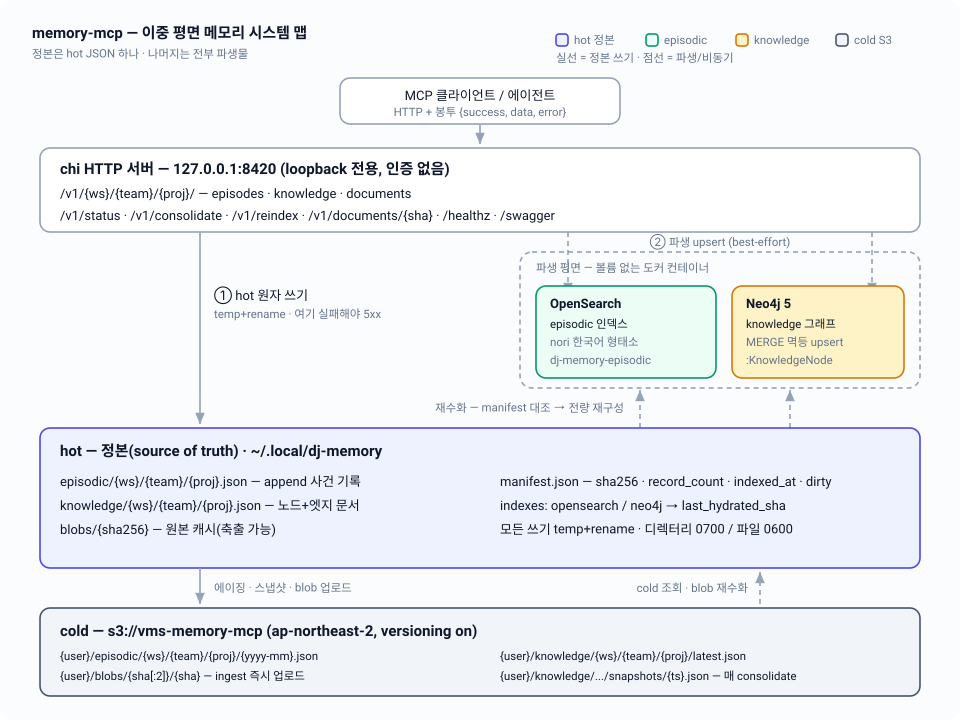

# 01 — 시스템 개요: 이중 평면 메모리

정본(hot JSON) 하나와 파생 인덱스 둘, 콜드 아카이브 하나로 이루어진 memory-mcp의 전체 지도 — 요청 하나가 어디를 지나고, 무엇이 죽어도 되는지.

| 항목 | 내용 |
|---|---|
| 관련 코드 | `cmd/memory-mcp/main.go` · `internal/server/{server,startup,degraded,respond}.go` · `internal/config/config.go` · `internal/hotstore` · `internal/search` · `internal/graph` · `internal/cold` · `internal/rehydrate` |
| 관련 스펙 | [02-storage-model](02-storage-model.md) · [03-lifecycle](03-lifecycle.md) · [04-episodic-search](04-episodic-search.md) · [05-knowledge-graph](05-knowledge-graph.md) · [06-documents](06-documents.md) · [07-rehydration](07-rehydration.md) · [08-http-api](08-http-api.md) · [09-code-structure](09-code-structure.md) · [10-operations](10-operations.md) · [11-testing](11-testing.md) · 인덱스: [README](../../README.md) |
| 상태 | 구현됨 — Go 1.25.9, `go-chi/chi/v5`, `opensearch-go/v4`, `neo4j-go-driver/v5`, `aws-sdk-go-v2`. 본 문서는 `docs/design/architecture-v2.md`(설계)가 아니라 **현재 소스 코드**를 기술한다 |



---

## 1. 문제 — 정본 있는 기억 vs 주장 기억

에이전트 기억은 두 종류다.

- **정본 있는 기억(ground-truth memory)**: 코드 인덱스, 문서 색인처럼 **디스크 어딘가에 원본 파일이 이미 존재**하는 기억. 인덱스가 틀리면 원본을 다시 읽어 고치면 된다. 동기화 문제일 뿐 소유권 문제가 아니다.
- **주장 기억(claim memory)**: "사용자가 X를 선호한다", "Y로 결정했다", "Z를 시도했다가 실패했다". **원본 파일이 존재하지 않는다.** 누군가 정본을 소유하지 않으면, 인덱스가 날아가는 순간 기억 자체가 사라진다.

memory-mcp가 다루는 것은 후자다. 그래서 서버는 검색 엔진을 "저장소"로 쓰지 않고, **자기 손으로 정본을 만들어 로컬 JSON 파일에 쓴다.** OpenSearch와 Neo4j는 그 정본을 조회 가능한 형태로 비춘 **뷰**일 뿐이다.

이 판단이 코드에 직접 박혀 있다 (`internal/hotstore/hotstore.go` 패키지 주석):

> OpenSearch and Neo4j are derived, disposable views; content that exists only in a derived store is a bug.

## 2. 원칙 — 정본 하나, 나머지는 전부 파생물

### 2.1 세 가지 불변 원칙

| # | 원칙 | 코드에서의 실체 |
|---|---|---|
| 1 | **원본이 콘텐츠를 소유한다** | `hotstore.Store`가 유일한 쓰기 정본. `search.Index`·`graph.Store`는 파생. 파생 컨테이너는 볼륨 없이 뜬다(`deploy/docker-compose.yml`) |
| 2 | **판정 없는 자동 덮어쓰기 없음** | 서버 안에 LLM·요약·OCR·임베딩이 없다. supersede 대상 결정은 요청 본문의 `supersedes[]`로 **호출 에이전트가** 지정한다 (`handleCreateNode`) |
| 3 | **정직성** | `GET /v1/status`가 `StatusReport{Drift, Unconsolidated, StaleUnconsolidated, DirtyFiles, S3, Degraded}`를 항상 반환. 문서 청킹이 잘리면 `truncated:{total,indexed}`, 텍스트 추출 불가면 `extractable:false` |

### 2.2 쓰기 순서 규칙 (코드에 강제되어 있음)

```
hot 쓰기  ──실패──► 5xx, 요청 실패                       (정본이 안 써지면 없던 일)
   │성공
   ├─► 파생 upsert ──실패──► 2xx + degraded[] + manifest dirty   (요청은 성공)
   └─► S3 put ──확인 후에만──► hot 삭제 ──► 파생 삭제      (에이징의 철칙)
```

- `handleCreateEpisode`: `Store.AppendEpisode` 실패 → `500 failed to persist episode`. 그 뒤의 `Index.IndexRecords` 실패 → **여전히 201**, 응답에 `degraded:["search unavailable"]`, `markDirty(PlaneEpisodic)`.
- `handleCreateNode`: `Store.WriteKnowledge` 실패 → 500. `mirrorKnowledge`의 Neo4j MERGE 실패 → 201 + `degraded:["graph unavailable"]` + `markDirty(PlaneKnowledge)`.
- `consolidate.Runner.ageProject`: `archiver.ArchiveEpisodes` → `store.RemoveEpisodes` → `index.DeleteRecords` 순서를 지킨다. S3 put이 실패하면 hot은 건드리지 않고 `Report.Failures`에만 남긴다. 반대로 hot 삭제가 실패해도 콜드 사본은 이미 존재하므로(안전한 방향) 다음 실행이 멱등하게 재아카이브한다.

## 3. 두 메모리 평면

| | **episodic** | **knowledge** |
|---|---|---|
| 담는 것 | 사건·대화·결정·관찰·문서 청크 — "그때 무슨 일이 있었나" | 개체·사실·교훈·선호·문서 — "지금 무엇이 참인가" |
| 도메인 타입 | `episodic.Record` (`Kind`: `event`\|`conversation`\|`decision`\|`observation`\|`document_chunk`) | `knowledge.Node` / `knowledge.Edge` / `knowledge.Graph` |
| hot 정본 | `episodic/{ws}/{team}/{proj}.json` — Record 배열 | `knowledge/{ws}/{team}/{proj}.json` — `{nodes, edges}` 문서 |
| 파생 저장소 | OpenSearch 인덱스 `dj-memory-episodic` (전 프로젝트 공유, `workspace`/`team`/`project` keyword로 스코프) | Neo4j `:KnowledgeNode` 라벨 + `:REL` 관계 (`rel` 속성에 관계 종류 저장) |
| 변경 모델 | append 전용. `UpdateEpisodes`는 `consolidated` 플래그와 recall 통계만 갱신 | 비파괴 개정. `Transition`으로 `active ↔ archived ↔ deprecated`, `Supersede`로 승계 체인 |
| 수명 | 유한 — `consolidated=true` + TTL 경과 시 S3로 가라앉고 hot·인덱스에서 제거 | 영구 — hot에 항상 상주. 이동 없음, consolidation마다 S3 스냅샷만 |
| 질의 | nori 형태소 한국어 전문검색 + `occurred_at` 범위 + `kinds` 필터 (`search.Query`) | Cypher 순회: `Neighborhood(entity, depth)`, `SupersedeChain(id)`, lucene fulltext `Search(q, includeArchived)` |
| 재수화 | 인덱스 `Drop` → `EnsureIndex` → `IndexRecords` 벌크 | `Clear` → `UpsertNodes`/`UpsertEdges` MERGE 재생 |

### 3.1 두 평면을 잇는 것: provenance

`knowledge.Node.Provenance []string`과 `knowledge.Edge.Provenance []string`은 유래 episode의 **ULID**를 담는다. episode ID는 불변이고 cold로 내려가도 바뀌지 않으므로 링크가 끊기지 않는다.

`GET /v1/{ws}/{team}/{proj}/episodes/{id}`는 이 계약을 지키기 위해 2단 조회를 한다: `Store.GetEpisode` → `hotstore.ErrNotFound`면 `Archiver.FetchArchivedEpisode`가 S3 월별 배치를 최신순으로 스캔한다.

문서도 같은 방식으로 두 평면에 걸친다 — 원본 바이트는 blob, 본문은 `document_chunk` episode들, 존재 자체는 `kind: document` knowledge 노드. 자세한 것은 [06-documents](06-documents.md).

## 4. 세 저장 계층

| 계층 | 위치 | 구현 | 수명 / 실패 시 |
|---|---|---|---|
| **hot (정본)** | `~/.local/dj-memory` (env `DJ_MEMORY_HOME`) | `hotstore.FileStore` — temp+rename 원자 쓰기, fsync 후 rename, 디렉터리 `0700` / 파일 `0600`, 프로세스 내 단일 mutex로 모든 연산 직렬화 | 영구. 죽으면 서버가 못 쓴다 (`Store == nil`이면 각 핸들러가 503) |
| **derived (파생)** | 도커 컨테이너, 볼륨 없음 | `search.Client`(OpenSearch 2.x + nori), `graph.Client`(Neo4j 5) | 언제든 폐기 가능. 죽으면 쓰기는 degraded로 성공, 검색 읽기만 503 |
| **cold (아카이브)** | `s3://vms-memory-mcp` (`ap-northeast-2`, versioning on) | `cold.S3Storage`(원시 IO) + `cold.S3Archiver`(포맷·키 레이아웃) | 백스톱. 죽으면 에이징·스냅샷·문서 ingest가 막힌다 |

### 4.1 hot 디스크 레이아웃

```
~/.local/dj-memory/
  episodic/{ws}/{team}/{proj}.json    # []episodic.Record
  knowledge/{ws}/{team}/{proj}.json   # knowledge.Graph {nodes, edges}
  blobs/{sha256}                      # 문서 원본 캐시(평면 배치, 축출 가능)
  manifest.json                       # hotstore.Manifest
```

`ProjectKey{Workspace, Team, Project}`의 각 세그먼트는 `^[a-z0-9._-]+$`여야 하고 `.`/`..`를 포함할 수 없다 — 그래야 파일 경로와 S3 키에 그대로 끼워 넣어도 안전하다. HTTP 경계(`server.validateProjectKey`)와 저장소 경계(`hotstore.ProjectKey.Validate`)에서 각각 한 번씩 검증한다.

### 4.2 manifest.json — 파생물이 진실한지 판정하는 근거

```go
type Manifest struct {
    Files     map[string]FileState  // 키: "{plane}/{ws}/{team}/{proj}"
    Indexes   map[string]IndexState // 키: "opensearch" | "neo4j"
    UpdatedAt time.Time
}
type FileState struct { SHA256 string; RecordCount int; IndexedAt time.Time; Dirty bool }
type IndexState struct { LastHydratedSHA string }
```

`RecordCount`는 **파생 저장소의 단위 개수**다 — episodic 평면은 record 수, knowledge 평면은 **노드 수**(엣지 제외). OpenSearch doc-count / Neo4j node-count와 직접 비교하기 위해서다. `LastHydratedSHA`는 `rehydrate.PlaneStateSHA`가 계산한, 평면 내 모든 파일 해시의 결정적 다이제스트다 — 개수만 같고 내용이 바뀐 경우를 잡는다.

### 4.3 cold S3 키 레이아웃 (`internal/cold/keys.go`)

```
{username}/episodic/{ws}/{team}/{proj}/{yyyy-mm}.json     # 월별 배치, id 기준 병합(멱등)
{username}/knowledge/{ws}/{team}/{proj}/latest.json       # consolidation마다 갱신
{username}/knowledge/{ws}/{team}/{proj}/snapshots/{ts}.json  # ts = 20060102T150405Z
{username}/blobs/{sha[:2]}/{sha}                          # content-addressed, ingest 즉시
```

`{username}`은 `DJ_MEMORY_USERNAME` 또는 OS 사용자명. 리전은 **반드시** `DJ_MEMORY_S3_REGION`(기본 `ap-northeast-2`)으로 명시 설정한다 — `AWS_PROFILE`(기본 `vms-holdings`)의 기본 리전을 상속하면 `PermanentRedirect`가 난다.

## 5. 기동 시퀀스 (`cmd/memory-mcp/main.go`)

1. `slog.NewTextHandler(os.Stderr, nil)` 로거 생성 후 `slog.SetDefault`.
2. `config.Load()` — env 읽기, 기본값 적용, `Validate()`. **실패하면 여기서 `os.Exit(1)`** (전체 기동 중 fatal은 이것과 `ListenAndServe` 에러 둘뿐).
3. `signal.NotifyContext(ctx, os.Interrupt, syscall.SIGTERM)` — 이 ctx가 graceful shutdown 트리거.
4. `hotstore.SystemClock{}` → `hotstore.New(cfg.Home, clock)` → `blob.New(filepath.Join(cfg.Home, "blobs"))`. 어느 것도 디스크를 건드리지 않는다(지연 생성).
5. `search.NewClient(cfg.OpenSearchURL)` — 다이얼하지 않는다. 실패 시 `Warn("opensearch client init failed; episodic search degraded")`, `deps.Index`는 nil로 남는다.
6. `graph.NewClient(cfg.Neo4jURL, cfg.Neo4jUser, cfg.Neo4jPassword)` — 성공 시 종료 훅으로 `gr.Close(context.Background())` 등록(ctx가 이미 취소된 시점이라 새 ctx 사용). 실패 시 `deps.Graph`는 nil.
7. `cold.NewS3(ctx, cfg.AWSProfile, cfg.S3Region, cfg.S3Bucket)` → 성공 시 `deps.Archiver = cold.NewArchiver(s3, cfg.Username)`. 실패 시 nil.
8. 서비스 조립: `document.NewIngestor(...)`, `consolidate.New(store, deps.Index, deps.Archiver, clock, cfg.EpisodicTTLDays)`, `rehydrate.New(store, deps.Index, deps.Graph, clock)`.
9. `server.New(cfg, deps)` — `Logger`/`Clock`이 nil이면 기본값으로 채운다.
10. **`srv.Startup(ctx)`** — `Rehydrator.CheckDrift` → 드리프트가 하나라도 있으면 `RehydrateAll(ctx, false)`. 결과는 전부 로그. **절대 fatal이 아니다**: 파생 저장소가 부팅 시점에 죽어 있어도 hot 쓰기는 동작해야 하기 때문.
11. `srv.ListenAndServe(ctx)` — `http.Server{Addr: cfg.ListenAddr, ReadHeaderTimeout: 5s}`. ctx 취소 시 10초 타임아웃으로 `Shutdown`.

**핵심**: 파생 클라이언트 생성 실패는 기동을 막지 않는다. `server.Deps`의 모든 필드는 인터페이스이고 nil이 될 수 있으며, 각 핸들러가 nil을 degraded 또는 503으로 번역한다.

### 5.1 설정 (`internal/config`)

| env | 기본값 | 비고 |
|---|---|---|
| `DJ_MEMORY_HOME` | `~/.local/dj-memory` | hot 루트 |
| `DJ_MEMORY_USERNAME` | OS 사용자명 | 모든 S3 키의 프리픽스 |
| `DJ_MEMORY_S3_BUCKET` | `vms-memory-mcp` | |
| `DJ_MEMORY_S3_REGION` | `ap-northeast-2` | 프로파일 리전 상속 금지 |
| `AWS_PROFILE` | `vms-holdings` | |
| `DJ_MEMORY_OPENSEARCH_URL` | `http://127.0.0.1:9200` | |
| `DJ_MEMORY_NEO4J_URL` | `bolt://127.0.0.1:7687` | 자격증명은 env가 아님 (§9 참조) |
| `DJ_MEMORY_EPISODIC_TTL_DAYS` | `30` | 양의 정수가 아니면 Load 실패 |
| `DJ_MEMORY_LISTEN_ADDR` | `127.0.0.1:8420` | `127.0.0.1:` 또는 `localhost:` 접두사가 아니면 Load 실패 |

결정적 상한(패키지 상수로 고정, 전 패키지가 이 값 하나를 공유):

| 상수 | 값 | 쓰이는 곳 |
|---|---|---|
| `config.MaxProjectFileBytes` | 5 MiB | episodic 압박 에이징 |
| `config.MaxProjectRecords` | 5000 | episodic 압박 에이징 |
| `config.DocumentChunkBytes` | 2048 | 문서 청크 목표 크기 |
| `config.MaxDocumentChunks` | 500 | 청크 상한(초과분은 `truncated`로 보고) |
| `search.DefaultSearchSize` | 20 | 검색 히트 상한 |
| `graph.searchLimit` | 50 | knowledge fulltext 상한 |
| `server.maxGraphDepth` | 10 | 이웃 순회 깊이 클램프(기본 1) |
| `server.maxJSONBodyBytes` | 1 MiB | JSON 요청 본문 |
| `server.maxUploadBytes` | 128 MiB | multipart 문서 업로드 |
| `rehydrate.DebounceInterval` | 2s | 요청 진입 stat-gate 디바운스 |

## 6. 요청 흐름 end-to-end

라우터(`server.Router()`)가 마운트하는 전부:

```
GET  /healthz                          GET  /swagger/*
GET  /v1/status                        POST /v1/consolidate      POST /v1/reindex
GET  /v1/documents/{sha}               GET  /v1/documents/{sha}/chunks
POST /v1/{ws}/{team}/{proj}/episodes           GET .../episodes/search   GET .../episodes/{id}
POST .../knowledge/nodes   PATCH .../knowledge/nodes/{id}   DELETE .../knowledge/nodes/{id}
POST .../knowledge/edges   GET .../knowledge/search          GET .../knowledge/graph
POST .../documents
```

모든 응답은 `server.Envelope{success, data, error}` 봉투다. 예외는 단 하나 — `GET /v1/documents/{sha}`는 `application/octet-stream`으로 원시 바이트를 스트리밍한다.

### 6.1 쓰기 — `POST /v1/{ws}/{team}/{proj}/episodes`

1. `validateProjectKey` (400) → `Store == nil` 확인 (503) → `decodeJSON`(1 MiB 상한, 400) → `CreateEpisodeRequest.validate()` (400).
2. `Clock.Now().UTC()`로 ULID 발급(`ulid.At(now.UnixMilli())`). `occurred_at`이 비어 있으면 now. `consolidated`는 항상 `false`로 시작 — 클라이언트가 지정할 수 없다.
3. **`Store.AppendEpisode`** — 실패하면 500. 여기가 정본 경계다.
4. `Index == nil`이거나 `Index.IndexRecords`가 실패하면 → `degraded: ["search unavailable"]` + `markDirty`. 성공하면 `markIndexed`(dirty 해제, `IndexedAt` 갱신, 평면 `LastHydratedSHA` 재계산).
5. `201` + `CreateEpisodeResponse{record, degraded?}`.

### 6.2 읽기 — `GET .../episodes/search?q=&from=&to=&kinds=`

1. 파라미터 검증(`q` 필수, `from`/`to`는 RFC3339, `kinds`는 알려진 값) → 400.
2. `Index == nil`이면 **503 `search unavailable`** (쓰기와 달리 읽기는 degraded로 넘어가지 않는다).
3. **stat-gate**: `Rehydrator.StatGate(ctx, key)` — 프로젝트별 2초 디바운스 후, manifest의 dirty 플래그 또는 파일 mtime > `IndexedAt`이면 해당 프로젝트만 부분 재수화. 실패해도 요청은 진행한다(경고 로그만).
4. `Index.Search` → `search.ErrUnavailable`이면 503, 그 외 에러는 500.
5. `bumpRecall` — 히트한 record들의 `recall_count`/`last_recalled`를 hot에 best-effort 반영. 실패는 로그만(검색 결과 자체는 이미 옳다).
6. `200` + `[]search.Hit{record, score, excerpt}`. 발췌·메타·점수만 나가고 본문 전문을 통째로 주입하지 않는다.

### 6.3 운영 — `/v1/status`, `/v1/consolidate`, `/v1/reindex`

- **`GET /v1/status`**: `CheckDrift`(라이브 대조) + manifest의 dirty 파일 목록 + 전 프로젝트 스캔으로 얻은 `Unconsolidated`/`StaleUnconsolidated` + `BlobExists(sha256(""))`로 찔러본 S3 도달 가능성 + 마지막 아카이브/스냅샷 시각. 어느 하위 조회가 실패해도 `Degraded[]`에 적고 200을 반환한다.
- **`POST /v1/consolidate`**: `consolidate.Runner.Run` — 증류 후보 제안 → entity 통계 → 에이징(§2.2 순서) → knowledge 스냅샷 → manifest 갱신. `dry_run`이면 S3 업로드·hot 삭제·인덱스 삭제를 전부 건너뛰고 "무엇이 움직였을지"만 센다. 성공 시 `lastArchiveAt`/`lastSnapshotAt`을 갱신(`statusMu`로 보호).
- **`POST /v1/reindex?verify=true`**: `RehydrateAll` — episodic은 `Drop`+벌크, knowledge는 `Clear`+MERGE 재생. `verify`면 프로젝트별 doc-count/node-count를 hot과 대조하는 감사까지 수행. 부분 실패는 `Report.Failures[]`로 전부 노출한다.

## 7. degraded — 실패가 아닌 상태

`internal/server/degraded.go`에 문구가 상수로 고정되어 있다.

| 상수 | 문구 | 언제 |
|---|---|---|
| `degradedSearch` | `search unavailable` | OpenSearch 미설정/도달 불가 |
| `degradedGraph` | `graph unavailable` | Neo4j 미설정/도달 불가 |
| `degradedCold` | `cold storage unavailable` | S3 미설정/도달 불가 |

규칙:

- **쓰기 + 파생 실패 = 성공.** 2xx + `data.degraded[]` + manifest dirty. 다음 재수화가 수렴시킨다.
- **읽기 + 파생 실패 = 503.** 검색·그래프 순회는 파생물 없이는 답이 없으므로 정직하게 거절한다.
- **예외 — 문서 ingest는 콜드 우선.** `handleIngestDocument`는 `Archiver == nil`이면 **503**을 낸다. blob은 S3가 정본이고 로컬 `blobs/`는 축출 가능한 캐시이므로, 콜드 사본 없는 ingest는 계약 위반이다.

## 8. 비목표

- **인증·멀티유저** — `config.Validate()`가 loopback 바인딩을 강제한다. 인증 미들웨어도, 사용자 개념도 없다(`{username}`은 S3 키 프리픽스일 뿐).
- **서버 내 LLM / OCR / 임베딩 / 요약** — 문서 추출은 결정적 텍스트 레이어 추출뿐(`document.DefaultExtractor`). 추출 불가면 `extractable:false`로 정직하게 보고하고 끝낸다. 증류(episode → knowledge)는 에이전트가 API를 호출해서 한다.
- **MCP stdio 어댑터** — 현재 바이너리는 `cmd/memory-mcp` 하나이고 HTTP만 제공한다. 레포 루트의 `src/`(TypeScript v1)와 `package.json`은 역사적 잔존물이며 Go 서버와 연결되어 있지 않다.
- **파생 저장소 영속화** — `deploy/docker-compose.yml`의 두 컨테이너에는 볼륨이 없다. 의도된 설계이며, 이것이 재수화 경로가 상시 검증되는 이유다.
- **자동 삭제** — 미통합(unconsolidated) episode는 나이와 무관하게 hot에 남는다. `AgeEligible`은 `Consolidated == false`인 record를 압박 상황에서도 후보에 넣지 않는다. 대신 `/v1/status`가 `stale_unconsolidated`로 영원히 노출한다.

## 9. ⚠️ 설계 문서와 차이

1. **`internal/errs` / `internal/server/apierr`가 존재하지 않는다.** `docs/design/code-standards.md` §2는 도메인 에러(`*errs.Error` + Kind 매핑)와 전송 에러(`*apierr.Error`)의 2계층을 규정하지만, 코드에는 두 패키지 모두 없다. 실제로는 패키지별 센티넬(`hotstore.ErrNotFound`, `search.ErrUnavailable`, `graph.ErrUnavailable`, `cold.ErrNotFound`, `blob.ErrNotCached`, `knowledge.ErrNodeNotFound`, `episodic.ErrInvalidRecord`, `document.ErrColdUnavailable`)을 `errors.Is`로 판별하고, 핸들러가 `writeError(w, status, message)`로 직접 상태 코드를 정한다. Kind→HTTP 매핑표는 각 핸들러에 분산되어 있다.
2. **버킷 이름 표기.** `architecture-v2.md`의 스택 행은 S3를 `vms-holdings`로 적었지만, `vms-holdings`는 **AWS 프로파일 이름**이고 버킷은 `vms-memory-mcp`다(§1 다이어그램·§8과는 일치). 코드 기본값이 정답: `S3Bucket: "vms-memory-mcp"`, `AWSProfile: "vms-holdings"`.
3. **env 목록 차이.** 설계 §8에 없는 `DJ_MEMORY_LISTEN_ADDR`가 코드에 있고 loopback 검증까지 붙어 있다. 반대로 Neo4j 자격증명은 env가 아니라 `config.Load`에 하드코딩되어 있다(`Neo4jUser: "neo4j"`, `Neo4jPassword: "djmemory-local"`) — compose의 `NEO4J_AUTH`와 짝을 이룬 로컬 고정값이다.
4. **manifest 파일 키 헬퍼가 두 곳에 중복.** `hotstore.ManifestFileKey(plane, key)`와 `rehydrate.FileKey(plane, key)`가 같은 `"{plane}/{ws}/{team}/{proj}"` 문자열을 만든다. `code-standards.md` §4("중복 헬퍼는 삭제가 아니라 통합한다")와 어긋난다.
5. **`server.notImplemented`는 프로덕션 경로에서 쓰이지 않는다.** 스캐폴드 잔존 스텁으로, 유일한 호출자가 `validate_test.go`다.

## 코드 위치

| 개념 | 파일 |
|---|---|
| 기동·의존성 조립 | `cmd/memory-mcp/main.go` |
| 설정·상수·loopback 강제 | `internal/config/config.go` |
| 라우트 테이블·`Deps`·graceful shutdown | `internal/server/server.go` |
| 부팅 시 드리프트 대조 → 재수화 | `internal/server/startup.go` |
| degraded 상수·manifest 마킹·stat-gate | `internal/server/degraded.go` |
| `{success,data,error}` 봉투 | `internal/server/respond.go` |
| 경로/본문 검증·요청 상한 | `internal/server/validate.go` |
| episodic 핸들러(쓰기·검색·단건) | `internal/server/handlers_episodic.go` |
| knowledge 핸들러(노드·엣지·순회·purge) | `internal/server/handlers_knowledge.go` |
| documents 핸들러(ingest·원본·청크) | `internal/server/handlers_documents.go` |
| status·consolidate·reindex 핸들러 | `internal/server/handlers_ops.go` |
| hot 정본 계약·ProjectKey·Manifest | `internal/hotstore/hotstore.go` |
| hot 원자 쓰기 구현 | `internal/hotstore/filestore.go` |
| episodic 도메인·검증 | `internal/episodic/record.go` |
| knowledge 도메인·상태기계·supersede | `internal/knowledge/knowledge.go` |
| OpenSearch 계약·nori 인덱스 매핑 | `internal/search/search.go`, `internal/search/mapping.go`, `internal/search/client.go` |
| Neo4j 계약·Cypher | `internal/graph/graph.go`, `internal/graph/convert.go` |
| S3 원시 IO / 아카이브 포맷 / 키 | `internal/cold/cold.go`, `internal/cold/archive.go`, `internal/cold/keys.go` |
| blob 로컬 캐시 | `internal/blob/blob.go` |
| 문서 파이프라인·청킹 | `internal/document/document.go`, `internal/document/extract.go` |
| consolidation·에이징 규칙 | `internal/consolidate/consolidate.go`, `internal/consolidate/cluster.go` |
| 드리프트 판정·재수화·stat-gate | `internal/rehydrate/rehydrate.go`, `internal/rehydrate/manifest.go` |
| ULID | `internal/ulid/ulid.go` |
| 파생 컨테이너(볼륨 없음) | `deploy/docker-compose.yml`, `deploy/opensearch/Dockerfile` |
| 실행·검증 타깃 | `Makefile` (`make start` / `make test` / `make blackbox` / `make swagger`) |
| 블랙박스 수용 시나리오 | `test/blackbox/` |
