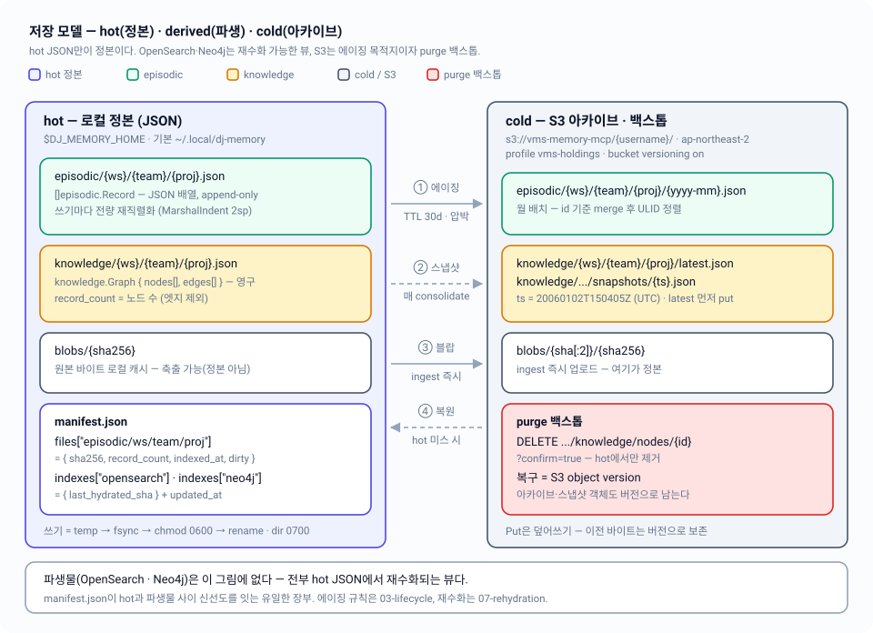

# 02 — 저장 모델: hot / derived / cold

로컬 JSON(hot)이 유일한 정본이고, OpenSearch·Neo4j(derived)는 버려도 되는 뷰이며, S3(cold)는 에이징 목적지이자 purge 백스톱이다 — 이 세 계층의 실제 디렉토리·키·레코드 형태를 코드 기준으로 규정한다.

| 항목 | 내용 |
|---|---|
| 관련 코드 | `internal/hotstore/{hotstore.go,filestore.go}` · `internal/episodic/record.go` · `internal/knowledge/knowledge.go` · `internal/blob/blob.go` · `internal/cold/{keys.go,archive.go,cold.go}` · `internal/config/config.go` |
| 관련 스펙 | [01-overview](01-overview.md) · [03-lifecycle](03-lifecycle.md) · [05-knowledge-graph](05-knowledge-graph.md) · [06-documents](06-documents.md) · [07-rehydration](07-rehydration.md) · [09-code-structure](09-code-structure.md) · 인덱스: [README](README.md) |
| 상태 | 코드 반영 완료. 설계 문서와의 차이는 §10에 명시 |



---

## 1. 세 계층의 계약

| 계층 | 실체 | 소유하는 것 | 잃어버리면 |
|---|---|---|---|
| **hot** | `$DJ_MEMORY_HOME` 아래 JSON 파일 | 콘텐츠 전부(정본) | 복구 불가 — S3 아카이브에 내려간 것만 남는다 |
| **derived** | OpenSearch 인덱스, Neo4j 그래프 | 없음(검색·순회 성능만) | 재수화로 전부 재구성 ([07-rehydration](07-rehydration.md)) |
| **cold** | `s3://vms-memory-mcp/{username}/` | 에이징된 episode, knowledge 스냅샷, 블랍 원본 | 에이징된 과거 기록과 purge 복구 경로 |

불변식 세 개:

1. **파생물에만 존재하는 콘텐츠는 버그다.** 쓰기는 항상 hot 먼저, 파생물 upsert는 best-effort. 실패해도 요청은 성공하고 manifest에 `dirty` 마크가 남는다.
2. **hot에서 제거하기 전에 cold put이 확인돼야 한다.** `consolidate`의 에이징 순서는 S3 put → hot 제거 → 인덱스 삭제로 고정 (`internal/consolidate/consolidate.go:201-224`).
3. **블랍만 반대다.** 문서 원본은 cold-first — S3가 정본이고 `blobs/`는 축출 가능한 캐시다.

## 2. hot 레이아웃

`internal/hotstore/filestore.go:20-33`, `cmd/memory-mcp/main.go:50` 기준의 실제 트리:

```text
$DJ_MEMORY_HOME/                              # 기본 ~/.local/dj-memory (config.Load)
├── episodic/{workspace}/{team}/{project}.json   # []episodic.Record
├── knowledge/{workspace}/{team}/{project}.json  # knowledge.Graph
├── blobs/{sha256}                               # 원본 바이트 (flat, 서브디렉토리 없음)
└── manifest.json                                # hotstore.Manifest
```

- 경로 조립은 `FileStore.planePath()` 한 곳: `filepath.Join(home, plane, ws, team, project + ".json")`. plane은 `PlaneEpisodic="episodic"` / `PlaneKnowledge="knowledge"` 두 값뿐이다.
- 퍼미션: 디렉토리 `0o700`, 파일 `0o600` (`hotstore` · `blob` 양쪽 동일). 개인 기억이므로 group/other 비트를 주지 않는다.
- 디렉토리는 첫 쓰기 때 lazily 생성된다. `hotstore.New(home, clock)`은 디스크를 건드리지 않는다.
- 파일 없음은 에러가 아니다 — episodic은 빈 슬라이스, knowledge는 `Graph{Nodes: []Node{}, Edges: []Edge{}}`를 돌려준다. 반면 **JSON 파싱 실패는 에러**로 올라온다(`hotstore: parse %s`) — 조용히 빈 값으로 덮지 않는다.
- 프로젝트 열거는 `ListProjects`가 두 plane에 대해 `{home}/{plane}/*/*/*.json` 글롭을 돌려 dedupe·정렬한다. 세그먼트가 `ProjectKey.Validate`를 통과하지 못하는 파일은 **우리가 쓴 것일 수 없으므로 건너뛴다**.

## 3. 레코드 형태 (실제 struct)

### 3.1 episodic — `internal/episodic/record.go:48-70`

```go
type Record struct {
	ID           string    `json:"id"`            // ULID, 불변 (provenance 앵커)
	Kind         Kind      `json:"kind"`          // event|conversation|decision|observation|document_chunk
	OccurredAt   time.Time `json:"occurred_at"`   // 에이징 TTL 기준시각
	Actor        Actor     `json:"actor"`         // agent|user|system
	Text         string    `json:"text"`          // nori 전문검색 대상
	Entities     []string  `json:"entities"`
	Refs         *Refs     `json:"refs,omitempty"` // kind=document_chunk 일 때만
	Consolidated bool      `json:"consolidated"`   // cold 자격의 전제. 서버가 자동 설정하지 않는다
	RecallCount  int       `json:"recall_count"`
	LastRecalled string    `json:"last_recalled"`  // RFC3339 또는 ""
}

type Refs struct {
	DocSHA   string `json:"doc_sha"`
	ChunkSeq int    `json:"chunk_seq"`
}
```

`Record.Validate()`가 강제하는 것: ULID id, 알려진 kind/actor, 공백 아닌 text, 0이 아닌 `occurred_at`, **`refs`는 `document_chunk`일 때만 존재**(그 외 kind에 refs가 붙으면 거부), `recall_count >= 0`, `last_recalled`는 빈 문자열이거나 RFC3339. `omitempty`가 붙은 필드는 `Refs` 하나뿐이다 — 나머지는 비어 있어도 항상 직렬화된다.

파일 최상위는 **레코드 JSON 배열**이다(JSONL 아님). 그래서 append 한 건도 전체 배열을 읽어 다시 쓴다(§4).

### 3.2 knowledge — `internal/knowledge/knowledge.go:57-94`

```go
type Node struct {
	ID           string    `json:"id"`            // ULID, 불변
	Kind         NodeKind  `json:"kind"`          // entity|fact|lesson|preference|document
	Name         string    `json:"name"`
	Body         string    `json:"body"`
	Aliases      []string  `json:"aliases"`
	State        State     `json:"state"`         // active|archived|deprecated
	Trust        Trust     `json:"trust"`         // user-stated|agent-inferred|imported
	Supersedes   []string  `json:"supersedes"`
	SupersededBy string    `json:"superseded_by"` // active면 반드시 ""
	Provenance   []string  `json:"provenance"`    // 유래 episode id들
	Created      time.Time `json:"created"`
	Updated      time.Time `json:"updated"`
	ReviewAfter  string    `json:"review_after"`  // RFC3339 또는 ""
}

type Edge struct {
	From       string   `json:"from"`
	To         string   `json:"to"`
	Rel        Rel      `json:"rel"`        // relates_to|derived_from|supersedes|about
	Provenance []string `json:"provenance"`
	Confidence float64  `json:"confidence"` // [0,1]
}

type Graph struct {
	Nodes []Node `json:"nodes"`
	Edges []Edge `json:"edges"`
}
```

프로젝트당 파일 하나에 그래프 전체가 들어간다. 노드 추가·supersede·purge 전부 `UpdateKnowledge(ctx, key, fn)` 안에서 변환 후 전량 교체다 — 읽기·변환·쓰기가 한 락 안에서 끝나므로 동시 쓰기가 서로를 덮어쓰지 못한다. 상태기계와 supersede 규칙은 [05-knowledge-graph](05-knowledge-graph.md) 소관.

`Provenance`가 episode id를 가리키는데 그 episode가 cold로 내려가도 링크가 깨지지 않는 이유는 id가 불변이기 때문이다 — `GET .../episodes/{id}`가 hot 미스 시 S3 아카이브를 스캔한다(§8).

## 4. 원자 쓰기 — `writeFileAtomic`

`internal/hotstore/filestore.go:73-103`. 모든 hot 파일(두 plane + manifest)이 이 함수 하나를 통과한다.

```text
MkdirAll(dir, 0700)
  → os.CreateTemp(dir, ".tmp-*")     # 같은 디렉토리 = 같은 파일시스템 → rename이 원자적
  → defer os.Remove(tmp)             # rename 성공 후엔 no-op, 실패 시 쓰레기 정리
  → Write(data)
  → tmp.Sync()                       # fsync: 바이트가 디스크에 도달한 뒤에만 rename
  → tmp.Close()
  → Chmod(tmp, 0600)
  → os.Rename(tmp, path)             # 관찰자는 옛 파일 또는 새 파일만 본다
```

이렇게 하는 이유: 정본 파일은 **잘린 상태로 존재해선 안 된다**. 크래시가 나면 옛 파일이 그대로 남거나 새 파일이 통째로 보이거나 둘 중 하나여야 한다. in-place 쓰기는 "절반만 쓰인 JSON 배열" 상태를 만들 수 있고, 그건 파싱 에러로 정본 전체를 못 읽는 상황이다.

부가 규칙:

- **직렬화는 `marshalCanonical` 한 곳** — `json.MarshalIndent(v, "", "  ")` + 개행 하나. 같은 내용이 항상 같은 sha256을 내야 manifest 대조가 성립한다.
- **동시성**: `FileStore.mu sync.Mutex` 하나가 모든 연산을 직렬화한다. append/update/manifest의 read-modify-write 사이클이 교차하지 않는다. 프로세스 **내부** 보호만이며 크로스 프로세스 락은 없다 — 서버는 loopback 단일 프로세스라는 전제(`config.Validate`가 bind 주소를 loopback으로 강제).
- **쓰기 없는 no-op은 파일도 manifest도 건드리지 않는다.** `RemoveEpisodes`가 아무것도 지우지 않았으면 재작성하지 않는다(manifest churn 방지 → 불필요한 drift 신호 방지).
- **한계**: rename 이후 **부모 디렉토리를 fsync하지 않는다**. 파일 내용은 durable하지만 디렉토리 엔트리 갱신은 OS에 맡긴다. 설계 문서의 "temp+rename 원자 쓰기"는 만족하나, 전원 차단 시 rename 자체가 유실될 수 있다(§10).

### 4.1 쓰기 연산의 계약

| 메서드 | 계약 |
|---|---|
| `AppendEpisode` | 같은 id가 이미 있으면 거부 — episodic은 append-only이고 id는 provenance 앵커다 |
| `UpdateEpisodes(ids, fn)` | `fn`이 id를 바꾸면 에러. 요청한 id 중 하나라도 없으면 `ErrNotFound`(정렬된 목록 포함) |
| `RemoveEpisodes(ids)` | 없는 id는 그냥 건너뛴다 — 에이징 재시도가 멱등해야 하므로 |
| `UpdateKnowledge(fn)` | `fn`이 현재 그래프로부터 다음 그래프를 만들고, 읽기·`fn`·쓰기가 한 번의 락 안에서 일어난다(전량 교체). `fn` 에러는 쓰기를 취소하고 원인을 그대로 전달한다. manifest `record_count`는 **노드 수**(엣지 제외) |
| `MarkDirty` | 엔트리가 없으면 만들어서 표시 — dirty 마크는 절대 유실되면 안 된다 |
| `FileInfo` | `os.Stat` → (size, mtime). 없으면 `ErrNotFound`. stat-gate와 압박 임계치가 쓴다 |

## 5. ProjectKey 검증과 경로 컨테인먼트

`internal/hotstore/hotstore.go:32-72`.

```go
type ProjectKey struct{ Workspace, Team, Project string }

var segmentPattern = regexp.MustCompile(`^[a-z0-9._-]+$`)
```

세그먼트 각각에 대해:

1. 빈 문자열 거부
2. `^[a-z0-9._-]+$` 불일치 거부 — **charset 자체에 `/`와 `\`가 없다**. 그래서 경로 구분자 주입이 원천 차단되고, 컨테인먼트 문제는 점(dot) 세그먼트 거부로 축소된다.
3. `.` 정확히 일치하거나 `..`를 **포함**하면 거부

`Validate()`는 IO를 하는 모든 메서드의 첫 관문이다(`checkCtx(ctx, key)`가 컨텍스트 취소 확인 후 바로 호출). 즉 파일시스템 경로든 S3 키든 이 검증을 통과한 세그먼트만 문자열 결합에 들어간다. `String()`이 `"ws/team/proj"`를 만들고 이게 로그·manifest 키·S3 키의 공통 표현이다.

**두 겹 검증**: HTTP 경계에서 `server.validateProjectKey`가 같은 정규식으로 먼저 거른다(`internal/server/validate.go:41-51`). 다만 규칙이 완전히 같지는 않다 — 서버는 `"."`와 `".."` **정확 일치만** 거부하고 hotstore는 `..` **포함**을 거부한다. 따라서 `a..b` 같은 세그먼트는 HTTP 400이 아니라 hotstore 에러 → 500으로 나간다(§10). 두 경우 모두 실제 경로 탈출은 아니다(`a..b`는 평범한 디렉토리 이름).

블랍 sha도 같은 방식이다 — `blob.validSHA`가 `^[0-9a-f]{64}$`를 강제해서 sha가 캐시 디렉토리를 벗어날 수 없고, 서버 경계에서도 `shaHexPattern`이 동일 검사를 한다.

## 6. manifest.json

`internal/hotstore/hotstore.go:88-114`.

```go
type FileState struct {
	SHA256      string    `json:"sha256"`
	RecordCount int       `json:"record_count"`
	IndexedAt   time.Time `json:"indexed_at"`
	Dirty       bool      `json:"dirty"`
}
type IndexState struct {
	LastHydratedSHA string `json:"last_hydrated_sha"`
}
type Manifest struct {
	Files     map[string]FileState  `json:"files"`
	Indexes   map[string]IndexState `json:"indexes"`
	UpdatedAt time.Time             `json:"updated_at"`
}
```

- **`Files` 키 포맷**: `ManifestFileKey(plane, key)` = `"{plane}/{ws}/{team}/{proj}"`. 예) `"episodic/vms/platform/memory-mcp"`.
- **`Indexes` 키**: `"opensearch"`(episodic), `"neo4j"`(knowledge) — `rehydrate.IndexKeyEpisodic` / `IndexKeyKnowledge` 상수.

필드별 용도와 기록 주체:

| 필드 | 무엇을 위한 것 | 누가 쓰나 |
|---|---|---|
| `sha256` | 파일 내용 지문. 파생물 hydration 기준점 계산의 입력 | `updateFileStateLocked` (모든 hot 쓰기) |
| `record_count` | 파생 저장소 유닛 수 — episodic은 레코드 수, knowledge는 **노드 수**. OpenSearch doc-count / Neo4j node-count와 직접 비교하려고 이렇게 맞췄다 | 동상 |
| `indexed_at` | 마지막으로 파생물에 성공 반영한 시각. stat-gate가 파일 mtime과 비교해 부분 재수화를 결정 | `server.markIndexed`, `rehydrate.commitManifest` |
| `dirty` | best-effort upsert 실패 표시. 다음 재수화가 수렴시킨다 | `Store.MarkDirty` (핸들러·consolidate·document 실패 경로) |
| `last_hydrated_sha` | `PlaneStateSHA` — 해당 plane의 (정렬된 파일키 + 파일 sha) 전체에 대한 다이제스트. 건수만으로는 못 잡는 "건수는 같은데 내용이 바뀐" drift를 잡는다 | `markIndexed`, `commitManifest` |
| `updated_at` | manifest 자체의 신선도. `/v1/status`가 그대로 보고 | 모든 `updateManifestLocked` (주입된 `Clock`) |

읽는 쪽:

- `rehydrate.CheckDrift` → `planeTotals()`로 plane별 `record_count` 합과 `dirty` 개수를 구해 라이브 카운트와 대조. knowledge 쪽은 manifest 대신 **hot 파일에서 노드를 직접 세서**(`hotNodeCount`) 비교한다 — 회계 방식과 무관하게 성립하는 검사를 원해서다.
- `rehydrate.StatGate` → `FileInfo`의 mtime이 `indexed_at`보다 새로우면 해당 프로젝트만 부분 재수화.
- `GET /v1/status` → `ManifestUpdatedAt` 및 drift 리포트.

쓰기 시 필드 보존 규칙이 중요하다: 내용 쓰기(`updateFileStateLocked`)는 `sha256`/`record_count`만 갱신하고 `indexed_at`/`dirty`는 **손대지 않는다**. 반대로 파생물 동기화(`markIndexed`)는 `dirty`/`indexed_at`/`last_hydrated_sha`만 건드린다. 두 관심사가 서로를 덮지 않는다.

`UpdateManifest(fn)`은 항상 clone에 `fn`을 적용하고, `fn`이 에러를 반환하면 아무것도 쓰지 않는다.

## 7. blobs — content-addressed 캐시

`internal/blob/blob.go`. `{home}/blobs/{sha256}` 평면 배치(S3와 달리 2글자 샤딩 없음).

- `Put(ctx, r)`는 바이트를 `io.MultiWriter(hasher, tmp)`로 흘려 **주소를 알기 전에는 최종 경로를 만들지 않는다**. 전체를 다 읽고 sha가 확정된 뒤에야 rename → 부분 쓰기가 content address 아래 노출되는 일이 없다.
- 같은 sha가 이미 있으면 rename하지 않고 바로 반환(멱등). temp는 defer가 지운다.
- `Get`은 없으면 `ErrNotCached` — 호출부(document)는 이걸 보고 S3에서 복원한다.
- `Cache` 인터페이스에 `Has`/`Evict`가 선언·구현·테스트돼 있지만 **프로덕션 호출부가 없다**(§10). 즉 "축출 가능"은 현재 설계 의도이지 자동 정책이 아니다.

블랍 파이프라인 전체(추출·청킹·문서 노드)는 [06-documents](06-documents.md).

## 8. cold — S3 키 레이아웃

`internal/cold/keys.go`가 키 포맷의 유일한 출처다. 모든 키는 `{username}` 프리픽스로 시작한다(`DJ_MEMORY_USERNAME`, 기본 OS 사용자).

| 헬퍼 | 키 |
|---|---|
| `EpisodeArchiveKey(u, k, month)` | `{u}/episodic/{ws}/{team}/{proj}/{yyyy-mm}.json` |
| `EpisodeArchivePrefix(u, k)` | `{u}/episodic/{ws}/{team}/{proj}/` |
| `KnowledgeLatestKey(u, k)` | `{u}/knowledge/{ws}/{team}/{proj}/latest.json` |
| `KnowledgeSnapshotKey(u, k, ts)` | `{u}/knowledge/{ws}/{team}/{proj}/snapshots/{20060102T150405Z}.json` |
| `BlobKey(u, sha)` | `{u}/blobs/{sha[:2]}/{sha}` |
| `ArchiveMonth(t)` | `t.UTC().Format("2006-01")` — 배치 버킷 이름 |

버킷/리전/프로파일: `vms-memory-mcp` / `ap-northeast-2` / `vms-holdings` (env `DJ_MEMORY_S3_BUCKET`, `DJ_MEMORY_S3_REGION`, `AWS_PROFILE`). `cold.NewS3`가 `awsconfig.WithRegion(region)`을 **명시**하는 이유는 프로파일 기본 리전이 다르면 모든 호출이 `PermanentRedirect`로 죽기 때문이다.

### 8.1 아카이브 포맷과 멱등성

- `ArchiveEpisodes`는 **download-merge-upload**다. 기존 `{yyyy-mm}.json`을 받아 레코드 id 기준으로 합치고, `strings.Compare(x.ID, y.ID)`로 정렬(ULID이므로 시간순)한 뒤 다시 올린다. 부분 실패 후 재실행해도 중복이 생기지 않는다.
- 인코딩은 `json.Marshal` — **compact**다. hot의 들여쓴 canonical 인코딩과 다르다(hot만 sha256 안정성이 필요하므로).
- 빈 배치는 put하지 않고 키만 돌려준다.
- `FetchArchivedEpisode`는 프리픽스를 리스트해 **최신 월부터** 역순 스캔한다 — 최근 episode 조회가 더 흔하다는 가정. `GET /v1/{ws}/{team}/{proj}/episodes/{id}`가 hot 미스일 때 여기로 폴백해서 provenance 링크가 계속 풀린다.
- `SnapshotKnowledge`는 `latest.json`을 **먼저** 올리고 그다음 타임스탬프 스냅샷을 올린다 — latest가 동반 스냅샷보다 오래된 상태가 되지 않게.
- `UploadBlob`은 `Exists` 확인 후 있으면 skip. content-addressed이므로 같은 sha면 이미 옳은 바이트다.

### 8.2 versioning = purge 백스톱

`Storage.Put`은 항상 덮어쓴다. 버킷 versioning이 켜져 있다는 전제 아래, 덮어쓴 이전 바이트는 이전 object version으로 남는다. 이게 `DELETE .../knowledge/nodes/{id}?confirm=true`(purge)의 복구 경로다 — purge는 hot 파일에서 노드와 인접 엣지를 지우지만, 직전 consolidate가 올린 `latest.json`/`snapshots/{ts}.json`에는 그 노드가 살아 있다.

주의할 점: **Go 코드 어디에서도 versioning을 켜지 않는다.** 버킷 설정은 운영 전제이고, 코드에 남은 유일한 흔적은 블랙박스 하네스가 버킷 미존재 시 띄우는 안내 문구다(`test/blackbox/harness_test.go:113-121`):

```text
aws --profile vms-holdings s3api put-bucket-versioning \
  --bucket vms-memory-mcp --versioning-configuration Status=Enabled
```

versioning이 꺼진 버킷에서는 purge가 되돌릴 수 없다. 운영 체크리스트는 [10-operations](10-operations.md).

## 9. hot → cold 이동 순서

에이징 판정 자체(어떤 레코드가 자격이 있는가)는 [03-lifecycle](03-lifecycle.md) 소관이고, 여기서는 **저장 계층이 지키는 순서**만 못박는다. `consolidate.ageProject`가 월 배치마다:

```text
3a  ArchiveEpisodes(...)   → 실패하면 continue. 로컬은 그대로다
3b  RemoveEpisodes(...)    → cold 사본이 확인된 뒤에만
3c  DeleteRecords(...)     → best-effort. 실패하면 MarkDirty + Failures에 기록
```

이 방향이 "안전한 쪽"인 이유: 3b가 실패하면 cold와 hot에 같은 레코드가 동시에 존재하는데, 다음 실행이 멱등하게 재아카이브하므로 수렴한다. 반대 순서였다면 3a 실패 시 데이터가 사라진다.

관련 임계값은 전부 `internal/config/config.go`의 상수다: `DefaultEpisodicTTLDays=30`, `MaxProjectFileBytes=5<<20`(5MiB), `MaxProjectRecords=5000`. **이 값들이 실제로 어떤 판정식에 들어가는지(TTL 규칙, 압박 규칙, 미통합 불변식)는 [03-lifecycle §3.2 `AgeEligible`](03-lifecycle.md#32-ageeligible--이동-자격-판정)이 단독으로 소유한다** — 본 문서는 저장 계층의 키·형태만 규정한다.

## 10. ⚠️ 설계 문서와 차이

| # | 항목 | 실제 코드 | 설계 문서 |
|---|---|---|---|
| 1 | manifest 필드 | `FileState`에 `dirty`, `Manifest`에 `updated_at`이 더 있다 | §5는 `{sha256, record_count, indexed_at}` + `{last_hydrated_sha}`만 기술 |
| 2 | knowledge `record_count` | **노드 수**(엣지 제외) — Neo4j node-count와 직접 비교하려고 | 미규정 |
| 3 | 원자 쓰기 durability | 파일은 fsync하지만 **부모 디렉토리 fsync 없음**. rename 자체는 durable하지 않다 | §1 "temp+rename 원자 쓰기"만 요구 |
| 4 | episodic append | 파일이 JSON 배열이라 append 1건도 전량 재직렬화. 5MiB 임계치는 이 비용의 상한 역할도 한다 | §1 "append 지향 사건 기록" |
| 5 | purge 상태 검사 | `handlePurgeNode`는 `confirm=true`와 노드 존재만 확인한다. `knowledge.CanPurge`(archived/deprecated에서만 허용)는 정의·테스트만 되고 **호출부가 없다** | §3의 상태기계상 active 직접 purge는 의도 밖. code-standards §4 데드코드 정책 위반이기도 하다 |
| 6 | blob 축출 | `Cache.Has`/`Evict` 프로덕션 호출부 없음 — 축출 정책이 아직 없다 | §1 "blobs/{sha256} 원본 파일 캐시(축출 가능)" |
| 7 | 키 검증 이중화 | HTTP는 `"."`/`".."` 정확 일치만 거부, hotstore는 `..` 포함을 거부. `a..b`는 400이 아니라 500으로 나간다 | 미규정 |
| 8 | env 목록 | `DJ_MEMORY_LISTEN_ADDR`가 코드에 있다(기본 `127.0.0.1:8420`, loopback 강제) | §8 env 목록에 없음 |
| 9 | 버킷/프로파일 표기 | 버킷 `vms-memory-mcp`, 프로파일 `vms-holdings` (코드는 §8과 일치) | 헤더 표(8행)가 `AWS S3(vms-holdings, ap-northeast-2)`라 버킷처럼 읽힌다 — §8이 맞다 |
| 10 | 컴포넌트 형태 | `hotstore.FileStore`, `blob.FileCache`, `cold.S3Storage`, `cold.S3Archiver`가 **exported 구현체**이고 생성자도 `New(home, clock) *FileStore` 등 구체 타입 반환 | code-standards §1은 `Client`/`client` 쌍 + `New(Config) (Client, error)` 단일 생성자를 요구 |

## 11. 코드 위치

| 개념 | 파일 | 심볼 |
|---|---|---|
| hot 계약(인터페이스) | `internal/hotstore/hotstore.go` | `Store`, `ProjectKey`, `Plane`, `Manifest`, `FileState`, `IndexState`, `ManifestFileKey` |
| hot 구현(디스크) | `internal/hotstore/filestore.go` | `FileStore`, `writeFileAtomic`, `marshalCanonical`, `updateFileStateLocked`, `planePath` |
| 키 검증 | `internal/hotstore/hotstore.go:42-67` · `internal/server/validate.go:35-59` | `segmentPattern`, `ProjectKey.Validate`, `validateProjectKey`, `validateSHA` |
| episodic 레코드 | `internal/episodic/record.go` | `Record`, `Refs`, `Kind`, `Actor`, `Record.Validate`, `NewRecord` |
| knowledge 그래프 | `internal/knowledge/knowledge.go` | `Node`, `Edge`, `Graph`, `State`, `Trust`, `Rel`, `Transition`, `Supersede`, `CanPurge` |
| 블랍 캐시 | `internal/blob/blob.go` | `Cache`, `FileCache`, `validSHA`, `ErrNotCached` |
| S3 키 포맷 | `internal/cold/keys.go` | `EpisodeArchiveKey`, `EpisodeArchivePrefix`, `KnowledgeLatestKey`, `KnowledgeSnapshotKey`, `BlobKey`, `ArchiveMonth` |
| 아카이브 포맷 | `internal/cold/archive.go` | `Archiver`, `S3Archiver`, `ArchiveEpisodes`, `FetchArchivedEpisode`, `SnapshotKnowledge`, `UploadBlob` |
| S3 IO | `internal/cold/cold.go` | `Storage`, `S3Storage`, `NewS3`, `isNotFoundErr`, `ErrNotFound` |
| 경로·임계값·env | `internal/config/config.go` | `Config`, `Load`, `DefaultEpisodicTTLDays`, `MaxProjectFileBytes`, `MaxProjectRecords`, `DefaultS3Region` |
| manifest 소비 | `internal/rehydrate/manifest.go` | `FileKey`, `IndexKeyFor`, `PlaneStateSHA`, `IndexKeyEpisodic`, `IndexKeyKnowledge` |
| manifest 갱신(핸들러) | `internal/server/degraded.go` | `markIndexed`, `markDirty`, `statGate` |
| 에이징 순서 | `internal/consolidate/consolidate.go:160-226` | `ageProject` |
| 블랍 디렉토리 배선 | `cmd/memory-mcp/main.go:49-50` | `hotstore.New(cfg.Home, clock)`, `blob.New(filepath.Join(cfg.Home, "blobs"))` |
| 저장 계층 테스트 | `internal/hotstore/hotstore_test.go` · `internal/blob/blob_test.go` · `internal/cold/{archive_test.go,cold_test.go}` | `TestManifestTracksShaAndCount`, `TestNoTempLitterAcrossOperations`, `TestPutIdempotent` 등 — [11-testing](11-testing.md) |
