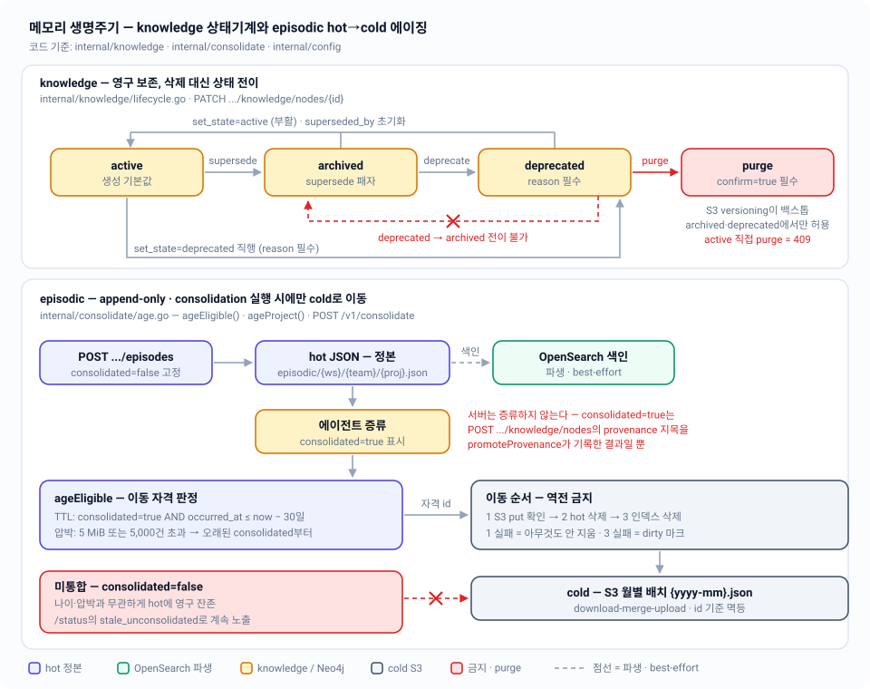

# 03 — 메모리 생명주기: 상태기계와 hot→cold 에이징

episodic은 append-only이고 유한하며, knowledge는 영구이고 상태 전이만 한다 — 두 평면의 수명 규칙, 이동 자격 판정식, 미통합 레코드 불변식, 그리고 절대 뒤집히지 않는 S3 put → hot 삭제 → 인덱스 삭제 순서를 코드 기준으로 규정한다.

| 항목 | 내용 |
|---|---|
| 관련 코드 | `internal/knowledge/knowledge.go` · `internal/consolidate/{consolidate.go,cluster.go}` · `internal/config/config.go` · `internal/server/{handlers_knowledge.go,handlers_ops.go,handlers_episodic.go}` · `internal/cold/{archive.go,keys.go}` |
| 관련 스펙 | [01-overview](01-overview.md) · [02-storage-model](02-storage-model.md) · [04-episodic-search](04-episodic-search.md) · [05-knowledge-graph](05-knowledge-graph.md) · [07-rehydration](07-rehydration.md) · [08-http-api](08-http-api.md) · [10-operations](10-operations.md) · [11-testing](11-testing.md) · 인덱스: [README](README.md) |
| 상태 | 코드 반영 완료. 설계 문서·주석과의 차이는 §8에 명시 |



---

## 1. 두 평면의 수명 계약

| | episodic | knowledge |
|---|---|---|
| 변경 모델 | append-only. 정정은 새 레코드 | 비파괴 개정 — supersede 체인 + 상태 전이 |
| 수명 | **유한** — consolidation 실행 시 cold로 가라앉는다 | **영구** — hot에 항상 상주 |
| hot에서 사라지는 경로 | `ageProject` (S3 아카이브 성공 후) | `DELETE .../knowledge/nodes/{id}?confirm=true` 뿐 |
| 자동 삭제 | 없음. `consolidated=true`인 레코드만 이동 | 없음. 상태 전이는 값을 바꿀 뿐 레코드를 지우지 않는다 |
| 트리거 | `POST /v1/consolidate` (유일) | HTTP 요청 시점 (즉시) |
| 삭제 후 복구 | S3 `{yyyy-mm}.json`에서 조회 가능 | S3 `latest.json` + `snapshots/{ts}.json` + 버킷 versioning |
| 도메인 코드 | `internal/episodic/record.go` | `internal/knowledge/knowledge.go` |

두 평면 모두 **서버가 판정하지 않는다**. episodic의 `consolidated` 플래그도, knowledge의 supersede/deprecate 판정도 호출 에이전트가 결정한다 (`internal/episodic/record.go:63-65` — "Never auto-set by the server").

---

## 2. knowledge 상태기계

### 2.1 합법 전이

전이표는 `internal/knowledge/knowledge.go:124-128`의 맵 하나가 전부다:

```go
var transitions = map[State][]State{
	StateActive:     {StateArchived, StateDeprecated},
	StateArchived:   {StateActive, StateDeprecated},
	StateDeprecated: {StateActive},
}
```

| from \ to | active | archived | deprecated |
|---|---|---|---|
| **active** | no-op(허용) | O | O (reason 필수) |
| **archived** | O (부활) | no-op(허용) | O (reason 필수) |
| **deprecated** | O (부활) | **X** | no-op(허용, reason 필수) |

- `deprecated → archived`가 유일하게 막히는 전이다. 다이어그램의 빨간 점선이 이것.
- 동일 상태 전이는 `Transition`의 `n.State != target` 가드에 걸리지 않으므로 **합법**이며, 그래도 `Updated = now`는 갱신된다 (`knowledge.go:196-208`).
- `target == StateActive`면 `SupersededBy`를 `""`로 초기화한다 — active 노드는 `superseded_by`를 가질 수 없다는 `Node.Validate` 불변식(`knowledge.go:149-151`)을 만족시키기 위한 것. `Supersedes` 리스트는 그대로 남는다.
- `Transition`은 입력 노드를 절대 변형하지 않고 복사본을 반환한다 (`TestTransitionDoesNotMutateInput`, `internal/knowledge/knowledge_test.go:174`).

### 2.2 deprecate는 reason이 필수

```go
if target == StateDeprecated && strings.TrimSpace(reason) == "" {
	return Node{}, fmt.Errorf("%w: deprecating requires a reason — why is it wrong?", ErrInvalidTransition)
}
```

HTTP 계층에서 한 번 더 막는다 — `internal/server/handlers_knowledge.go:500-503`이 `op=="deprecate"` 또는 `set_state`의 target이 `deprecated`인데 `reason`이 빈 문자열이면 **400**으로 끊는다. 따라서 도메인의 `ErrInvalidTransition`(→409)까지 도달하는 경로는 실질적으로 없다.

- `op`는 `set_state` | `deprecate` 두 값만 허용, 그 외는 400 (`handlers_knowledge.go:487-499`).
- 불법 전이(`deprecated → archived`)는 **409 Conflict** (`errors.Is(err, knowledge.ErrInvalidTransition)`, `handlers_knowledge.go:525-528`).
- 존재하지 않는 노드는 404, ULID가 아닌 id는 400.
- **reason은 저장되지 않는다.** `knowledge.Node`에 reason 필드가 없고 핸들러도 어디에 기록하지 않는다 — 게이트 역할만 한다 (§8-3).

### 2.3 supersede — 비파괴 개정

`Supersede(g, newNode, supersedes, now)` (`knowledge.go:225-282`)는 새 그래프를 반환하는 순수 함수다. 입력 그래프는 변형되지 않는다.

1. `newNode.ID`가 이미 그래프에 있으면 `ErrInvalidNode`.
2. `supersedes`를 `dedupe`하고, 자기 자신을 가리키면 `ErrInvalidNode`, 없는 id면 `ErrNodeNotFound`(→ HTTP 404).
3. **패자**: `SupersededBy = newNode.ID`, 상태가 `active`면 `archived`로 이동 (이미 `deprecated`면 그대로 둔다), `Updated = now`.
4. **승자**: `State = active`, `SupersededBy = ""`, `Supersedes = targets`, `Created`가 zero면 `now`, `Updated = now`.
5. 패자마다 `Edge{From: 승자, To: 패자, Rel: supersedes, Provenance: 승자의 provenance, Confidence: 1.0}`를 추가한다. 같은 `(from,to,rel)` 엣지가 이미 있으면 건너뛴다.
6. `supersedes`가 비어 있으면 단순 append.

호출부는 `POST .../knowledge/nodes` 하나뿐이다 (`handlers_knowledge.go:156-166`). 노드는 항상 `state=active`, 서버가 부여한 ULID(`ulid.At(now.UnixMilli())`)로 생성되며, 클라이언트가 상태나 id를 지정할 방법은 없다.

체인은 `superseded_by`를 따라 최신 노드까지 올라가고, `supersedes` 리스트와 `supersedes` 엣지로 반대 방향도 추적된다. Neo4j 순회는 [05-knowledge-graph](05-knowledge-graph.md) 참조.

### 2.4 purge — confirm 게이트

`DELETE /v1/{ws}/{team}/{proj}/knowledge/nodes/{id}?confirm=true` (`handlers_knowledge.go:562-625`):

| 단계 | 동작 |
|---|---|
| 게이트 | `confirm != "true"`면 **400** — `"purge requires confirm=true (§3 — S3 versioning is the backstop)"` |
| id 검증 | ULID 아니면 400, hot 그래프에 없으면 404 |
| 생명주기 게이트 | `knowledge.CanPurge`가 거부하면 **409** — `"purge requires state archived or deprecated — archive or deprecate the node first"`. §3의 완충층을 건너뛰는 직접 삭제는 없다 |
| hot 쓰기 | `knowledge.Purge`가 노드 제거 + **인접 엣지 전부 제거**(`e.From == id || e.To == id`) + **매달린 참조 복구**(다른 노드의 `superseded_by`·`supersedes`에서 해당 id 제거), `UpdateKnowledge` 클로저 안에서 원자 교체 — 조회·게이트·제거가 같은 락 안에 있다 |
| 파생물 | `Graph.DeleteNode` best-effort — 실패하면 `degraded: ["graph unavailable"]` + manifest dirty 마크 |
| 응답 | `PurgeNodeResponse{purged_id, removed_edges, degraded}` |

purge는 hot에서만 지운다. 백스톱은 S3 — 버킷 versioning과 consolidation이 남긴 `knowledge/.../latest.json`·`snapshots/{ts}.json`이다. 스냅샷이 없는 갓 만든 노드가 사라지는 일은 생명주기 게이트가 막는다: purge하려면 먼저 `archived`나 `deprecated`로 전이해야 하고, 그 전이 자체가 에이전트의 명시적 판정이다.

### 2.5 상태가 읽기에 미치는 영향

Neo4j 전문검색은 기본적으로 `active`만 반환한다 (`internal/graph/graph.go:171`):

```cypher
AND ($includeArchived OR node.state = 'active')
```

`GET .../knowledge/search?include_archived=true`로만 archived·deprecated가 노출된다 (opt-in). `GET .../knowledge/graph`(이웃 순회)에는 이 필터가 없다.

---

## 3. episodic 에이징

### 3.1 append-only가 코드에서 강제되는 방식

- 라우터(`internal/server/server.go:83-85`)에 episode용 `PUT`/`PATCH`/`DELETE`가 **아예 없다**. `POST /episodes`, `GET /episodes/search`, `GET /episodes/{id}` 셋뿐.
- `POST /episodes`는 `Consolidated: false`를 하드코딩한다 (`handlers_episodic.go:105-114`). 요청 바디(`CreateEpisodeRequest`)에 해당 필드 자체가 없다.
- `occurred_at`이 zero면 `now`로 채운다. id는 서버가 `ulid.At(now.UnixMilli())`로 부여한다.
- hot 파일을 in-place로 고치는 유일한 경로는 `hotstore.Store.UpdateEpisodes`이고, 서버는 이걸 **recall 통계 갱신에만** 쓴다 (`bumpRecall`, `handlers_episodic.go:207-224`). `UpdateEpisodes`는 fn이 id를 바꾸면 에러를 반환해 id 불변성을 지킨다 (`internal/hotstore/filestore.go:283-317`).

### 3.2 `AgeEligible` — 이동 자격 판정

```go
func AgeEligible(recs []RecordView, now time.Time, ttlDays int,
	fileBytes int64, maxBytes int64, maxRecords int) []string
```

순수 함수이며 (`internal/consolidate/consolidate.go:276-329`), 에이징 자격을 판정하는 곳은 여기 하나뿐이다.

**(1) TTL 규칙**

```
cutoff  = now - ttlDays일          // now.AddDate(0, 0, -ttlDays)
자격    = Consolidated == true  AND  OccurredAt <= cutoff
```

경계는 닫혀 있다 — `!rec.OccurredAt.After(cutoff)`이므로 **정확히 ttlDays 지난 레코드는 이동한다** (`age_test.go:48-55`: "exactly ttl days old is eligible" / "one day short of ttl stays hot").

**(2) 압박 규칙** (`consolidate.go:302-314`)

```
need = 0
if maxRecords > 0 && len(recs) > maxRecords:
    need = len(recs) - maxRecords
if maxBytes > 0 && fileBytes > maxBytes && len(recs) > 0:
    keep = maxBytes * len(recs) / fileBytes      // 정수 나눗셈, 레코드 평균 크기 추정
    need = max(need, len(recs) - keep)
```

그 다음 오래된 consolidated부터 `len(eligible) >= need`가 될 때까지 채운다. TTL로 이미 자격을 얻은 레코드도 이 쿼터에 산입된다 (`age_test.go:92-100`).

- `len(recs)`는 **미통합 레코드를 포함한 전체 건수**다. 즉 압박 목표치는 전체 기준으로 계산되지만 실제로 뺄 수 있는 건 consolidated뿐이라, consolidated가 모자라면 쿼터는 조용히 미달로 끝난다 (`age_test.go:82-90`).
- `maxBytes`/`maxRecords`가 0 이하면 해당 압박 검사는 비활성 (`age_test.go:109-119`).
- `ageProject`는 `FileInfo`가 실패하면 `fileBytes = 0`으로 두어 바이트 압박을 끈다 (`consolidate.go:161-164`).

**(3) 정렬** — 반환 id는 `(OccurredAt, ID)` 오름차순, 즉 오래된 것부터다.

| 상황 | 결과 |
|---|---|
| `consolidated=true`, 40일 전 | 이동 |
| `consolidated=true`, 5일 전, 압박 없음 | 잔존 |
| `consolidated=false`, 40일 전 | **잔존 (영구)** |
| `consolidated=false`, 압박 초과 | **잔존 (영구)** |
| 파일 8 MiB / 상한 5 MiB, 레코드 4건 전부 consolidated | 오래된 2건 이동 (`keep = 5*4/8 = 2`) |

### 3.3 불변식 — 미통합 episode는 절대 자동 삭제되지 않는다

`AgeEligible`은 후보 집합을 만들 때부터 `rec.Consolidated`인 것만 `consolidated` 슬라이스에 담는다. 따라서 TTL이든 압박이든, **어떤 경로로도 `consolidated=false`인 레코드의 id는 반환되지 않는다.** 증류 없이 버리는 삭제는 존재하지 않는다.

대신 정직하게 계속 노출한다 — `GET /v1/status`의 `countUnconsolidated`(`internal/server/handlers_ops.go:126-152`)가 전 프로젝트를 스캔해:

- `unconsolidated`: `consolidated=false`인 전체 건수
- `stale_unconsolidated`: 그중 `OccurredAt < now - EpisodicTTLDays`인 건수 — "TTL이 지났는데도 이동하지 못한 것"

블랙박스 시나리오 6이 이 불변식을 실물로 검증한다: 40일 된 레코드 2건 중 consolidated인 것만 S3로 내려가고 미통합 건은 hot 파일에 남아야 하며, `/status`의 `stale_unconsolidated`가 정확히 1이어야 한다 (`test/blackbox/blackbox_test.go:393-491`, `555-587`).

### 3.4 이동 순서 — S3 put → hot 삭제 → 인덱스 삭제

`ageProject`(`consolidate.go:160-226`)는 자격 id를 `cold.ArchiveMonth(rec.OccurredAt)`(UTC `2006-01`) 기준으로 월별 배치로 묶고, 월 키를 정렬한 순서로 처리한다. 각 배치마다:

| # | 단계 | 코드 | 실패 시 |
|---|---|---|---|
| 3a | `Archiver.ArchiveEpisodes` — S3 `{yyyy-mm}.json` put | `consolidate.go:201-207` | `Failures`에 `archive {month}` 기록 후 **다음 월로 continue — 로컬은 아무것도 건드리지 않는다** |
| 3b | `Store.RemoveEpisodes` — hot 파일에서 제거 | `consolidate.go:209-215` | `Failures`에 `hot-remove {month}` 기록 후 continue — **인덱스 삭제도 하지 않는다.** cold 사본만 존재하는 안전한 방향이고, 다음 실행이 멱등하게 재아카이브한다 |
| 3c | `Index.DeleteRecords` — OpenSearch 문서 삭제 | `consolidate.go:218-224` | `Failures`에 `index-delete {month}` 기록 + `MarkDirty(PlaneEpisodic)` — 드리프트는 재수화가 수렴시킨다 |

`MovedEpisodes`는 3b가 성공한 시점에만 증가한다.

**멱등성 근거**

- `S3Archiver.ArchiveEpisodes`는 download → merge(레코드 id 기준 중복 제거) → upload이고, 결과를 id로 정렬해 쓴다 (`internal/cold/archive.go:62-98`). 부분 실패 후 재실행해도 중복 레코드가 생기지 않는다.
- `FileStore.RemoveEpisodes`는 없는 id와 없는 파일을 조용히 건너뛰고, 실제로 지워진 게 없으면 파일을 다시 쓰지 않는다 — manifest churn 없음 (`internal/hotstore/filestore.go:324-349`).
- `Archiver`가 nil(=S3 초기화 실패)이면 아예 `"age: {proj}: cold storage unavailable"` 실패만 기록하고 로컬은 손대지 않는다 (`consolidate.go:181-184`).

**테스트 근거** — `internal/consolidate/run_test.go`가 공유 호출 로그(`calls`)로 순서를 직접 단언한다:

| 테스트 | 단언 |
|---|---|
| `TestRunHappyPath:300-310` | 월별로 `archive:` → `remove:` → `index-delete:` 순서 고정 |
| `TestRunS3FailureBlocksLocalDeletion:312` | S3 실패 시 `remove:`/`index-delete:` 로그가 **하나도** 없고, hot 4건 전부 잔존 |
| `TestRunHotRemoveFailureSkipsIndexDelete:344` | hot 삭제 실패 시 인덱스 삭제로 넘어가지 않음 |
| `TestRunIndexFailureIsDegraded:367` | 인덱스 삭제 실패는 dirty 마크 + 실패 보고, 이동은 유효 |

---

## 4. consolidation 파이프라인

트리거는 `POST /v1/consolidate` **하나**다. 바디는 `ConsolidateRequest{projects []string, dry_run bool}`이며 `projects`는 `"ws/team/proj"` 문자열, 비우면 `Store.ListProjects`가 돌려주는 전 프로젝트가 대상이다.

### 4.1 5단계 (`Runner.Run`, `consolidate.go:93-156`)

프로젝트 루프 안에서 1~4를 돌고, 루프가 끝난 뒤 5를 한 번 수행한다.

| 단계 | 하는 일 | 코드 |
|---|---|---|
| 1. 후보 제안 | 미통합 episode를 (정규화된) 공유 entity + 24시간 윈도우로 그리디 클러스터링해 `Candidate{project, entities, episode_ids, from, to}` 목록 반환 | `cluster.go:28-92`, `candidateWindow = 24h` |
| 2. entity 통계 | 프로젝트의 **모든** 레코드에 대해 entity를 trim+lowercase 정규화하고 건수·쌍별 co-occurrence를 누적 | `cluster.go:96-135` |
| 3. 에이징 | §3.4 | `consolidate.go:160-226` |
| 4. 스냅샷 | `ReadKnowledge` → `SnapshotKnowledge`로 `latest.json`과 `snapshots/{yyyymmdd}T{hhmmss}Z.json` 두 개를 업로드, 두 키 모두 보고 | `consolidate.go:237-253`, `cold/archive.go:148-162` |
| 5. manifest 갱신 | 항등 함수로 `UpdateManifest`를 호출해 `UpdatedAt`만 밀어 올린다 → `/status`가 실행 사실을 반영 | `consolidate.go:147-153` |

클러스터링 규칙 상세: 레코드를 `(occurred_at, id)`로 정렬한 뒤, 각 레코드는 **가장 최근에 만들어진** 호환 클러스터(24시간 이내 + entity 교집합 존재)에 붙고, 없으면 새 클러스터를 만든다. entity가 없는 레코드는 entity가 없는 클러스터하고만 묶인다.

### 4.2 서버가 하는 일 / 에이전트가 하는 일

| | 서버 (결정적) | 호출 에이전트 |
|---|---|---|
| 증류 | **하지 않는다** — 요약·LLM·임베딩 없음 | episode를 읽고 요약해 knowledge 노드/엣지를 만든다 |
| `consolidated=true` | 추론하지 않는다. 에이전트가 `provenance`로 지목한 episode에만 그 선언의 결과로 세팅한다 (`promoteProvenance`) | `POST .../knowledge/nodes`의 `provenance`에 증류한 episode를 적어 증류를 선언한다 |
| 후보 묶기 | entity·시간 클러스터를 제안 | 어느 후보를 증류할지 선택 |
| supersede 판정 | 요청받은 대로만 수행 | 무엇이 무엇을 대체하는지 결정 |
| deprecate 사유 | 비어 있으면 거부 | 왜 틀렸는지 문장을 제공 |
| 에이징·스냅샷 | 규칙대로 실행하고 결과를 보고 | 실행 시점을 결정 (`POST /v1/consolidate`) |

`Consolidator` 인터페이스 주석이 이 계약을 그대로 적어 두었다 — *"Distillation itself (summarize → knowledge) is the calling agent's job, never the server's."* (`consolidate.go:1-5`)

### 4.3 보고와 실패 처리

```go
type Report struct {
	Candidates    []Candidate  `json:"candidates"`
	Entities      []EntityStat `json:"entities"`
	MovedEpisodes int          `json:"moved_episodes"`
	ArchiveKeys   []string     `json:"archive_keys"`
	SnapshotKeys  []string     `json:"snapshot_keys"`
	Failures      []string     `json:"failures"`
}
```

- **단계·프로젝트 실패는 나머지를 중단시키지 않는다.** `Failures`에 `"{step}: {ws/team/proj}: {err}"` 형태로 쌓일 뿐이다.
- `Run`이 error를 반환하는 경우는 `ListProjects` 실패 하나뿐 → 그때만 HTTP 500.
- 전부 실패해도 응답은 **200**이며 `data.failures`로 보고한다. 정직성 우선(fail-fast 아님)이 의도된 설계다.
- 핸들러는 `ArchiveKeys`/`SnapshotKeys`가 비어 있지 않을 때만 `lastArchiveAt`/`lastSnapshotAt`을 갱신한다(`statusMu` 보호). 이 값이 `/status`의 `s3.last_archive_at`·`s3.last_snapshot_at`으로 나간다 (`handlers_ops.go:191-199`).
- `Consolidator`가 nil이면 503, 프로젝트 셀렉터 문자열이 잘못되면 400.

### 4.4 dry_run

`dry_run: true`면 후보·entity 통계는 계산하고 `MovedEpisodes`에 **이동했을 건수**만 채운 뒤 S3 업로드·hot 삭제·인덱스 삭제·스냅샷·manifest 갱신을 전부 건너뛴다 (`consolidate.go:177-180`, `138-153`). 에이징 규칙을 실행 전에 확인하는 용도.

---

## 5. 상수와 환경변수

`internal/config/config.go:17-34`가 임계값의 단일 출처다.

| 상수 | 값 | 의미 |
|---|---|---|
| `DefaultEpisodicTTLDays` | `30` | consolidated episode의 cold 이동 기준 일수 |
| `MaxProjectFileBytes` | `5 << 20` = 5 MiB (5,242,880 B) | 프로젝트 episodic 파일 압박 임계 |
| `MaxProjectRecords` | `5000` | 프로젝트 episodic 레코드 수 압박 임계 |

| env | 기본값 | 비고 |
|---|---|---|
| `DJ_MEMORY_EPISODIC_TTL_DAYS` | `30` | 양의 정수만. 파싱 실패나 0 이하면 `config.Load`가 에러를 반환해 프로세스가 부팅하지 않는다 (`config.go:83-90`, `119-121`) |
| `DJ_MEMORY_HOME` | `~/.local/dj-memory` | hot 루트 |
| `DJ_MEMORY_USERNAME` | OS 사용자 | S3 키 프리픽스 |
| `DJ_MEMORY_S3_BUCKET` / `DJ_MEMORY_S3_REGION` | `vms-memory-mcp` / `ap-northeast-2` | cold 목적지 |

`MaxProjectFileBytes`·`MaxProjectRecords`는 env로 조정할 수 없다 — `ageProject`가 `config` 상수를 직접 참조한다 (`consolidate.go:172`). TTL만 주입 가능하며 `consolidate.New(..., cfg.EpisodicTTLDays)`로 `Runner.ttlDays`에 들어간다 (`cmd/memory-mcp/main.go`).

---

## 6. 에이징 후에도 깨지지 않는 것

episode가 cold로 내려가도 id는 불변이므로 knowledge의 `provenance: ["episode_id"]` 링크는 유효하다.

- `GET /v1/{ws}/{team}/{proj}/episodes/{id}`는 hot 조회가 `ErrNotFound`면 `Archiver.FetchArchivedEpisode`로 폴백한다 (`handlers_episodic.go:267-280`). 아카이버가 nil이면 404 + `"episode not in hot store; cold archive unavailable"`.
- `FetchArchivedEpisode`는 `{username}/episodic/{ws}/{team}/{proj}/` 프리픽스를 리스팅해 **최신 월부터** 배치를 내려받아 id를 찾는다 (`cold/archive.go:120-144`). 월 배치가 많아질수록 선형으로 느려진다.
- **검색은 hot 범위만 본다.** 에이징 3c에서 OpenSearch 문서를 지우므로 아카이브된 episode는 `GET /episodes/search`에 잡히지 않는다. 블랙박스 시나리오 6이 "aged=0 hits, stale은 여전히 검색됨"으로 확인한다.

---

## 7. 상태 흐름 요약 (요청 → 결과)

| 요청 | 결과 | 실패 코드 |
|---|---|---|
| `POST .../knowledge/nodes` (supersedes 없음) | `state=active` 노드 append | 400(검증), 500(hot 쓰기) |
| `POST .../knowledge/nodes` (supersedes 있음) | 승자 active + 패자 archived + `supersedes` 엣지 | 404(대상 없음) |
| `PATCH .../knowledge/nodes/{id}` `{op:"deprecate", reason}` | `deprecated`로 전이 | 400(reason 없음), 404, 409(불법 전이) |
| `PATCH ...` `{op:"set_state", state:"active"}` | 부활 + `superseded_by` 초기화 | 409(`deprecated→archived` 같은 불법 조합) |
| `DELETE .../knowledge/nodes/{id}?confirm=true` | hot에서 노드+인접 엣지 제거 | 400(confirm 없음), 404 |
| `POST /v1/consolidate` | 후보·통계·에이징·스냅샷·manifest | 400(프로젝트 셀렉터), 503(consolidator 없음) |
| `GET /v1/status` | `unconsolidated`, `stale_unconsolidated`, `s3.last_archive_at` 등 | 503(hot store 없음), 500(manifest 불가) |

---

## 8. 설계 문서·주석과의 차이

| # | 코드 실제 | 문서/주석 |
|---|---|---|
| 1 | ~~`consolidated=true`를 세팅하는 HTTP 경로가 없다~~ — **해소됨.** `handleCreateNode`가 노드 쓰기 성공 후 `promoteProvenance`로 `provenance`에 지목된 hot episode를 `consolidated=true`로 표시하고 재색인한다. §7에 새 엔드포인트를 더하지 않고 설계 §3이 말한 자리(“에이전트가 증류해 knowledge 승격 — POST /knowledge, provenance 링크”)에서 루프가 닫힌다. 이 프로젝트에 없는 id(이미 cold로 내려갔거나 타 프로젝트)는 건너뛰고, 실패는 `degraded: ["provenance episodes not marked consolidated"]` | 설계 §3.1·§4와 일치 |
| 2 | ~~`knowledge.CanPurge`는 테스트에서만 호출된다~~ — **해소됨.** `knowledge.Purge`가 게이트를 적용해 `active` 노드 purge를 409로 거부하고, 매달린 `superseded_by`·`supersedes` 참조까지 복구한다. `handlePurgeNode`는 그 함수만 호출한다 | 설계 §3의 완충층 원칙과 일치 |
| 3 | `reason`은 `Transition`의 게이트로만 쓰이고 **어디에도 저장되지 않는다.** `Node`에 필드가 없고 감사 로그를 쓰는 코드도 없다 | `knowledge.go:189-190` 주석 "which the caller records in the PATCH audit" |
| 4 | 압박 임계는 5 MiB(`5 << 20` = 5,242,880 B)와 5,000건. env로 조정 불가 | 설계 §3.1은 "파일 > 5MB 또는 5,000건" (MB vs MiB) |
| 5 | 스냅샷은 dry-run이 아닌 **모든 실행에서 모든 프로젝트**에 대해 수행되며, knowledge 그래프가 비어 있어도 `latest.json` + `snapshots/{ts}.json` 2개를 쓴다. 스냅샷 정리(retention) 로직은 없다 | 설계 §3.1 "knowledge: 이동 없음 — 스냅샷 백업만"과 방향은 같지만, 무조건·무제한 누적이라는 점은 미규정 |
| 6 | 에이징 트리거는 `POST /v1/consolidate` 뿐. `cmd/memory-mcp/main.go`에 CLI 플래그 파싱 자체가 없다 | 설계 §4 "또는 `--consolidate` CLI" |
| 7 | 압박 쿼터 `need`는 `len(recs)`(미통합 포함) 기준으로 계산되므로, 미통합이 다수인 프로젝트에서는 압박이 영구히 해소되지 않는다 | 설계 §3.1은 "오래된 consolidated부터"만 규정하고 쿼터 미달을 다루지 않는다 |
| 8 | `Transition`은 동일 상태 전이를 허용하며 `Updated`를 갱신한다 (`active→active`, `deprecated→deprecated`) | 설계 §3의 화살표 그림에는 self-loop가 없다 |

---

## 9. 코드 위치

| 개념 | 파일 | 심볼 |
|---|---|---|
| 상태·전이 정의 | `internal/knowledge/knowledge.go:28-35`, `:124-128` | `State`, `StateActive/Archived/Deprecated`, `transitions` |
| 전이 실행 | `internal/knowledge/knowledge.go:192-209` | `Transition`, `ErrInvalidTransition` |
| purge 자격·실행 | `internal/knowledge/lifecycle.go` | `CanPurge`, `Purge`, `withoutID` |
| 증류 승격 | `internal/server/handlers_knowledge.go` | `promoteProvenance`, `degradedPromotion` |
| supersede 체인 | `internal/knowledge/knowledge.go:225-282` | `Supersede`, `FindNode`, `hasEdge`, `dedupe` |
| 노드 불변식 | `internal/knowledge/knowledge.go:133-183` | `Node.Validate`, `Edge.Validate` |
| 상태 전이 HTTP | `internal/server/handlers_knowledge.go:466-543` | `handlePatchNode`, `PatchNodeRequest` |
| purge HTTP | `internal/server/handlers_knowledge.go:562-625` | `handlePurgeNode`, `PurgeNodeResponse` |
| supersede HTTP | `internal/server/handlers_knowledge.go:112-184` | `handleCreateNode`, `supersedeGraph` 심 |
| episodic append-only | `internal/server/handlers_episodic.go:80-133` · `internal/episodic/record.go:121-138` | `handleCreateEpisode`, `NewRecord` |
| 이동 자격 판정 | `internal/consolidate/consolidate.go:276-329` | `AgeEligible`, `RecordView` |
| 에이징 실행·순서 | `internal/consolidate/consolidate.go:160-233` | `ageProject`, `deleteFromIndex` |
| 파이프라인 5단계 | `internal/consolidate/consolidate.go:93-156` | `Runner.Run`, `Consolidator`, `Options`, `Report` |
| 후보 클러스터링 | `internal/consolidate/cluster.go:14-92` | `candidateWindow`, `proposeCandidates`, `findCluster` |
| entity 통계 | `internal/consolidate/cluster.go:96-144` | `normalizeEntities`, `entityAccumulator` |
| 스냅샷 | `internal/consolidate/consolidate.go:237-253` · `internal/cold/archive.go:148-162` | `snapshotProject`, `SnapshotKnowledge` |
| 월별 아카이브 포맷 | `internal/cold/archive.go:62-144` · `internal/cold/keys.go:15-52` | `ArchiveEpisodes`, `FetchArchivedEpisode`, `EpisodeArchiveKey`, `ArchiveMonth` |
| hot 제거·수정 | `internal/hotstore/filestore.go:283-349` | `UpdateEpisodes`, `RemoveEpisodes` |
| 임계값·TTL | `internal/config/config.go:17-34`, `:83-90` | `DefaultEpisodicTTLDays`, `MaxProjectFileBytes`, `MaxProjectRecords` |
| 미통합 노출 | `internal/server/handlers_ops.go:20-38`, `:126-152` | `StatusReport`, `countUnconsolidated` |
| consolidate HTTP | `internal/server/handlers_ops.go:165-201` | `handleConsolidate`, `ConsolidateRequest` |
| cold 폴백 조회 | `internal/server/handlers_episodic.go:242-283` | `handleGetEpisode` |
| 생명주기 테스트 | `internal/knowledge/knowledge_test.go:125-311` · `internal/consolidate/{age_test.go,run_test.go}` · `internal/server/handlers_knowledge_test.go:461-654` · `test/blackbox/blackbox_test.go:393-491` | `TestTransition`, `TestSupersede`, `TestAgeEligible`, `TestRunS3FailureBlocksLocalDeletion`, `TestPurgeNodeRequiresConfirm`, `TestScenario06_Consolidation` — [11-testing](11-testing.md) |
