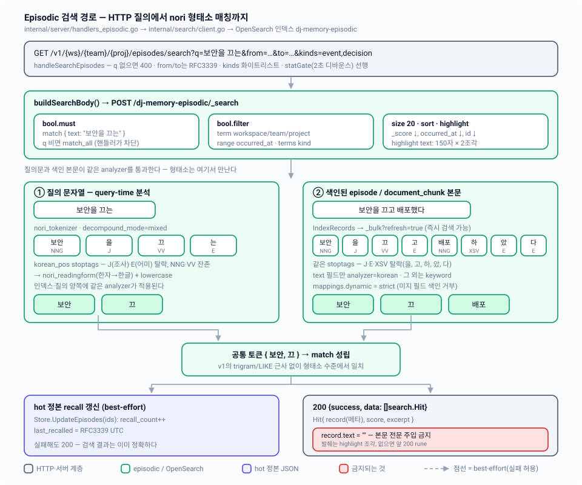

# 04 — Episodic: OpenSearch와 한국어 형태소 검색

episodic 평면의 검색 경로 — nori 형태소로 색인·질의하는 단일 OpenSearch 인덱스, 시간·kind 필터와 프로젝트 스코핑, 본문을 절대 돌려주지 않는 발췌 전용 응답 계약, 그리고 재수화 벌크 배칭.

| 항목 | 내용 |
|---|---|
| 관련 코드 | `internal/search/{search,mapping,transport,index,bulk,query}.go` · `internal/episodic/record.go` · `internal/server/handlers_episodic.go` · `internal/errs/errs.go` · `internal/server/apierr/apierr.go` · `deploy/opensearch/Dockerfile` |
| 관련 스펙 | [02-storage-model](02-storage-model.md)(hot 정본·manifest) · [03-lifecycle](03-lifecycle.md)(에이징 시 색인 삭제) · [06-documents](06-documents.md)(document_chunk) · [07-rehydration](07-rehydration.md)(drift·벌크 재적재) · [08-http-api](08-http-api.md)(엔드포인트 표면) · [11-testing](11-testing.md)(live/blackbox) · 인덱스: [README](README.md) |
| 상태 | 구현 완료. 단위 테스트 `internal/search/{search,index,bulk,query,schema_concurrency}_test.go`(fake transport), 실물 통합 `internal/search/live_test.go`(`DJ_MEMORY_LIVE_TEST=1`, `make live`), 블랙박스 시나리오 2·7(`-tags blackbox`, `make blackbox`) |



---

## 1. 왜 episodic이 검색 인덱스에 사는가

정본은 hot JSON이다(`~/.local/dj-memory/episodic/{ws}/{team}/{proj}.json`). 그런데 episodic은 **append-only 사건 로그**라서 정본만으로는 검색이 성립하지 않는다.

- **선형 스캔의 상한이 곧 검색 비용이다.** 프로젝트 파일은 `config.MaxProjectRecords = 5000`건 / `config.MaxProjectFileBytes = 5 << 20`(5MiB)까지 자란다([03-lifecycle](03-lifecycle.md)의 압박 조건). 매 검색마다 이걸 전부 JSON 디코드해 부분 문자열을 찾는 것은 성립하지 않는다.
- **한국어 형태소는 색인 시점 분석이 필요하다.** 질의 시점에만 분석하면 저장된 표면형("끄고")과 질의 표면형("끄는")은 영영 만나지 못한다. 양쪽을 같은 analyzer에 통과시켜 같은 토큰(`끄`)으로 환원해야 매칭이 성립한다 — 이것이 다이어그램 중앙의 요지다.
- **인덱스는 버려도 되는 파생물이다.** OpenSearch 컨테이너는 볼륨 없이 뜬다(`deploy/docker-compose.yml`). 인덱스가 통째로 사라져도 hot JSON에서 전량 재구성된다([07-rehydration](07-rehydration.md)). 그래서 인덱스에만 존재하는 콘텐츠는 없다.

knowledge 평면은 같은 이유로 Neo4j에 산다 — 역할 분담은 [01-overview](01-overview.md), 그래프 질의는 [05-knowledge-graph](05-knowledge-graph.md).

---

## 2. 인덱스 하나 — `dj-memory-episodic`

```go
// internal/search/mapping.go:6,11
const IndexName = "dj-memory-episodic"
const koreanAnalyzer = "korean"
```

**프로젝트별 인덱스가 아니다.** 모든 workspace/team/project가 단일 인덱스를 공유하고, 스코핑은 문서 필드(`workspace`, `team`, `project` keyword)로 한다. 이유는 재수화 경로에 있다 — 인덱스 하나만 drop하면 전체 파생물이 초기화되고, 프로젝트를 순회하며 벌크로 다시 채우면 끝난다(§9).

문서 `_id`는 복합 키다:

```go
// internal/search/bulk.go:36
func docID(key hotstore.ProjectKey, id string) string {
	return key.String() + docIDSep + id   // docIDSep = "#" → "ws/team/proj#01JD..."
}
```

- 서로 다른 프로젝트에 같은 ULID가 있어도 충돌하지 않는다.
- 같은 record를 다시 색인하면 **업서트**다. 재수화가 중복 문서를 만들지 않는 근거다.
- 다만 업서트만으로는 **사라진 record가 수렴되지 않는다.** 그래서 부분 재수화는 `DeleteProject`(delete-by-query)로 그 프로젝트 문서를 먼저 지우고 다시 채운다(§9.3).

색인되는 문서는 `episodic.Record`에 스코프 3필드를 덧붙인 것이다(`bulk.go:27`):

```go
type esDoc struct {
	episodic.Record
	Workspace string `json:"workspace"`
	Team      string `json:"team"`
	Project   string `json:"project"`
}
```

---

## 3. 매핑과 analyzer (`indexBody`)

`internal/search/mapping.go:26`의 `indexBody` 상수가 인덱스 생성 페이로드 전체다.

### 3.1 settings

| 항목 | 값 | 근거 |
|---|---|---|
| `number_of_shards` | `1` | 로컬 단일 노드 컨테이너 |
| `number_of_replicas` | `0` | 복제본 없음 — 파생물이므로 내구성은 hot이 책임진다 |
| tokenizer `korean_nori` | `nori_tokenizer`, `decompound_mode: mixed`, `discard_punctuation: "true"` | mixed는 복합명사를 원형과 구성요소로 **둘 다** 남겨 리콜을 올린다 |
| filter `korean_pos` | `nori_part_of_speech` + stoptags 18종 | 조사·어미 제거 (§3.3) |
| analyzer `korean` | `custom` = `korean_nori` + `[korean_pos, nori_readingform, lowercase]` | `nori_readingform`은 한자를 한글 독음으로, `lowercase`는 라틴 문자를 정규화 |

### 3.2 mappings

`"dynamic": "strict"` — 스펙에 없는 필드가 들어오면 색인이 **거부된다**(조용히 매핑이 늘어나지 않는다).

| 필드 | 타입 | 비고 |
|---|---|---|
| `workspace` / `team` / `project` | `keyword` | 프로젝트 스코핑 필터 |
| `id` | `keyword` | tie-break 정렬 대상 — text로 매핑되면 정렬이 깨진다 |
| `kind` | `keyword` | `terms` 필터 |
| `occurred_at` | `date` | RFC3339(기본 `strict_date_optional_time`), `range` 필터 |
| `actor` | `keyword` | 색인만 — 질의 경로 없음 |
| **`text`** | **`text`, `analyzer: "korean"`** | **유일한 전문 검색 대상** |
| `entities` | `keyword` | 색인만 — 질의 경로 없음 (§5.3) |
| `refs.doc_sha` | `keyword` | document_chunk 역참조 |
| `refs.chunk_seq` | `integer` | |
| `consolidated` | `boolean` | 색인만 — 필터 경로 없음 |
| `recall_count` | `integer` | |
| `last_recalled` | **`keyword`** | 도메인이 "한 번도 회상 안 됨"을 `""`로 표현한다(`episodic.Record.LastRecalled`). `date`였다면 빈 문자열을 거부하므로 의도적으로 keyword다 |

### 3.3 stoptags — 무엇이 탈락하는가

```json
["E","IC","J","MAG","MAJ","MM","SP","SSC","SSO","SC","SE","XPN","XSA","XSN","XSV","UNA","NA","VSV"]
```

Lucene nori의 거친 품사 태그 기준이다. 핵심은 **여기에 `NNG`(일반명사)와 `VV`(동사 어간)가 없다는 것** — 명사와 용언 어간은 살아남고, 조사(`J`)·어미(`E`)·파생접미사(`XSV`, `XSN`, `XSA`)·접두사(`XPN`)·부사류(`MAG`, `MAJ`)·관형사(`MM`)·구두점류(`SP`, `SC`, `SE`, `SSO`, `SSC`)·미분석 토큰(`UNA`, `NA`, `VSV`)은 버려진다.

그 결과가 다이어그램의 두 레인이다:

| | 원문 | 토큰 (품사) | stoptags 통과 후 |
|---|---|---|---|
| 색인 본문 | `보안을 끄고 배포했다` | 보안/NNG, 을/J, 끄/VV, 고/E, 배포/NNG, 하/XSV, 았/E, 다/E | **보안, 끄, 배포** |
| 질의문 | `보안을 끄는` | 보안/NNG, 을/J, 끄/VV, 는/E | **보안, 끄** |

교집합 `{보안, 끄}`가 비어 있지 않으므로 `match`가 성립한다.

---

## 4. v1의 근사(trigram/prefix)와 무엇이 다른가

v1 TypeScript(`src/search.ts`, 역사적 참조용으로 트리에 남아 있다)는 임베딩도 형태소 분석기도 없이 SQLite FTS5로 버텼다. `planQuery()`가 토큰마다 3갈래로 라우팅한다:

| 토큰 종류 | 전략 |
|---|---|
| 라틴/숫자 | word FTS **prefix** 질의 `"tok"*` (BM25) |
| CJK, 3자 이상 | **trigram** 구절 `"tok"` + word prefix — 사실상 부분 문자열 일치 |
| CJK, 2자 이하 | word prefix + **`LIKE '%tok%'` 스캔** — trigram 최소 길이 미만 |

이걸 `"보안을 끄는"` → `"보안을 끄고 배포했다"` 케이스에 대입하면:

- `보안을` (3자 CJK) → trigram 구절 `"보안을"`. 저장문에 `보안을`이라는 **문자열이 그대로 들어 있어서** 히트한다. 개념이 일치한 게 아니라 **조사까지 우연히 같아서** 걸린 것이다. 질의가 `보안이`, `보안은`, `보안 설정을`이었다면 즉시 0건이다.
- `끄는` (2자 CJK) → `LIKE '%끄는%'`. 저장문은 `끄고`이므로 **매칭 실패**. 동사는 아예 잡히지 않는다.

즉 v1은 **표면형 일치**다. 어미가 바뀌면(끄고/끄는/껐다/꺼진), 조사가 바뀌면(을/이/은/의), 복합어가 갈라지면(보안 설정/보안설정) 검색이 무너진다. 한국어처럼 교착어에서는 같은 개념이 매번 다른 표면형으로 나타나므로 실패가 예외가 아니라 기본값이다.

v2는 이 문제를 **근사하지 않고 분석기로 해결한다.** 색인 시점과 질의 시점에 동일한 `korean` analyzer가 적용되므로 두 문장 모두 `보안`·`끄`로 환원된다. 어미/조사/파생접미사는 stoptags에서 사라지고, 남는 것은 개념 단위 토큰이다.

이 계약은 테스트로 못 박혀 있다:

- `internal/search/live_test.go:TestLiveEpisodicIndexLifecycle` — 저장 `"보안을 끄고 오픈서치를 배포했다"`, 질의 `"보안을 끄는"`, 최상위 히트가 그 record여야 한다. 게이트는 `DJ_MEMORY_LIVE_TEST=1`(레포 전역 공통 게이트, `internal/graph`·`internal/cold`와 동일), 전용 스크래치 인덱스 `dj-memory-episodic-livetest`를 쓰고 끝나면 drop하므로 프로덕션 인덱스는 건드리지 않는다.
- `test/blackbox/blackbox_test.go:TestScenario02_EpisodicNoriSearch` — `noriQuery = "보안을 끄는"`이 `koreanEpisodeTexts[0] = "오늘 OpenSearch 보안을 끄고 단일 노드 모드로 컨테이너를 띄웠다."`를 HTTP 왕복으로 히트해야 한다.

> ⚠️ v1은 점수를 `text × trust_w × state_w × (1 + freshness + heat)`로 합성했다(`src/search.ts`의 `ScoreComponents`). v2 episodic에는 그 가중치 축이 없다 — episodic record에는 trust/state가 없고, 점수는 OpenSearch `_score` 하나뿐이다(§6 참조).

---

## 5. 질의 구성 — `buildSearchBody()`

```go
// internal/search/query.go:43
func buildSearchBody(key hotstore.ProjectKey, q Query) map[string]any
```

산출되는 `_search` 본문의 구조:

```jsonc
{
  "query": { "bool": {
    "must":   [ { "match": { "text": { "query": "보안을 끄는" } } } ],   // q 비면 match_all
    "filter": [                                                        // 비면 키 자체를 넣지 않는다
      { "term":  { "workspace": "..." } },
      { "term":  { "team": "..." } },
      { "term":  { "project": "..." } },
      { "range": { "occurred_at": { "gte": "...", "lte": "..." } } },   // From/To 있을 때만
      { "terms": { "kind": ["event","decision"] } }                     // Kinds 있을 때만
    ]
  }},
  "size": 20,
  "sort": [ {"_score":{"order":"desc"}}, {"occurred_at":{"order":"desc"}}, {"id":{"order":"desc"}} ],
  "highlight": { "fields": { "text": { "fragment_size": 150, "number_of_fragments": 2 } } }
}
```

### 5.1 must / filter 분리

- 텍스트만 `must`에 들어가 **점수에 기여**한다. 스코프·시간·kind는 전부 `filter` — 점수 영향 없이 후보만 자른다(필터 캐시 대상).
- `q.Text`가 공백뿐이면 `match_all`이다. 다만 HTTP 계층이 빈 `q`를 400으로 막으므로(§5.2) 이 경로는 내부 호출자와 테스트만 도달한다.
- `From`/`To`는 `UTC()` 변환 후 `time.RFC3339Nano`로 직렬화된다(`query.go:48,51`) — 클라이언트가 어떤 오프셋을 보내든 인덱스 쪽 비교는 UTC 하나다.
- 프로젝트 키가 zero-value면 `projectFilters`가 nil을 반환하고 `filter` 키 자체가 빠진다 — 전 프로젝트 질의(테스트·`DocCount`)의 경로다.
- 정렬은 `_score` → `occurred_at` → `id` 전부 내림차순. **점수 동률이면 최신 순**이고, `occurred_at`까지 같으면 ULID 역순으로 완전히 결정적이다.

### 5.2 HTTP 파라미터 매핑

`GET /v1/{ws}/{team}/{proj}/episodes/search` (`internal/server/handlers_episodic.go:161` `handleSearchEpisodes`)

| 쿼리 파라미터 | 필수 | 검증 | `search.Query` 필드 |
|---|---|---|---|
| `q` | ✅ | 빈 문자열이면 400 `{code:"invalid_request", message:"q is required"}` | `Text` |
| `from` | | `parseTimeParam` — RFC3339 아니면 400 | `From` |
| `to` | | 동일 | `To` |
| `kinds` | | 콤마 분리, `parseKindsParam`이 **`episodic.ValidKind`** 화이트리스트로 검증(미지 값이면 400) | `Kinds` |

`kinds` 검증이 도메인 함수를 직접 부르는 것이 리팩터링의 결과다 — 서버가 갖고 있던 사본 슬라이스는 삭제되고, 어휘의 소유자는 `internal/episodic`(`ValidKind`/`ValidActor`) 하나로 통일됐다(code-standards §4).

경로 세그먼트는 `validateProjectKey`(`internal/server/validate.go:61`)로 `^[a-z0-9._-]+$` 및 dot-path 금지를 검사한다 — hot 파일 경로·S3 키에 그대로 박히는 값이기 때문이다([02-storage-model](02-storage-model.md)).

**API에 없는 것**: `size`/`limit`, `entities` 필터, `include_archived`, `consolidated` 필터, 페이지네이션 커서. 핸들러는 `Query.Size`를 설정하지 않으므로 항상 `DefaultSearchSize = 20`으로 잘린다. (`paramIncludeArchived` 상수는 존재하지만 knowledge 검색 전용이다.)

### 5.3 색인되지만 질의되지 않는 필드

`actor`, `entities`, `consolidated`, `recall_count`는 매핑에 있고 `_source`에도 들어가지만 `buildSearchBody`가 이들에 대한 필터를 만들지 않는다. entity 기반 조회는 knowledge 평면(Neo4j `Neighborhood`)이 담당하고([05-knowledge-graph](05-knowledge-graph.md)), `consolidated` 판정은 consolidation이 hot을 직접 읽어서 한다([03-lifecycle](03-lifecycle.md)). 즉 이 필드들은 재수화 왕복(`_source` 복원)과 향후 확장을 위한 것이며, 현재 검색 표면에는 노출되지 않는다.

---

## 6. 발췌 전용 응답 계약

```go
// internal/search/search.go:63
type Hit struct {
	Record episodic.Record `json:"record"`
	Score  float64         `json:"score"`
	// Excerpt is a highlighted fragment of Text, not the full body.
	Excerpt string `json:"excerpt"`
}
```

`(*client).Search`의 히트 변환 루프가 계약의 전부다(`internal/search/query.go:138-143`):

```go
rec := h.Source.Record
excerpt := strings.Join(h.Highlight[highlightField], excerptJoiner)   // " … "
if excerpt == "" {
	excerpt = truncateRunes(rec.Text, excerptMaxRunes)                // 200 rune + "…"
}
rec.Text = "" // excerpt-only responses; never inject the full body (§7)
```

- 하이라이트는 최대 **150자 × 2조각**(`highlightFragmentSize`/`highlightFragments`), 조각 사이는 `excerptJoiner = " … "`로 잇는다. `<em>` 태그가 그대로 남는다(코드가 pre/post tag를 지정하지 않으므로 OpenSearch 기본값).
- 하이라이트가 없으면(예: `match_all`) 본문 앞 **200 rune**(`excerptMaxRunes`)으로 대체하고 `excerptEllipsis = "…"`를 붙인다. rune 단위라 한글이 잘려 깨지지 않는다.
- **`Record.Text`는 항상 빈 문자열로 지워진다.** 인덱스의 `_source`에는 본문이 그대로 있지만(발췌를 만들려면 필요하다) 응답 경계에서 제거한다.

왜 본문을 주지 않는가:

1. **원본은 hot이 소유한다.** 파생물이 본문의 배포 창구가 되면 "인덱스에만 있는 콘텐츠"라는 금지선이 흐려진다([02-storage-model](02-storage-model.md)).
2. **컨텍스트 예산 통제.** 검색 한 번에 20건 × 수 KB 본문이 에이전트 컨텍스트로 무통제 유입되는 것을 구조적으로 막는다. 발췌를 보고 필요한 것만 지목해서 가져가는 흐름을 강제한다.
3. 본문이 필요하면 **`GET /v1/{ws}/{team}/{proj}/episodes/{id}`**(`handleGetEpisode`, `handlers_episodic.go:299`) — hot 조회가 `errs.ErrNotFound`면 `ColdArchive.FetchArchivedEpisode`로 S3 아카이브까지 폴백한다. cold로 내려간 episode도 provenance 링크가 계속 풀린다([03-lifecycle](03-lifecycle.md), [07-rehydration](07-rehydration.md)).

검증: `internal/search/query_test.go:TestSearchHitsAreExcerptOnly`, `TestSearchJoinsHighlightFragments`, `TestTruncateRunes`, 그리고 `live_test.go`가 `hits[0].Record.Text != ""`를 실패로 처리한다.

### 6.1 recall 통계 갱신 — best-effort, 그리고 색인 수렴까지

검색이 성공하면 `bumpRecall`(`handlers_episodic.go:215`)이 hot 정본의 `recall_count++`, `last_recalled = RFC3339 UTC`를 기록한다(시각은 주입된 `s.clock`에서 온다 — 핸들러는 `time.Now()`를 직접 부르지 않는다). 실패는 로그로만 남기고 응답은 그대로 200이다("검색 결과는 이미 정확하다").

그 다음이 리팩터링에서 추가된 핵심이다. `bumpRecall`은 `convergeEpisodes`(`handlers_episodic.go:249`)를 호출해 **방금 고쳐 쓴 record만** 다시 색인하고 `markIndexed`로 manifest 신선도(`Dirty=false`, `IndexedAt=now`, plane hydration sha)를 갱신한다:

- `recall_count`/`last_recalled`/`consolidated`는 매핑된 색인 필드이므로(§3.2) hot만 고치면 파생 문서가 즉시 낡는다.
- hydration sha는 hot 파일 전체를 덮으므로, 이 수렴이 없으면 재수화 직후 첫 검색이 `CheckDrift`를 `"episodic hot content changed since last hydration"`으로 영구히 뒤집는다 — 그리고 그 상태를 지울 재색인이 다음 검색에 다시 더럽혀지므로 절대 수렴하지 않는다.
- 낡은 mtime 때문에 stat-gate가 디바운스(2초)를 넘긴 모든 검색마다 **프로젝트 전체**를 재수화하던 문제도 같이 닫힌다.

남는 비용은 정직하게 적어 둔다: 검색 1회 = hot 파일 재기록 1회 + `ListEpisodes` 재독 1회 + 히트 수(≤20)만큼의 `_bulk` 1회. `s.index == nil`이거나 재색인이 실패하면 `markDirty(PlaneEpisodic)`로 떨어져 다음 재수화가 수렴시킨다.

---

## 7. refresh 의미론 — read-after-write

```go
// internal/search/bulk.go:118-123
req := rawRequest{
	path:        bulkPath,
	query:       url.Values{"refresh": {"true"}},   // 실시간 계약
	body:        payload,
	contentType: contentTypeNDJSON,
}
```

모든 벌크 쓰기(색인·삭제 공통)가 `refresh=true`다. OpenSearch 기본 `refresh_interval`(1초)을 기다리지 않고 즉시 검색 가능해진다. `DeleteProject`의 `_delete_by_query`도 같은 `refresh=true`를 쓰고(`index.go:195`), 여기에 `conflicts=proceed`를 더해 스크롤 중 다른 쓰기가 건드린 문서 때문에 패스 전체가 실패하지 않게 한다.

- **왜 필요한가**: `POST /episodes`가 201로 돌아온 직후 같은 에이전트가 검색하면 방금 쓴 record가 나와야 한다. 로컬 개인 메모리 서버에서 "1초 뒤에 보입니다"는 디버깅 불가능한 비결정성이다.
- **대가**: 쓰기마다 세그먼트 refresh를 강제한다. 단일 노드·로컬 도구·저빈도 쓰기라는 전제에서 수용한 트레이드오프다. 재수화 벌크도 같은 경로를 쓰므로 500건 배치마다 refresh가 일어난다.
- **인덱스가 없을 때**: `Search`는 `_search` 404를 **빈 배열로 바꾸지 않는다.** `indexAbsent`가 `errs.KindUnavailable`을 올리고 핸들러가 503으로 응답한다(`query.go:120-127`). "아무것도 매칭되지 않았다"와 "파생 저장소가 통째로 사라졌다"를 호출자가 구분할 수 없게 만드는 조용한 0건이 금지선이기 때문이다. 회복은 두 경로다 — 요청 진입 시 `statGate`가 재수화하고, `CheckDrift`가 `"episodic index absent or uncountable"`로 잡는다([07-rehydration](07-rehydration.md)). 검증: `query_test.go:TestSearchMissingIndexIsUnavailable`.
- 그럼에도 블랙박스는 `waitFor(20s)` 폴링으로 검증한다 — refresh 자체가 아니라 HTTP 왕복·statGate 재수화·프로세스 기동 타이밍까지 감싸는 방어다.

---

## 8. 스키마 수렴 가드 — 조용한 리콜 파괴 방지

이 패키지에서 가장 방어적인 코드다(`internal/search/index.go`). 배경:

> OpenSearch는 존재하지 않는 인덱스에 `_bulk`가 들어오면 **dynamic mapping으로 자동 생성**한다. 그렇게 만들어진 인덱스에는 nori analyzer가 없고 `id`가 `text`로 매핑된다. 에러는 나지 않는다 — 한국어 리콜이 조용히 표면형 매칭으로 퇴화하고 `id` 정렬이 깨진다.

그래서 구현체는 매핑 수렴을 래치로 강제한다:

```go
// internal/search/search.go:116
type client struct {
	os    doer          // opensearch.Client의 Do 하나만 소비하는 narrow interface
	index string
	log   *slog.Logger

	schemaMu    sync.Mutex   // schemaReady를 지킨다
	schemaReady bool
}
```

| 메서드 | 동작 |
|---|---|
| `ensureSchema`(`index.go:38`) | 쓰기 경로의 가드. 래치가 없으면 `ensureIndexLocked`. **래치가 있어도 `indexExists`(HEAD) 한 번은 반드시 확인한다** — 컨테이너가 교체되면 래치는 "수렴됨"이라 우기는데 실제 인덱스는 사라져 있고, 그 상태의 `_bulk`가 정확히 이 가드가 막으려던 nori 없는 인덱스를 만들기 때문이다. 비싼 `_settings` 읽기만 래치된다. 호출자는 **`IndexRecords`(`bulk.go:47`)와 `DeleteRecords`(`bulk.go:78`) 둘뿐**이고, 각각 빈 슬라이스 no-op 직후·첫 `_bulk` 직전에 부른다 |
| `EnsureIndex`(`index.go:21`) | 공개 진입점. `schemaMu` 잡고 `ensureIndexLocked`. 재수화 경로가 명시 호출한다 |
| `ensureIndexLocked`(`index.go:59`) | `indexExists` → **있으면** `hasKoreanAnalyzer`로 실제 확인 → 매핑 정상이면 래치하고 성공 / 아니면 **경고 로그 후 `dropIndex` + 재생성**(매핑은 in-place 변경 불가, 파생물이므로 버려도 된다). **없으면** `createIndexLocked` |
| `indexExists`(`index.go:89`) | `HEAD /{index}` — 200/404만 정상, 그 외는 `unexpected`(KindInternal) |
| `createIndexLocked`(`index.go:106`) | `PUT /{index}` + `indexBody`. 200이거나 400 + `resource_already_exists_exception`(동시 생성 경쟁)이면 성공하고 래치 |
| `hasKoreanAnalyzer`(`index.go:135`) | `GET /{index}/_settings`에서 `settings.index.analysis.analyzer["korean"]` 존재 여부. dynamic 자동 생성 인덱스에는 `analysis` 블록 자체가 없다는 점을 판별 신호로 쓴다 |
| `Drop`(`index.go:161`) | 인덱스 삭제 후 `schemaReady = false` — 다음 쓰기가 `_bulk` 자동 생성 대신 정상 생성 경로를 타게 한다 |
| `DeleteProject`(`index.go:180`) | `_delete_by_query`로 **한 프로젝트 문서만** 삭제. 인덱스와 래치는 그대로 둔다. zero-value 키는 "전 프로젝트 삭제"가 되므로 `errs.Invalid`로 거부한다 |

검증: `index_test.go`의 `TestWritesEnsureMappingBeforeBulk`(매핑 PUT이 `_bulk`보다 먼저 오고 `nori_tokenizer`를 담고 있어야 한다), `TestEnsureIndexCreatesWithNoriMapping`, `TestEnsureIndexIdempotent`, `TestWriteAfterContainerReplacementRecreatesMapping`, `TestDropResetsMappingState`, `TestDeleteProjectRejectsZeroKey`, 그리고 `schema_concurrency_test.go`의 `TestConcurrentEnsureIndexCreatesOnce` / `TestConcurrentEnsureSchemaConvergesOnce`.

---

## 9. 벌크 배칭과 재수화

리팩터링으로 파일이 관심사별로 갈렸으므로 상수도 각자의 집에 있다:

| 상수 | 값 | 위치 | 의미 |
|---|---|---|---|
| `DefaultSearchSize` | `20` | `search.go:46` | `Query.Size` 미설정 시 히트 상한. 이 표에서 유일한 exported 상수이고, 패키지 전체로도 exported 상수는 이것과 §2의 `IndexName` 둘뿐이다 |
| `bulkBatchSize` | `500` | `bulk.go:17` | `_bulk` 한 요청의 record 수 |
| `excerptMaxRunes` | `200` | `query.go:16` | 하이라이트 없을 때 발췌 길이 |
| `highlightFragmentSize` / `highlightFragments` | `150` / `2` | `query.go:25-26` | 하이라이트 조각 크기·개수 |

### 9.1 `IndexRecords` (`bulk.go:41`)

1. 빈 슬라이스는 즉시 no-op (`_bulk`도, `ensureSchema`도 부르지 않는다)
2. `ensureSchema` (§8)
3. `recs`를 **500건씩** 잘라 ndjson 조립:
   ```
   {"index":{"_index":"dj-memory-episodic","_id":"ws/team/proj#01JD..."}}
   {"id":"01JD...","kind":"event",...,"workspace":"...","team":"...","project":"..."}
   ```
4. `POST /_bulk?refresh=true`, 응답의 `errors`가 true면 첫 실패 항목을 에러로 승격(`notFoundOK = false`)

### 9.2 `DeleteRecords` (`bulk.go:72`)

동일한 500건 배칭에 액션만 `delete`이고 `notFoundOK = true`다. 이미 없는 문서에 대한 404는 무시한다 — 에이징이 중간에 실패하고 재시도돼도 멱등해야 하기 때문이다([03-lifecycle](03-lifecycle.md): S3 put → hot 제거 → 인덱스 삭제 순서, 인덱스 삭제는 best-effort). 호출자는 `internal/consolidate/age.go:90`의 `deleteFromIndex` 하나이고, 실패하면 `MarkDirty(PlaneEpisodic)`로 떨어진다.

### 9.3 재수화 경로 (`internal/rehydrate`)

| 경로 | 동작 |
|---|---|
| `rehydrateEpisodicAll` (`hydrate.go:51`) — `POST /v1/reindex`, 기동 시 드리프트 감지 | `Drop` → `EnsureIndex` → 프로젝트 순회하며 `ListEpisodes` → `IndexRecords`. `verify=true`면 프로젝트별 `DocCount == len(recs)` 대조 |
| `rehydrateProjectEpisodic` (`hydrate.go:168`) — statGate 부분 수렴 | Drop 없이 `EnsureIndex` → `ListEpisodes` → **`DeleteProject`** → `IndexRecords`. 업서트만으로는 hot에서 사라진 record가 영원히 검색되므로, 전체 경로의 drop-then-bulk를 프로젝트 범위로 축소한 delete-then-replay다. **hot이 비어 있어도 delete는 반드시 실행한다** — "hot에 아무것도 없다"가 곧 "색인된 모든 문서가 낡았다"인 상태다 |
| `episodicDrift` (`rehydrate.go:226`) — `/v1/status`, 기동 검사 | `Ping` → `DocCount(ProjectKey{})`(전체 프로젝트) vs manifest의 episodic 레코드 합계. 단계마다 다른 `Reason`을 낸다 — 미구성 `reasonIndexNotConfigured` / `Ping` 실패 `reasonIndexUnreachable`(둘 다 `Unavailable=true`) / `DocCount` 실패 `reasonIndexAbsent`(= `"episodic index absent or uncountable"`) / 개수 불일치·dirty 파일은 인라인 포맷 문자열 / hydration sha 변화 `reasonEpisodicChanged`. 상수 전부 `rehydrate.go:44-54` |
| `derivedLost` (`hydrate.go:325`) — statGate 보조 | `DocCount(key) < manifest RecordCount`면 컨테이너 교체로 판단해 부분 재수화를 트리거한다. **부족분만** 드리프트로 본다 — 초과분은 부분 경로가 고칠 수 없으므로(`/reindex` 몫) 매 요청 재수화 루프가 되기 때문이다 |

`DocCount`에 zero-value `ProjectKey{}`를 주면 `projectFilters`가 nil을 반환해 **전체 문서 수**를 센다. 이것이 drift 판정의 좌변이다.

### 9.4 document_chunk

문서 인제스트는 청크를 `kind: document_chunk` episode로 만들어 `indexChunks`(`internal/document/ingest.go:180`)를 통해 **한 번의 `IndexRecords` 호출**로 넘긴다. `config.MaxDocumentChunks = 500`이 `bulkBatchSize = 500`과 같으므로 문서 하나는 정확히 `_bulk` 1회다. 색인 실패는 인제스트를 실패시키지 않고 `reportDegraded`가 manifest를 dirty로 마크한 뒤 `degraded: ["search unavailable"]`을 결과에 싣는다([06-documents](06-documents.md)). 소비자 측 인터페이스는 `document.RecordIndexer`(`document.go:122`) — `IndexRecords` 하나짜리 narrow interface다.

---

## 10. 에러 2계층과 저하 모드

리팩터링으로 패키지 센티넬(`search.ErrUnavailable`)이 사라지고, **모든 하위 계층 에러가 `*errs.Error`**, **HTTP 상태 결정은 `internal/server/apierr` 한 곳**이라는 2계층 구조가 자리 잡았다(code-standards §2).

### 10.1 search가 만드는 도메인 에러

| 헬퍼 | Kind | 언제 |
|---|---|---|
| `unreachable`(`transport.go:106`) | `KindUnavailable` | 전송 실패 / `resp == nil` / 본문 읽기 실패 / HTTP ≥ 500. `method`·`path`를 구조화 필드로 붙인다 |
| `indexAbsent`(`transport.go:116`) | `KindUnavailable` | `_search`가 404 — "찾는 게 없다"가 아니라 "파생 저장소가 없다"이므로 NotFound가 아니다 |
| `unexpected`(`transport.go:124`) | `KindInternal` | 우리 요청이 유발할 리 없는 응답 상태. 응답 본문은 cause에만 남고 클라이언트에는 가지 않는다 |
| `malformed`(`transport.go:133`) | `KindInternal` | 우리 쪽 인코딩/디코딩 실패 |
| `errs.Invalid`(`index.go:185`) | `KindInvalid` | `DeleteProject`에 zero-value 키 |

`(*client).do`(`transport.go:69`)가 승격 지점을 한 곳으로 모은다. 그 외 오류 상태는 `(status, body, nil)`로 돌려주고 **엔드포인트별로** 판단한다 — 404가 실패인지 아닌지는 엔드포인트만 안다.

각 exported 메서드는 자기 `Op` 문자열(`opSearch = "search.Search"` 등, `search.go:27-37`)을 에러에 실어 보내므로 로그에서 실패 지점이 문자열 파싱 없이 드러난다.

### 10.2 핸들러가 상태 코드로 바꾸는 지점

| 상황 | 동작 |
|---|---|
| `POST /episodes` + `s.index == nil` | hot append 성공 → **201** + `degraded: ["search unavailable"]` + `markDirty(PlaneEpisodic)` |
| `POST /episodes` + 색인 실패(Kind 무관) | 동일하게 **201** + degraded + dirty. 로그에 warn |
| `POST /episodes` + hot 실패 | `apierr.From(err)` — 중복 ID면 **409**, IO 실패면 **500** `"internal error"`. 정본 쓰기는 타협 없음 |
| `GET /episodes/search` + `s.index == nil` | **503** `"search unavailable"` (statGate보다 먼저 걸린다) |
| `GET /episodes/search` + `errors.Is(err, errs.ErrUnavailable)` | **503** `"search unavailable"` — `unavailable(degradedSearch).WithCause(err)`, cause는 로그로만 |
| `GET /episodes/search` + 그 외(`KindInternal`) | `apierr.From(err)` → **500** `"internal error"` |
| `_search` 404 (인덱스 없음) | 위의 `KindUnavailable` 경로 → **503** |
| `_count` 404 | `0` 반환 — 오류가 아니라 정당한 drift 신호 (`query.go:167-170`) |

`degradedSearch = "search unavailable"` 문자열은 서버 계층에서 `internal/server/degraded.go:13` 한 곳에 선언되고, 쓰기 degraded 노트·검색 503 본문·`/v1/status`의 `degraded` 배열(`handlers_ops.go:84`)이 전부 그 상수를 쓴다([10-operations](10-operations.md)). 503 본문을 `apierr.From`이 아니라 `unavailable(...)` 헬퍼로 만드는 이유가 이것이다 — 쓰기가 degraded 노트로 실었을 문구와 읽기의 503 메시지가 **글자 그대로 같아야** 클라이언트가 어휘 하나만 알면 된다(`internal/server/respond.go:87-93`).

문자열 자체는 한 벌 더 있다: `internal/document`는 server를 import하지 않으므로 같은 값을 자기 상수로 선언한다(`document.go:45`, 주석이 "mirror the server's degraded vocabulary word for word"라고 못 박는다). 패키지 의존 방향을 지키려고 의도적으로 남긴 중복이지 실수가 아니다.

블랙박스 시나리오 7이 이 표를 통째로 검증한다: OpenSearch 컨테이너 정지 → 쓰기 201 + degraded → 검색 503 → 컨테이너 복구 → `/v1/reindex` → 그 record가 검색된다.

---

## 11. 인프라

| 항목 | 값 |
|---|---|
| 이미지 | `opensearchproject/opensearch:2.19.1` + `opensearch-plugin install --batch analysis-nori` (`deploy/opensearch/Dockerfile`) |
| 기동 | `discovery.type=single-node`, `DISABLE_SECURITY_PLUGIN=true`, `DISABLE_INSTALL_DEMO_CONFIG=true`, `OPENSEARCH_JAVA_OPTS=-Xms512m -Xmx512m` |
| 포트 | `127.0.0.1:9200` (루프백 바인딩) |
| 볼륨 | **없음** — 의도적 비영속 |
| healthcheck | `curl _cluster/health`의 status가 green 또는 yellow일 때까지 (5초 간격, 최대 30회, start_period 20초) |
| 클라이언트 | `github.com/opensearch-project/opensearch-go/v4 v4.7.3`. 다만 고수준 API 대신 `rawRequest`(자체 `opensearch.Request` 구현, `transport.go:34`)로 경로·쿼리·본문을 직접 조립하고, 소비하는 것은 `Do` 하나짜리 `doer` 인터페이스뿐이다(`search.go:102`) |
| 설정 | `search.Config{URL, Logger}` — `cmd/memory-mcp/main.go:113`에서 `cfg.OpenSearchURL`(env `DJ_MEMORY_OPENSEARCH_URL`, 기본 `http://127.0.0.1:9200`)로 주입. 생성 실패는 fatal이 아니라 `index = nil` 저하 모드다 |

`analysis-nori`가 없는 이미지로 갈아끼우면 `createIndexLocked`의 `PUT`이 `unknown tokenizer [nori_tokenizer]`로 400을 받고 `unexpected` → `KindInternal`이 된다. 그 에러는 `ensureSchema` → `IndexRecords` → 핸들러의 degraded 경로로 전파되므로 **쓰기는 계속 201로 성공**하고, 인덱스가 끝내 생기지 않으므로 검색은 `indexAbsent`를 거쳐 503이 된다.

---

## 12. ⚠️ 설계 문서와 차이

| # | 설계 문서(`architecture-v2.md` / `code-standards.md`) | 실제 코드 |
|---|---|---|
| 1 | architecture-v2 §7: recall 응답은 "발췌+메타+**점수 구성요소**" | `Hit`은 단일 `Score float64`(OpenSearch `_score`)만 담는다. v1의 `ScoreComponents`(text/trust/state/freshness/heat) 같은 분해는 episodic에 없다 |
| 2 | architecture-v2 §7: recall은 `include_archived` 옵트인 | episodic 검색에는 이 파라미터가 없다. archived/active 상태는 knowledge 평면 개념이며, episodic record에는 상태 필드 자체가 없다 |
| 3 | architecture-v2 §7 파라미터 표: `q&from=&to=&kinds=` | 코드도 동일하지만, **결과 건수 상한(20)이 문서화되어 있지 않고 조정 파라미터도 없다.** `search.Query.Size`는 존재하지만 핸들러가 채우지 않는다 |
| 4 | architecture-v2 §2/§5: 인덱스 구성 방식 명시 없음. code-standards §1 예시 `Client`는 `EnsureIndex(ctx, key)` / `Search(ctx, q)`로 프로젝트별 인덱스를 암시하고, 쓰기 메서드를 `Upsert`로, §1.1 소비자 예시를 `Delete`로 적는다 | 모든 프로젝트가 **단일 인덱스 `dj-memory-episodic`** 을 공유하고 스코핑은 keyword 필드로 한다. 그래서 실제 시그니처는 `EnsureIndex(ctx)`(키 없음) / `Search(ctx, key, q)`(키가 필터)로 예시와 반대이고, 메서드 이름도 `IndexRecords` / `DeleteRecords`다(`consolidate.EpisodeIndexer`도 `DeleteRecords`를 요구한다). 규약이 강제하는 **형태**(exported 인터페이스 + unexported 구현 + 단일 `New`)는 지켜졌고 다른 것은 예시의 이름·인자뿐이다. §5의 "인덱스 drop 후 bulk"와는 정합적이지만 문서에 명시된 적은 없다 |
| 5 | architecture-v2 §2.1: `entities`는 record 필드 | 인덱스 매핑에는 있으나 **질의 경로가 없다.** entity 기반 조회는 knowledge 평면 전용이다 |

> code-standards §1(exported `Client` 인터페이스 + unexported `client` + 단일 `New(Config) (Client, error)`)과 §2(2계층 에러: `internal/errs` → `internal/server/apierr`)는 이제 코드가 그대로 따른다. 예전 판에 있던 "`search.Index` 인터페이스", "`NewClient(url)`", "`errs`/`apierr` 패키지 부재", "패키지 센티넬 `ErrUnavailable`", "`writeError(w, status, msg)`" 차이 항목은 모두 해소되어 삭제했다.

---

## 13. 코드 위치

| 개념 | 파일 | 심볼 |
|---|---|---|
| 인덱스 이름 / analyzer 이름 | `internal/search/mapping.go` | `IndexName`, `koreanAnalyzer` |
| 매핑·analyzer 정의 전문 | `internal/search/mapping.go` | `indexBody` |
| 인덱스 계약(인터페이스) · 구현체 · 생성자 | `internal/search/search.go` | `Client`, `client`, `New`, `newClient`, `Config`, `doer`, `Query`, `Hit`, `DefaultSearchSize`, `op*` 상수 |
| 요청 어댑터 · 오류 승격 · Ping | `internal/search/transport.go` | `rawRequest`, `(*client).do`, `Ping`, `unreachable`, `indexAbsent`, `unexpected`, `malformed` |
| 매핑 수렴·복구·프로젝트 삭제 | `internal/search/index.go` | `EnsureIndex`, `ensureSchema`, `ensureIndexLocked`, `indexExists`, `createIndexLocked`, `hasKoreanAnalyzer`, `Drop`, `DeleteProject`, `dropIndex` |
| 벌크 색인/삭제 배칭 · 문서 id · 색인 문서 | `internal/search/bulk.go` | `IndexRecords`, `DeleteRecords`, `bulk`, `bulkAction`, `bulkBatchSize`, `docID`, `esDoc` |
| 질의 본문 조립 · 발췌 전용 변환 · 카운트 | `internal/search/query.go` | `buildSearchBody`, `projectFilters`, `Search`, `DocCount`, `truncateRunes`, `excerptMaxRunes` |
| record 도메인·검증·어휘 | `internal/episodic/record.go` | `Record`, `Kind`, `Actor`, `Refs`, `ValidKind`, `ValidActor`, `Validate` |
| 도메인 에러 어휘 | `internal/errs/errs.go` | `Kind`, `Error`, `Unavailable`, `Internal`, `Invalid`, `ErrUnavailable` |
| 상태 코드 매핑 | `internal/server/apierr/apierr.go` | `From`, `mappingFor`, `CodeUnavailable` |
| 핸들러가 보는 색인 표면(소비자 narrow interface) | `internal/server/deps.go` | `EpisodeIndex`(`IndexRecords`/`Search` 둘뿐), `ColdArchive`, `Clock`, `IDGenerator` |
| 검색 엔드포인트·파라미터 검증 | `internal/server/handlers_episodic.go` | `handleSearchEpisodes` |
| 색인 best-effort 쓰기 | `internal/server/handlers_episodic.go` | `handleCreateEpisode` |
| 본문 조회(hot → cold 폴백) | `internal/server/handlers_episodic.go` | `handleGetEpisode` |
| recall 통계 갱신 · 색인 수렴 | `internal/server/handlers_episodic.go` | `bumpRecall`, `convergeEpisodes` |
| 파라미터 파서 | `internal/server/validate.go` | `parseTimeParam`, `parseKindsParam`, `validateProjectKey` |
| degraded 문자열·manifest 신선도·statGate | `internal/server/degraded.go` | `degradedSearch`, `statGate`, `markDirty`, `markIndexed` |
| 503/400 응답 구성 | `internal/server/respond.go` | `unavailable`, `badRequest`, `writeAPIError`, `Envelope` |
| 벌크 재수화 | `internal/rehydrate/hydrate.go` | `rehydrateEpisodicAll`, `RehydrateProject`, `rehydrateProjectEpisodic`, `StatGate`, `derivedLost` |
| 드리프트 판정 | `internal/rehydrate/rehydrate.go` | `episodicDrift`, `EpisodeIndex`, `reasonIndexAbsent` |
| 에이징 시 색인 삭제 | `internal/consolidate/age.go` | `deleteFromIndex` |
| 청크 색인 | `internal/document/ingest.go`, `internal/document/document.go` | `ensureChunks`, `indexChunks`, `reportDegraded`, `RecordIndexer` |
| OpenSearch URL 설정 · 주입 | `internal/config/config.go`, `cmd/memory-mcp/main.go` | `Config.OpenSearchURL`, `search.New` |
| 컨테이너 · nori 플러그인 | `deploy/opensearch/Dockerfile`, `deploy/docker-compose.yml` | — |
| 단위 테스트(fake transport) | `internal/search/{search,index,bulk,query,schema_concurrency}_test.go` | `TestWritesEnsureMappingBeforeBulk`, `TestSearchRequestBody`, `TestSearchHitsAreExcerptOnly`, `TestSearchMissingIndexIsUnavailable`, `TestIndexRecordsBatchesLargeSets`, `TestDeleteProject` |
| 실물 통합 테스트 | `internal/search/live_test.go` | `TestLiveEpisodicIndexLifecycle` (`DJ_MEMORY_LIVE_TEST=1`) |
| 블랙박스 시나리오 2·7 | `test/blackbox/{blackbox,fixtures}_test.go` | `TestScenario02_EpisodicNoriSearch`, `TestScenario07_DegradedMode`, `noriQuery`, `koreanEpisodeTexts` |
