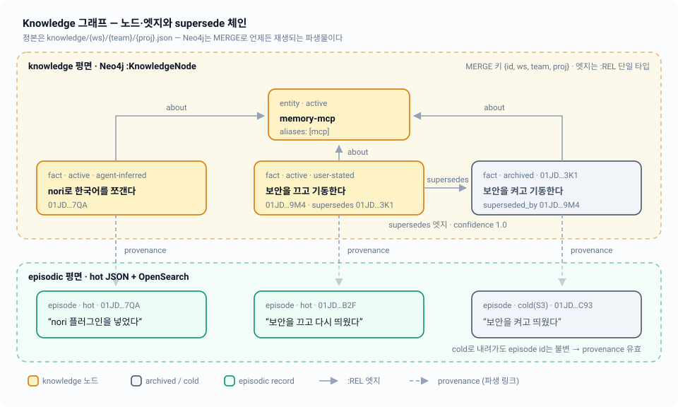

# 05 — Knowledge 그래프: Neo4j와 supersede 체인

"지금 무엇이 참인가"를 담는 knowledge 평면의 노드·엣지 모델, Neo4j로 실제로 나가는 Cypher, 그리고 삭제 대신 개정으로 진실을 갱신하는 supersede 체인.

| 항목 | 내용 |
|---|---|
| 관련 코드 | `internal/knowledge/knowledge.go` · `internal/graph/graph.go` · `internal/graph/convert.go` · `internal/server/handlers_knowledge.go` |
| 관련 스펙 | [01-overview](01-overview.md) · [02-storage-model](02-storage-model.md) · [03-lifecycle](03-lifecycle.md) · [04-episodic-search](04-episodic-search.md) · [06-documents](06-documents.md) · [07-rehydration](07-rehydration.md) · [08-http-api](08-http-api.md) · [11-testing](11-testing.md) · 인덱스: [README](README.md) |
| 상태 | 구현 완료. 본 문서는 위 Go 코드를 읽고 실측해서 쓴 것이며, 설계 문서([architecture-v2.md](../design/architecture-v2.md) §2·§2.2·§3·§5·§7)와 어긋나는 지점은 ⚠️로 표시했다 |



## 1. 왜 그래프인가

episodic이 시간축의 append-only 로그라면 knowledge는 **관계축**이다. 실제로 필요한 질문 세 가지가 전부 관계를 따라가는 질문이다.

| 질문 | 필요한 연산 | 구현 |
|---|---|---|
| "memory-mcp에 대해 아는 게 뭐지?" | entity를 중심으로 n-hop 이웃 | `Client.Neighborhood` |
| "이 사실은 뭘 뒤집은 거지?" | supersedes 링크를 양방향으로 추적 | `Client.SupersedeChain` |
| "이건 어디서 알게 됐지?" | 노드 → 유래 episode 역참조 | `provenance` 속성 |

앞의 둘은 가변 홉 순회라서 관계형 조인으로 풀면 홉마다 쿼리가 는다. 세 번째는 그래프 순회가 아니라 **id 배열 참조**로 풀려 있다(§7 참고). 그래서 Neo4j를 쓰되, 정본은 여전히 hot JSON 한 덩어리(`knowledge.Graph`)이고 Neo4j는 **언제든 버리고 `MERGE`로 재생하는 파생물**이다 — 이 비대칭이 아래 모든 설계 결정을 지배한다.

## 2. 노드와 엣지 — `internal/knowledge`의 실제 타입

`knowledge.Graph`는 프로젝트 한 개의 knowledge 문서 전체다. hot 경로는 `knowledge/{ws}/{team}/{proj}.json`이고, `hotstore.FileStore.WriteKnowledge`가 통째로 원자 교체한다([02 · 저장 모델](02-storage-model.md)).

```go
type Graph struct {
    Nodes []Node `json:"nodes"`
    Edges []Edge `json:"edges"`
}
```

### 2.1 Node

| 필드 | 타입 | 의미 |
|---|---|---|
| `id` | `string` | ULID. 불변, 노드 정체성의 유일한 근거 |
| `kind` | `NodeKind` | `entity` \| `fact` \| `lesson` \| `preference` \| `document` |
| `name` / `body` | `string` | 표제 / 서술. 둘 다 fulltext 색인 대상 |
| `aliases` | `[]string` | 별칭. Neighborhood의 중심 매칭과 fulltext에 함께 쓰인다 |
| `state` | `State` | `active` \| `archived` \| `deprecated` |
| `trust` | `Trust` | `user-stated` \| `agent-inferred` \| `imported` |
| `supersedes` | `[]string` | 이 노드가 대체한 노드 id들 |
| `superseded_by` | `string` | 이 노드를 대체한 노드 id. active면 반드시 `""` |
| `provenance` | `[]string` | 유래 episode id들 |
| `created` / `updated` | `time.Time` | |
| `review_after` | `string` | RFC3339 또는 `""` |

값 집합은 전부 **닫혀 있다**. `nodeKinds` / `states` / `trusts` / `rels` 맵이 §2.2의 열거값을 그대로 담고 있고, 그 밖의 문자열은 `Validate`에서 거부된다.

`Node.Validate()`가 강제하는 불변식:

- `id`는 ULID (`ulid.IsULID`, 26자 Crockford base32)
- `kind` / `state` / `trust`는 닫힌 집합 소속
- `name`은 `strings.TrimSpace` 후 비어 있으면 안 됨 (`body`는 비어도 됨)
- **`state == active`이면 `superseded_by`는 반드시 빈 문자열** — active인데 대체된 노드는 존재할 수 없다
- `superseded_by`가 있으면 그것도 ULID
- `review_after`는 RFC3339이거나 빈 문자열

### 2.2 Edge

```go
type Edge struct {
    From       string   `json:"from"`
    To         string   `json:"to"`
    Rel        Rel      `json:"rel"`
    Provenance []string `json:"provenance"`
    Confidence float64  `json:"confidence"`
}
```

`Rel`은 `relates_to` / `derived_from` / `supersedes` / `about` 네 개뿐이다. `Edge.Validate()`는 양 끝 ULID, 닫힌 `rel`, `confidence ∈ [0,1]`, 그리고 **자기 자신을 supersede할 수 없음**(`rel == supersedes && from == to` 금지, v1에서 계승)을 본다.

엣지 정체성은 `(from, to, rel)` 삼중항이다. hot 쪽 `handleCreateEdge`도, Neo4j 쪽 `MERGE`도, `graphFromPaths`의 중복 제거도 전부 이 삼중항을 키로 쓴다 — 같은 관계를 두 번 POST하면 새 엣지가 아니라 **교체**가 된다.

> ⚠️ **설계 문서와 차이 — 도메인 `Validate()`는 프로덕션 경로에서 호출되지 않는다.**
> `Node.Validate()` / `Edge.Validate()`의 호출부는 각 패키지의 단위 테스트뿐이다. 실제 검증은 HTTP 경계에서 `CreateNodeRequest.validate()`와 `handleCreateEdge` 인라인 체크가 따로 수행하고, `WriteKnowledge`는 도메인 검증 없이 직렬화만 한다. 두 검증이 완전히 겹치지 않아서 **`from == to`인 `supersedes` 엣지는 `POST .../knowledge/edges`로 만들어진다** — 핸들러는 self-supersede를 보지 않는다. 재수화는 이 엣지를 그대로 Neo4j로 재생하고, Neo4j는 자기 루프를 만든다(관계 유일성 때문에 `SupersedeChain`이 무한히 돌지는 않는다).

## 3. supersede — 비파괴 개정

`knowledge.Supersede(g, newNode, supersedes, now) (Graph, error)`는 순수 함수다. 입력 그래프를 절대 변형하지 않고 새 `Graph`를 만든다.

동작 순서:

1. `newNode.ID`가 이미 그래프에 있으면 `ErrInvalidNode`
2. `supersedes`를 `dedupe`. 각 대상에 대해 자기 참조면 `ErrInvalidNode`, 그래프에 없으면 `ErrNodeNotFound`를 감싼 에러
3. 패자(대상) 각각: `superseded_by = newNode.ID`, **`active`였을 때만** `archived`로 이동(`deprecated`는 그대로 둔다), `updated = now`
4. 승자: `State`를 `active`로 강제, `SupersededBy = ""`, `Supersedes = targets`, `Created`가 zero면 `now`, `Updated = now`
5. 대상마다 엣지 하나: `Edge{From: winner, To: target, Rel: supersedes, Provenance: 승자 provenance 복사본, Confidence: 1.0}` — `hasEdge`로 이미 있으면 건너뛴다

`supersedes`가 비어 있으면 3~5를 건너뛰고 노드만 append한다. 승자·패자 정보가 **노드 속성(`supersedes` / `superseded_by`)과 엣지 양쪽에 중복 기록**되는데, 속성은 hot JSON만 읽어도 체인을 복원할 수 있게 하고 엣지는 Cypher 순회를 가능하게 한다. 둘은 `Supersede` 안에서 함께 만들어지므로 갈라질 수 없다.

### 3.1 상태 전이

`knowledge.Transition(n, target, reason, now)`가 v1 상태기계(`src/lifecycle.ts` 포팅)를 강제한다.

| from | 허용되는 to |
|---|---|
| `active` | `archived`, `deprecated` |
| `archived` | `active`, `deprecated` |
| `deprecated` | `active` |

- 같은 상태로의 전이는 no-op으로 허용된다
- `deprecated`로 갈 때는 `reason`이 필수 — 비면 `ErrInvalidTransition`("deprecating requires a reason — why is it wrong?")
- `active`로 되살릴 때 `superseded_by`를 지운다. §2.1 불변식을 자동으로 만족시키기 위한 것
- 입력 노드는 변형되지 않는다(`out := n` 값 복사)

HTTP에서는 `PATCH .../knowledge/nodes/{id}`가 `op: "set_state" | "deprecate"`로 이 함수를 부르고, `ErrInvalidTransition`을 **409**로 매핑한다.

### 3.2 purge

`knowledge.CanPurge(s)`는 `archived` 또는 `deprecated`일 때만 참이다 — v1의 "삭제 전 버퍼" 규칙.

> ⚠️ **설계 문서와 차이 — purge 핸들러는 `CanPurge`를 부르지 않는다.**
> `handlePurgeNode`는 `confirm=true`, ULID 형식, 노드 존재만 확인하고 곧바로 hot에서 노드와 인접 엣지를 제거한다. 즉 **`active` 노드도 바로 purge된다.** §3의 "active ──supersede──► archived ──deprecate──► deprecated" 뒤에 붙는 "purge(confirm 필수)"는 archived/deprecated 버퍼를 전제하지만 코드에는 그 게이트가 없다. `CanPurge`는 현재 자기 단위 테스트(`TestCanPurge`)에서만 호출되는 사실상의 데드코드다(code-standards §4 기준으로는 삭제 또는 핸들러 연결 대상).

purge 응답은 `PurgeNodeResponse{purged_id, removed_edges, degraded}`로 **제거한 인접 엣지 수를 정직하게 보고**한다. Neo4j 쪽은 `DeleteNode`(`DETACH DELETE`)로 best-effort 반영하고, 실패하면 manifest를 dirty로 찍고 `degraded: ["graph unavailable"]`을 붙인다.

## 4. Neo4j 스키마 — 라벨 하나, 관계 타입 하나

```go
const (
    nodeLabel     = "KnowledgeNode"
    fulltextIndex = "knowledgeFulltext"
    searchLimit   = 50
)
```

모든 knowledge 노드가 라벨 하나(`:KnowledgeNode`)를 쓰고, 프로젝트 구분은 라벨이 아니라 **`ws` / `team` / `proj` 속성**으로 한다. 모든 엣지는 관계 타입 하나(`:REL`)를 쓰고 §2.2의 `rel`은 속성으로 들어간다. 이유는 `MERGE`다 — 관계 타입을 문자열로 조립하면 파라미터화가 불가능해지고, `MERGE (a)-[r:REL {rel: e.rel}]->(b)`로 두면 `(from, to, rel)` 삼중항 전체를 파라미터로 매칭할 수 있다.

### 4.1 속성 매핑 (`convert.go`)

`nodeProps`가 `knowledge.Node`를 Cypher 파라미터로 평탄화한다. 도메인 필드와 1:1이 아닌 부분만:

| 저장 속성 | 값 | 이유 |
|---|---|---|
| `ws` / `team` / `proj` | `hotstore.ProjectKey`의 세 조각 | 노드에 프로젝트 스코프를 직접 박는다 |
| `aliases` | 원본 리스트 | Neighborhood의 `IN coalesce(c.aliases, [])` 매칭용 |
| `aliases_text` | `strings.Join(aliases, " ")` | **Neo4j fulltext 인덱스는 문자열 속성만 색인한다** — 리스트는 색인되지 않아서 join한 사본을 따로 둔다 |
| `created` / `updated` | `time.RFC3339Nano` UTC 문자열, zero면 `""` | code-standards §3 "저장·비교는 RFC3339 UTC 문자열" |

`propsToNode`가 정확한 역변환이며, 없거나 타입이 다른 속성은 zero value로 떨어진다(`asString` / `asFloat` / `asStringSlice` / `parseTime`). `asStringSlice`는 드라이버가 `[]any`로 주든 `[]string`으로 주든 받아내고, 어떤 경우에도 nil이 아니라 빈 슬라이스를 돌려준다.

### 4.2 인덱스 생성 (`ensureSchema`)

```cypher
CREATE INDEX knowledge_node_id IF NOT EXISTS FOR (n:KnowledgeNode) ON (n.id)
CREATE FULLTEXT INDEX knowledgeFulltext IF NOT EXISTS FOR (n:KnowledgeNode) ON EACH [n.name, n.body, n.aliases_text]
```

- `graph.Store` 인터페이스에 `EnsureIndex` 훅이 없기 때문에 스키마는 **지연 수렴**한다: `schemaMu`로 보호되는 `schemaReady` 플래그가 false인 동안, `UpsertNodes`와 `Search`가 매 호출마다 위 두 문장을 재시도한다. 한 번 성공하면 프로세스 수명 동안 다시 안 돈다
- `IF NOT EXISTS`라서 멱등. 컨테이너가 새로 떠도 첫 upsert가 스키마를 다시 만든다
- `UpsertEdges` / `Neighborhood` / `SupersedeChain` / `NodeCount` / `DeleteNode` / `Clear`는 `ensureSchema`를 부르지 않는다 — 인덱스 없이도 정확한 답이 나오는 질의들이다

## 5. Cypher 패턴

모든 질의는 `withKey`가 주입한 `$ws` / `$team` / `$proj`로 프로젝트를 좁힌다. 세션은 질의마다 새로 열고(`c.run`), 읽기는 `ExecuteRead`, 쓰기는 `ExecuteWrite`로 분리한다.

### 5.1 노드 upsert — 멱등이 필수인 이유

```cypher
UNWIND $nodes AS n
MERGE (k:KnowledgeNode {id: n.id, ws: n.ws, team: n.team, proj: n.proj})
SET k.kind = n.kind, k.name = n.name, k.body = n.body,
    k.aliases = n.aliases, k.aliases_text = n.aliases_text,
    k.state = n.state, k.trust = n.trust,
    k.supersedes = n.supersedes, k.superseded_by = n.superseded_by,
    k.provenance = n.provenance,
    k.created = n.created, k.updated = n.updated, k.review_after = n.review_after
```

`MERGE` 매칭 키는 `{id, ws, team, proj}`이고 `SET`은 §2.2의 **모든 속성을 무조건 덮어쓴다**. 이 두 성질이 합쳐져야 재수화가 성립한다:

- Neo4j 컨테이너는 볼륨 없이 뜬다(§8, 의도적 비영속). 죽으면 노드 0개에서 시작한다
- 복구는 hot JSON을 그대로 다시 재생하는 것이다 — `rehydrate.Runner.rehydrateKnowledgeAll`이 프로젝트마다 `ReadKnowledge` → `UpsertNodes` → `UpsertEdges`를 돌린다
- 이 재생은 **부분 실패 후에도, 중복 실행돼도 같은 상태로 수렴해야 한다**. 그래서 create가 아니라 MERGE, 부분 SET이 아니라 전체 SET이다. 살아 있는 노드에 재생을 덮어쓰면 hot이 이긴다 — 파생물에만 있던 값은 사라지는 게 정답이다(§0 원칙 1)
- 라이브 테스트 `TestLiveUpsertIdempotentAndCount`가 같은 노드/엣지를 두 번 upsert한 뒤 `NodeCount == 2`를 확인해 이 성질을 고정한다

자세한 재수화 흐름은 [07 · 재수화](07-rehydration.md).

### 5.2 엣지 upsert — 끝점이 없으면 조용히 건너뛰되, 보고한다

```cypher
UNWIND $edges AS e
MATCH (a:KnowledgeNode {id: e.from, ws: $ws, team: $team, proj: $proj})
MATCH (b:KnowledgeNode {id: e.to,   ws: $ws, team: $team, proj: $proj})
MERGE (a)-[r:REL {rel: e.rel}]->(b)
SET r.provenance = e.provenance, r.confidence = e.confidence
RETURN count(r) AS merged
```

`MATCH`가 실패한 행은 결과에서 빠지므로 끝점이 없는 엣지는 만들어지지 않는다(고아 엣지 방지). 대신 `merged < len(edges)`면 `slog.Warn("graph: some edges skipped (endpoint missing)", ...)`로 요청 수/반영 수를 함께 남긴다. hot-first 쓰기 순서상 정상 경로에서는 끝점이 항상 먼저 존재하므로, 이 경고는 **순서가 뒤집힌 재생**의 신호다.

### 5.3 이웃 순회 — `GET .../knowledge/graph?entity=&depth=`

```cypher
MATCH (c:KnowledgeNode {ws: $ws, team: $team, proj: $proj})
WHERE c.name = $entity OR $entity IN coalesce(c.aliases, [])
WITH c LIMIT 1
OPTIONAL MATCH p = (c)-[:REL*1..N]-(m:KnowledgeNode)   // N = clampDepth(depth) ∈ [1,10]
WHERE all(x IN nodes(p) WHERE x.ws = $ws AND x.team = $team AND x.proj = $proj)
RETURN c, collect(p) AS paths
```

- **depth만 문자열 보간이다.** Cypher는 가변 길이 경계를 파라미터로 못 받는다. 그래서 `clampDepth(depth)`가 `[1, maxDepth=10]`으로 좁힌 **정수**를 `fmt.Sprintf`로 끼워 넣는다(주입 여지 없음). HTTP 계층에서도 `defaultGraphDepth=1` / `maxGraphDepth=10` 밖의 값은 400으로 먼저 잘린다
- 순회는 **방향 무시**다(`-[:REL*1..N]-`). "이 entity에 붙은 것 전부"가 질문이므로 엣지 방향은 필터가 아니다
- `all(x IN nodes(p) ...)` 술어가 경로 **전체**를 프로젝트 안에 가둔다. 중간 노드 하나라도 다른 프로젝트면 그 경로는 통째로 탈락
- `WITH c LIMIT 1` — 중심은 하나만 고른다. 같은 `name`이나 alias를 가진 노드가 둘이면 **어느 쪽이 뽑힐지는 정해져 있지 않다**(스캔 순서 의존)
- 없는 entity는 `knowledge.ErrNodeNotFound`를 감싼 에러

`graphFromPaths`가 경로 묶음을 `knowledge.Graph`로 접는다. 관계의 끝점은 드라이버에서 element id로 오기 때문에, **먼저 모든 경로 노드를 훑어 element id → ULID 맵을 채운 뒤에** 엣지를 변환한다. 노드는 ULID로, 엣지는 `(from, to, rel)` 시그니처로 중복 제거하며, 중심 노드가 항상 `Nodes[0]`이다.

### 5.4 supersede 체인 walk

```cypher
MATCH (n:KnowledgeNode {id: $id, ws: $ws, team: $team, proj: $proj})
OPTIONAL MATCH (n)-[:REL*1..50 {rel: 'supersedes'}]->(older:KnowledgeNode)
WITH n, collect(DISTINCT older) AS olders
OPTIONAL MATCH (newer:KnowledgeNode)-[:REL*1..50 {rel: 'supersedes'}]->(n)
RETURN n, olders, collect(DISTINCT newer) AS newers
```

- **양방향**이다. 시작 노드가 대체한 것(`olders`, 나가는 방향)과 시작 노드를 대체한 것(`newers`, 들어오는 방향)을 각각 모은다. 체인 중간 노드에서 물어봐도 전체가 나온다
- `{rel: 'supersedes'}` 술어는 가변 길이 경로의 **모든 관계**에 적용되므로 `about`이나 `relates_to`로 새지 않는다
- `maxChainHops = 50` — 순환 import가 질의를 잡아먹지 못하게 막는 홉 상한
- 결과는 `sortChainOldestFirst`가 `Created` 오름차순, 동률이면 ULID로 타이브레이크해 **오래된 것부터** 돌려준다. ULID가 시간 정렬 가능하다는 성질이 여기서 결정성을 만든다

> **HTTP 표면 없음**: `SupersedeChain`은 `graph.Store` 인터페이스에 있지만 라우터에 연결된 엔드포인트가 없다. 현재 호출자는 `internal/graph/live_test.go`와 블랙박스 시나리오 3(`TestScenario03_KnowledgeSupersedeChain`, [11 · 검증](11-testing.md))뿐이다. §7의 knowledge 엔드포인트 목록에도 체인 조회는 없으므로 스펙과는 일치하지만, 에이전트가 체인을 보려면 `GET .../knowledge/graph`로 이웃을 받아 `supersedes` 엣지를 직접 따라가야 한다.

### 5.5 fulltext 검색 — `GET .../knowledge/search?q=&include_archived=`

```cypher
CALL db.index.fulltext.queryNodes($index, $q) YIELD node, score
WHERE node.ws = $ws AND node.team = $team AND node.proj = $proj
  AND ($includeArchived OR node.state = 'active')
RETURN node ORDER BY score DESC LIMIT 50
```

- 인덱스는 `name`, `body`, `aliases_text` 세 속성을 덮는다
- **인덱스 자체는 프로젝트 스코프가 아니다.** 전체 인덱스에서 히트를 받아 `WHERE`로 프로젝트를 거르고, `LIMIT 50`(`searchLimit`)은 거른 **뒤에** 걸린다. 정확도는 보장되지만 다른 프로젝트 노드가 많을수록 필터링 비용이 는다
- **archived/deprecated는 기본 제외**, `include_archived=true`일 때만 포함(§7 옵트인). 라이브 테스트가 이 두 갈래를 모두 고정한다
- `$q`는 파라미터로 전달되지만 내용은 **Lucene 문법**이다. 문법이 깨진 질의(`AND`로 끝나거나 따옴표가 안 맞는 등)는 `ErrUnavailable`이 아닌 일반 에러로 올라와 **500**이 된다
- 형태소 분석이 없다. 인덱스를 옵션 없이 만들었으므로 Neo4j 기본 분석기가 쓰이고, episodic 쪽 nori 형태소 검색([04 · Episodic 검색](04-episodic-search.md))과 달리 **한국어는 토큰 일치 수준**으로만 잡힌다. 같은 "검색"이라도 두 평면의 재현율 특성이 다르다는 뜻이다
- fulltext 색인은 비동기로 채워진다. 라이브 테스트가 최대 15초간 폴링하는 이유이며, 쓰기 직후 검색이 비는 순간이 존재한다

### 5.6 나머지

| 메서드 | Cypher | 쓰임 |
|---|---|---|
| `DeleteNode` | `MATCH (n:KnowledgeNode {id, ws, team, proj}) DETACH DELETE n` | purge 경로 전용(§3) |
| `NodeCount` | `MATCH (n:KnowledgeNode {…}) RETURN count(n)` — zero-value 키면 스코프 없이 전체 | manifest 드리프트 대조(§5) |
| `Clear` | `MATCH (n:KnowledgeNode) DETACH DELETE n` | 재해 복구 reindex. **인덱스는 살아남고** 노드만 지운다 |
| `Ping` | `driver.VerifyConnectivity` | 기동 시·드리프트 판정 시 도달성 |

## 6. 쓰기 경로 — hot이 먼저, 그래프는 best-effort

`POST .../knowledge/nodes`(`handleCreateNode`)의 순서는 고정되어 있다.

1. `validateProjectKey` → `CreateNodeRequest.validate()` (kind/name/trust/provenance ULID/supersedes ULID/review_after)
2. `ulid.At(now.UnixMilli())`로 id 부여, `state: active`, `aliases`·`provenance`는 `normalizeStrings`(trim + 빈 문자열 제거, **절대 nil이 아님** — hot JSON에 `null` 대신 `[]`가 들어가도록)
3. `ReadKnowledge` → `supersedes`가 있으면 `knowledge.Supersede`, 없으면 노드만 append
4. `WriteKnowledge` — **여기가 커밋 지점.** 실패하면 500이고 그래프는 건드리지 않는다
5. `mirrorKnowledge`: `affectedNodes`(새 노드 + 전이된 패자들만) + `diffEdges`(직전 그래프에 없던 엣지만)를 골라 최소 범위로 `UpsertNodes` → `UpsertEdges`

5가 실패하면 요청은 여전히 **201**이고, `data.degraded: ["graph unavailable"]`와 함께 manifest에 `PlaneKnowledge` dirty가 찍힌다. 성공하면 `markIndexed`. degraded는 에러가 아니라는 규약(code-standards §2.2)이 여기 그대로 적용된다. 반대로 **읽기 경로**(`/knowledge/search`, `/knowledge/graph`)는 `deps.Graph == nil`이거나 `graph.ErrUnavailable`이면 **503**을 낸다 — 파생물이 없으면 대답할 수 없기 때문이다.

`ErrUnavailable`의 판정 기준은 `mapErr` 한 곳이다: `neo4j.IsConnectivityError(err)` 또는 `errors.Is(err, context.DeadlineExceeded)`일 때만 감싸고, 진짜 질의 에러는 그대로 통과시킨다.

## 7. provenance — knowledge에서 episodic으로 되짚기

`Node.Provenance`와 `Edge.Provenance`는 **유래 episode의 ULID 배열**이다. 서버는 이 값을 만들지 않는다 — 증류(episode 묶음 → 사실)는 에이전트의 일이고(§0 원칙 2), 서버는 `validateULIDs`로 형식만 확인한 뒤 그대로 싣는다.

이 링크가 깨지지 않는 이유는 episode id가 불변이기 때문이다. episode는 통합 후 30일이 지나면 hot에서 사라지고 S3 `{yyyy-mm}.json`으로 내려가지만([03 · 생명주기](03-lifecycle.md)), id는 그대로라 아카이브에서 다시 찾을 수 있다. 다이어그램의 회색 episode가 그 경우다.

구현상 알아둘 점:

- **provenance는 그래프 엣지가 아니다.** Neo4j에는 episode 노드가 없다. provenance는 노드/관계의 **리스트 속성**으로만 저장되고, 이를 따라가는 Cypher 질의도 없다. 되짚기는 호출자가 id로 `GET .../episodes/{id}`를 치거나 cold 아카이브를 뒤지는 방식이다
- `Supersede`는 승자의 provenance를 **복사해서** supersedes 엣지에 심는다(`append([]string(nil), winner.Provenance...)`) — 슬라이스 공유로 인한 원격 변형이 없다
- 문서 노드는 예외적으로 서버가 만든다. `document.Ingestor.ensureDocumentNode`가 `kind: document`, `name: 파일명`, `body: "sha256:…"`, `aliases: [sha]`, `trust: imported`, `provenance: []`인 노드를 자동 생성한다. **엣지는 하나도 만들지 않는다** — 문서에서 배운 사실을 `derived_from`으로 잇는 건 에이전트 몫이라는 §6 5번 규정 그대로다([06 · 문서](06-documents.md))
- 같은 sha를 다시 올리면 `aliases`에 sha가 든 기존 document 노드를 재사용한다(멱등)

## 8. trust / state 가중 — 실제로 가중되는 것은 state뿐

세 개의 "신뢰" 신호가 스키마에 있다. 코드가 실제로 무엇을 하는지는 다르다.

| 신호 | 저장 | 검증 | 질의에 미치는 영향 |
|---|---|---|---|
| `state` | 노드 속성 | 닫힌 집합 + active 불변식 | **있음.** fulltext 검색이 `node.state = 'active'`로 거르고, `include_archived=true`일 때만 archived/deprecated가 나온다 |
| `trust` | 노드 속성 | 닫힌 집합 | **없음.** 순위·가중·충돌 판정 어디에도 쓰이지 않는다. 저장되고 왕복될 뿐 |
| `confidence` | 엣지 속성 | `[0,1]` | **없음.** 순회 순서나 필터에 쓰이지 않는다. `Supersede`가 만드는 엣지는 `1.0` 고정 |

정렬 기준은 fulltext의 Lucene `score DESC` 하나뿐이고, 이웃 순회에는 순위 개념 자체가 없다. 이건 누락이 아니라 §0 원칙 2의 결과다 — **어떤 사실을 믿을지는 서버가 정하지 않는다.** 서버는 `trust`, `confidence`, `state`, `supersedes` 체인을 전부 응답에 실어 보내고, 가중은 그걸 읽는 에이전트가 한다. 서버가 자동으로 하는 유일한 "판정"은 supersede 요청을 받았을 때 패자를 archived 버퍼로 옮기는 것뿐이며, 그 요청조차 에이전트가 명시적으로 보낸 것이다.

## 9. 코드 위치

| 개념 | 파일 | 심볼 |
|---|---|---|
| 노드·엣지 도메인 타입, 닫힌 값 집합 | `internal/knowledge/knowledge.go` | `Node`, `Edge`, `Graph`, `NodeKind`, `State`, `Trust`, `Rel` |
| 불변식 검증 | `internal/knowledge/knowledge.go` | `Node.Validate`, `Edge.Validate` |
| 상태기계 / purge 게이트 | `internal/knowledge/knowledge.go` | `transitions`, `Transition`, `CanPurge` |
| 비파괴 개정 | `internal/knowledge/knowledge.go` | `Supersede`, `FindNode`, `hasEdge`, `dedupe` |
| Neo4j 계약 | `internal/graph/graph.go` | `Store` 인터페이스, `ErrUnavailable` |
| 스키마 상수·인덱스 생성 | `internal/graph/graph.go` | `nodeLabel`, `fulltextIndex`, `searchLimit`, `ensureSchema` |
| MERGE upsert | `internal/graph/graph.go` | `Client.UpsertNodes`, `Client.UpsertEdges` |
| 순회·체인·검색 | `internal/graph/graph.go` | `Client.Neighborhood`, `Client.SupersedeChain`, `Client.Search` |
| purge·카운트·초기화 | `internal/graph/graph.go` | `Client.DeleteNode`, `Client.NodeCount`, `Client.Clear` |
| 세션 실행·에러 매핑 | `internal/graph/graph.go` | `Client.run`, `mapErr`, `withKey` |
| 속성 변환·깊이 상한·경로 접기 | `internal/graph/convert.go` | `nodeProps`, `edgeProps`, `propsToNode`, `clampDepth`, `graphFromPaths`, `sortChainOldestFirst` |
| HTTP 핸들러 | `internal/server/handlers_knowledge.go` | `handleCreateNode`, `handleCreateEdge`, `handlePatchNode`, `handlePurgeNode`, `handleSearchKnowledge`, `handleKnowledgeGraph` |
| 그래프 미러링·degraded | `internal/server/handlers_knowledge.go` | `mirrorKnowledge`, `affectedNodes`, `diffEdges` |
| 경계 검증·깊이 범위 | `internal/server/validate.go` | `isNodeKind`, `isNodeState`, `isTrust`, `isRel`, `validateULIDs`, `normalizeStrings`, `defaultGraphDepth`, `maxGraphDepth` |
| hot 정본 IO | `internal/hotstore/filestore.go` | `FileStore.ReadKnowledge`, `FileStore.WriteKnowledge` |
| MERGE 재생 | `internal/rehydrate/rehydrate.go` | `Runner.rehydrateKnowledgeAll`, `Runner.knowledgeDrift`, `Runner.hotNodeCount` |
| 문서 노드 자동 생성 | `internal/document/document.go` | `Ingestor.ensureDocumentNode` |
| 도메인 단위 테스트 | `internal/knowledge/knowledge_test.go` | `TestSupersede`, `TestTransition`, `TestCanPurge` |
| 변환 단위 테스트 | `internal/graph/convert_test.go` | `TestGraphFromPaths`, `TestSortChainOldestFirst`, `TestClampDepth` |
| 실물 Neo4j 테스트 | `internal/graph/live_test.go` | `TestLiveUpsertIdempotentAndCount`, `TestLiveFulltextSearchAndArchivedOptIn`, `TestLiveSupersedeChainAndPurge` |
| 블랙박스 수용 시나리오 3 | `test/blackbox/blackbox_test.go` | `TestScenario03_KnowledgeSupersedeChain` |
