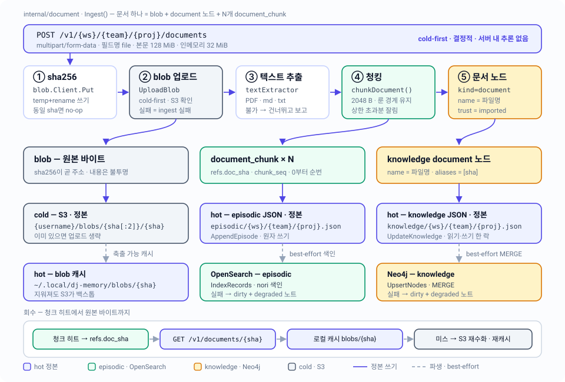

# 06 · 문서 — blob · 추출 · 청킹

문서 하나를 blob(원본 바이트) + knowledge `document` 노드 + N개의 episodic `document_chunk`로 분해해 세 저장 계층에 남기고, 청크 히트에서 원본 바이트까지 되짚어 오는 경로.

| 항목 | 내용 |
|---|---|
| 관련 코드 | `internal/document/` (`document.go`, `extract.go`) · `internal/blob/blob.go` · `internal/cold/` (`cold.go`, `archive.go`, `keys.go`) · `internal/server/handlers_documents.go` · `cmd/memory-mcp/main.go` |
| 관련 스펙 | [02 · 저장 모델](02-storage-model.md) · [03 · 생명주기](03-lifecycle.md) · [04 · Episodic 검색](04-episodic-search.md) · [05 · Knowledge 그래프](05-knowledge-graph.md) · [07 · 재수화와 degraded](07-rehydration.md) · [08 · HTTP API](08-http-api.md) |
| 설계 근거 | [architecture-v2.md §6](../design/architecture-v2.md) — 이 문서는 설계가 아니라 **현재 코드**를 기술한다 |
| 상태 | 구현 완료. 단위 테스트 `internal/document/document_test.go`·`extract_test.go`, 수용 시나리오 `test/blackbox/blackbox_test.go` `TestScenario04_DocumentIngest` |



## 1. "문서 하나"의 정의

문서는 단일 레코드가 아니다. 업로드 한 번이 성격이 다른 세 산출물을 만들고, 각각 다른 계층이 소유한다.

| 산출물 | 무엇 | 정본 위치 | 파생/캐시 |
|---|---|---|---|
| blob | 원본 바이트, sha256으로 주소화 | S3 `{username}/blobs/{sha[:2]}/{sha}` (cold-first) | `{Home}/blobs/{sha}` 로컬 캐시 |
| `document_chunk` × N | 추출 텍스트를 자른 episodic 레코드 | hot `episodic/{ws}/{team}/{proj}.json` | OpenSearch 색인 |
| `document` 노드 × 1 | knowledge 그래프의 문서 표제 노드 | hot `knowledge/{ws}/{team}/{proj}.json` | Neo4j |

세 산출물은 sha256으로 묶인다. 청크는 `refs.doc_sha`로, 노드는 `aliases`에 담긴 sha로 blob을 가리킨다. 이 sha가 유일한 조인 키다 — 문서 노드와 청크 사이에는 엣지가 없다.

계약은 `document.Service`다.

```go
type Service interface {
	Ingest(ctx context.Context, key hotstore.ProjectKey, filename string, data io.Reader) (IngestResult, error)
	Original(ctx context.Context, sha string) (io.ReadCloser, error)
	Chunks(ctx context.Context, sha string) ([]episodic.Record, error)
}
```

구현체는 `document.Ingestor`이고, 협력자는 전부 인터페이스로 주입된다(`document.Deps`: `Store`, `Cache`, `Archiver`, `Index`, `Graph`, `Extractor`, `Clock`). 제공자 패키지의 넓은 인터페이스 대신 소비자 측 narrow interface를 다시 선언한다 — `BlobCache`(Put/Get 2개), `BlobArchiver`(UploadBlob/FetchBlob/BlobExists), `RecordIndexer`(IndexRecords 1개), `NodeUpserter`(UpsertNodes 1개). 배선은 `cmd/memory-mcp/main.go:86`의 `document.NewIngestor(...)` 한 곳뿐이다.

응답 타입:

```go
type IngestResult struct {
	SHA         string      `json:"sha"`
	BlobKey     string      `json:"blob_key"`
	NodeID      string      `json:"node_id"`
	Extractable bool        `json:"extractable"`
	ChunkIDs    []string    `json:"chunk_ids"`
	Truncated   *Truncation `json:"truncated,omitempty"`  // Truncation{Total, Indexed int}
}
```

`ChunkIDs`는 `Ingest` 진입 즉시 `[]string{}`으로 초기화되므로 JSON에서 `null`이 아니라 `[]`로 나간다. `Truncated`는 잘림이 실제로 일어났을 때만 존재한다(§4).

## 2. 파이프라인 5단계와 실패 경계

`Ingestor.Ingest`는 아래 순서를 고정으로 실행한다. 어느 단계가 ingest 전체를 실패시키고 어느 단계가 degraded로 끝나는지가 이 표의 요점이다.

| 단계 | 코드 | 하는 일 | 실패하면 |
|---|---|---|---|
| ① sha256 + 로컬 캐시 | `Deps.Cache.Put` → `blob.FileCache.Put` | 스트림을 해싱하면서 캐시에 기록, sha 반환 | ingest 실패 (`document: cache original: …`) |
| ② cold-first blob 업로드 | `uploadBlob` → `cold.S3Archiver.UploadBlob` | 캐시본을 다시 열어 S3로 스트리밍 | ingest 실패. `Archiver == nil`이면 `ErrColdUnavailable` |
| ③ 결정적 추출 | `extract` → `Extractor.Extract` | 캐시본을 다시 열어 텍스트 추출 | **IO/파싱 오류만** ingest 실패. "추출 불가"는 실패가 아니다 |
| ④ 청킹 + hot append | `ensureChunks` → `Chunk` + `Store.AppendEpisode` | 청크마다 `document_chunk` 레코드 append | hot append 실패 시 ingest 실패. 색인 실패는 degraded |
| ⑤ knowledge 문서 노드 | `ensureDocumentNode` → `Store.WriteKnowledge` | 그래프에 `kind=document` 노드 추가 | hot write 실패 시 ingest 실패. Neo4j 실패는 degraded |

- ④는 `extractable == true`일 때만 실행된다. 스캔 PDF 같은 입력은 청크가 0개인 채로 ②·⑤만 남는다.
- ①과 ②는 파일을 두 번, ③은 세 번째로 읽는다. multipart 스트림은 ①에서 한 번만 소비되고, ②·③은 로컬 캐시에서 다시 연다(`Cache.Get`).
- **cold가 hot보다 먼저다.** ②가 성공하기 전에는 hot에 아무것도 쓰지 않는다. 그래서 중간 실패의 잔해는 항상 "S3와 캐시에는 blob이 있고 hot에는 참조가 없는 상태"이고, 같은 파일을 다시 올리면 §5의 멱등 경로로 수렴한다. 반대 방향(hot에 청크가 있는데 S3에 blob이 없음)은 만들어지지 않는다.

## 3. blob — content-addressed, cold-first

### 3.1 로컬 캐시 (`internal/blob`)

`blob.FileCache`는 `{DJ_MEMORY_HOME}/blobs/` 아래에 **플랫하게** `{sha256}` 이름으로 저장한다(cold와 달리 2자 샤딩이 없다). 디렉터리 0700, 파일 0600.

`Put`의 순서가 content-addressing의 안전성을 만든다.

1. `os.MkdirAll` → 같은 디렉터리에 `os.CreateTemp(dir, ".tmp-*")`
2. `io.Copy(io.MultiWriter(hasher, tmp), data)` — 해싱과 기록이 한 번의 스트리밍
3. `Sync` → `Close` → 여기서야 sha가 확정
4. `{dir}/{sha}`가 이미 있으면 **그대로 반환**(멱등 재put, temp는 defer로 삭제)
5. 없으면 `Chmod(0600)` → `Rename`

즉 주소(sha)를 알기 전에는 최종 경로에 아무것도 나타나지 않는다. 중간에 죽어도 `.tmp-*` 파편만 남지 부분 기록이 content address 아래로 노출되지 않는다.

`Get`/`Has`/`Evict`는 `^[0-9a-f]{64}$`(`shaPattern`)로 sha를 먼저 검증한다 — 경로 조작을 `{dir}/{sha}` 안에 가두는 유일한 장치다. 캐시 미스는 `blob.ErrNotCached`.

### 3.2 cold (`internal/cold`)

- 키 레이아웃의 단일 정본은 `cold.BlobKey(username, sha)` = `{username}/blobs/{sha[:2]}/{sha}`. 블랙박스 테스트가 응답의 `blob_key`를 이 함수 결과와 직접 비교한다.
- `S3Archiver.UploadBlob`은 `Exists`(HeadObject)로 먼저 확인하고 있으면 업로드를 **건너뛴다**. content-addressed이므로 같은 키의 기존 객체는 정의상 같은 바이트다.
- 업로드는 `manager.NewUploader`(멀티파트), 다운로드는 `GetObject`. 없는 객체는 `types.NoSuchKey`/`types.NotFound`/에러코드 문자열 셋 중 무엇으로 오든 `cold.ErrNotFound`로 정규화된다(`isNotFoundErr`).
- 버킷·리전·프로파일·username은 전부 config에서 온다: `DJ_MEMORY_S3_BUCKET`(기본 `vms-memory-mcp`), `DJ_MEMORY_S3_REGION`(기본 `ap-northeast-2`, 프로파일 리전 상속 금지), `AWS_PROFILE`(기본 `vms-holdings`), `DJ_MEMORY_USERNAME`(기본 OS 사용자).

## 4. 결정적 추출 — 되는 것과 안 되는 것

`document.DefaultExtractor.Extract(ctx, filename, data)`는 `(text string, extractable bool, err error)`를 돌려준다. 이 3-튜플의 조합이 정직성 계약이다.

| 반환 | 의미 | ingest 결과 |
|---|---|---|
| `(text, true, nil)` | 결정적 텍스트를 얻었다 | 청킹 진행 |
| `("", false, nil)` | 형식은 인식했지만 결정적 텍스트가 없다 | 청크 0개, blob·노드는 생성. **에러 아님** |
| `("", false, err)` | IO 실패 또는 파일 손상 | ingest 실패 |

디스패치 순서:

1. `bytes.HasPrefix(buf, "%PDF-")` **또는** 확장자 `.pdf` → PDF 경로. 매직 바이트가 확장자보다 우선하므로 `doc.bin`으로 이름 붙은 PDF도 텍스트 레이어를 읽는다.
2. 확장자 `.md` / `.markdown` / `.txt` / `.text` → `utf8.Valid(buf)`면 그대로 통과. 유효하지 않으면 **인코딩을 추측하지 않고** `("", false, nil)`.
3. 그 외 전부 → `("", false, nil)`. 이미지·오피스 문서·바이너리에는 결정적 추출기가 없다.

### 4.1 PDF

라이브러리는 `github.com/ledongthuc/pdf v0.0.0-20250511090121-5959a4027728`. `extractPDF`는 `pdf.NewReader(ra, size)` 후 1..`NumPage()`를 돌면서

- `page.V.IsNull()`인 페이지는 건너뛴다,
- `page.GetPlainText(nil)`이 에러면 **그 페이지를 건너뛴다** — 텍스트 레이어가 없는 페이지로 취급하고 내용을 지어내지 않는다,
- 빈 문자열도 건너뛴다,
- 나머지를 `\n`으로 이어붙이고 `TrimSpace`.

전부 합쳐 빈 문자열이면 `("", false, nil)`. **스캔 PDF의 정의가 이것이다** — 텍스트 레이어가 없으면 `extractable: false`로 정직하게 보고하고, OCR은 서버가 하지 않는다(설계 §11 비목표). blob은 이미 S3에 있으므로 에이전트가 원본을 내려받아 스스로 처리하면 된다.

`extractPDF`에는 `defer recover()`가 있다. `ledongthuc/pdf`는 일부 손상 입력에서 panic하는데, 이를 에러로 변환해 **손상된 업로드 하나가 서버를 내리지 못하게** 한다(코드 규약 §3: `main` 밖 panic 금지).

### 4.2 메모리

`Extract`는 `io.ReadAll`로 파일 전체를 메모리에 올린다 — `pdf.NewReader`가 `io.ReaderAt`을 요구하기 때문이다. 따라서 추출 순간의 피크 메모리는 파일 크기 그대로이고, 상한은 HTTP 계층의 업로드 캡(128 MiB)이다.

## 5. 청킹 — 2 KiB, 룬 경계, 500 상한

```go
func Chunk(text string, chunkBytes, maxChunks int) ([]string, Truncation)
```

- **바이트 예산**이지 문자 수가 아니다. 다음 룬을 넣으면 `chunkBytes`를 넘길 때 끊는다. 한글은 UTF-8 3바이트이므로 2048바이트 ≈ 682자, ASCII는 2048자.
- **룬을 절대 쪼개지 않는다**(`utf8.DecodeRuneInString`). 예산보다 큰 룬 하나는 통째로 방출된다.
- `chunkBytes <= 0`이면 `config.DocumentChunkBytes`(2048), `maxChunks <= 0`이면 무제한.
- 의미 경계(문장·문단·마크다운 헤딩)를 전혀 보지 않는다. 그래서 청크를 순서대로 이어붙이면 추출 텍스트가 바이트 단위로 복원된다 — `TestChunksOrderedBySeq`가 이걸 단언한다.

프로덕션 파라미터는 `internal/config/config.go`의 상수다.

| 상수 | 값 | 뜻 |
|---|---|---|
| `config.DocumentChunkBytes` | `2048` | 청크 목표 크기(바이트) |
| `config.MaxDocumentChunks` | `500` | 하드 상한 — 문서당 색인되는 텍스트는 최대 약 1 MiB |

### 5.1 잘림의 정직한 보고

`Truncation{Total, Indexed}`의 `Total`은 **상한과 무관한 실제 청크 수**다. 상한에 걸려 만들어지지 않은 꼬리까지 센다(루프가 `total++`를 먼저 하고 `len(chunks) < maxChunks`일 때만 append). `Indexed`는 실제로 만들어진 수.

`IngestResult.Truncated`는 `Total > Indexed`일 때만 채워진다. 잘림이 없으면 `omitempty`로 응답에서 사라진다 — "truncated 필드가 없다"가 곧 "전량 색인됐다"이다.

501 × 2048바이트 문서를 올리면 `{"total": 501, "indexed": 500}`과 500개의 `chunk_ids`가 온다(`TestIngestTruncatesAtChunkCap`).

### 5.2 만들어지는 레코드

```go
episodic.Record{
	ID:         ulid.At(now.UnixMilli()),
	Kind:       episodic.KindDocumentChunk,
	OccurredAt: now,                                  // Clock.Now() — 문서 날짜가 아니라 ingest 시각
	Actor:      episodic.ActorSystem,
	Text:       chunk,
	Entities:   []string{},
	Refs:       &episodic.Refs{DocSHA: sha, ChunkSeq: seq},
}
```

- `Consolidated`는 zero value인 `false`. 서버는 이 값을 자동으로 켜지 않으므로(설계 §3.1) 청크는 에이전트가 증류하기 전까지 hot에 남는다.
- 모든 청크가 같은 밀리초의 `ulid.At`를 쓴다. `internal/ulid`가 같은 밀리초 안에서 랜덤부를 증가시키므로 **청크 ID는 seq 순서대로 강하게 증가**한다. hot 파일을 ID 순으로 읽으면 청크 순서가 보존된다.
- `episodic.Record.Validate`가 `kind=document_chunk ⟺ refs != nil`을 강제한다. `refs.doc_sha`는 비어 있으면 안 되고 `chunk_seq >= 0`이어야 한다. 같은 규칙이 `POST .../episodes`에도 적용되어(핸들러가 `validateSHA`로 한 번 더 검사) 에이전트가 손으로 만든 청크도 같은 모양을 갖는다.

## 6. 같은 sha 재업로드 — 멱등

동일 바이트를 다시 올리면 각 계층이 각자 멱등하게 동작한다.

| 계층 | 판정 방법 | 결과 |
|---|---|---|
| 로컬 캐시 | `os.Stat({dir}/{sha})` | rename 생략, 같은 sha 반환 |
| cold | `Exists(BlobKey)` | 업로드 생략, 같은 키 반환 |
| 청크 | `chunkIDsFor(ListEpisodes(key), sha)` — 프로젝트 episodic 파일에서 `kind=document_chunk ∧ refs.doc_sha == sha` 스캔 | 기존 ID를 seq 순으로 그대로 반환, append 없음 |
| 문서 노드 | `ReadKnowledge(key)`에서 `kind=document ∧ sha ∈ aliases` 스캔 | 기존 노드 ID 반환, 노드 추가 없음 |

`TestIngestSameShaIsIdempotent`가 두 번째 ingest 후 `uploads == 1`, 청크 1개, 노드 1개, 그리고 `NodeID`·`ChunkIDs`가 첫 번째와 동일함을 단언한다.

재업로드 시의 잘림 보고는 다시 계산된다: `Chunk`를 돌려 `Total`을 얻고 `Indexed = min(계산값, 기존 청크 수)`로 낮춘다. 즉 "이미 저장된 것 기준"으로 정직하게 답한다.

주의할 스코프 비대칭:

- 청크 존재 확인과 노드 조회는 **요청 경로의 프로젝트 안에서만** 한다. 같은 파일을 다른 `{ws}/{team}/{proj}`로 올리면 청크와 문서 노드가 그 프로젝트에 새로 생긴다(blob은 계정 전역이므로 하나). 이건 프로젝트별 정본 파일 모델의 자연스러운 귀결이다.
- 반면 `Chunks(sha)`와 `GET /v1/documents/{sha}`는 **전역**이다(§8).
- 재업로드 때 파일명이 달라져도 기존 노드의 `Name`은 바뀌지 않는다 — 첫 업로드의 파일명이 유지된다.

## 7. degraded와 실패의 구분

| 죽은 것 | 결과 | 코드 |
|---|---|---|
| S3 (`Deps.Archiver == nil`) | **503** `cold storage unavailable` — 핸들러 사전 검사 | `handlers_documents.go:45` |
| S3 (업로드 중 실패) | **500** `document ingest failed` | `Ingest`가 에러 반환 → 핸들러가 500 |
| OpenSearch | ingest **성공**. `slog.Warn` + `MarkDirty(key, PlaneEpisodic)` | `ensureChunks` → `indexBestEffort` |
| Neo4j | ingest **성공**. `slog.Warn` + `MarkDirty(key, PlaneKnowledge)` | `ensureDocumentNode` → `upsertNodeBestEffort` |
| document 서비스 자체 미배선 | **503** `document pipeline unavailable` | 세 핸들러 공통 |

파생 저장소가 죽어도 hot 쓰기는 성공하고 manifest에 dirty가 찍힌다 — 다음 재수화가 수렴시킨다([07 · 재수화](07-rehydration.md)). `MarkDirty` 자체가 실패하면 로그만 남기고 요청은 계속 성공한다.

blob 업로드가 나중에 실패하는 경우가 사전 검사와 달리 500인 것은 `Ingest`가 반환하는 에러를 핸들러가 종류별로 구분하지 않기 때문이다. `hotstore.ErrNotFound`/`cold.ErrNotFound`만 404로 매핑되고 나머지는 전부 500이다.

## 8. 회수 — 청크 히트에서 원본까지

### 8.1 `GET /v1/documents/{sha}` — 원본 바이트

경로 파라미터는 핸들러 경계에서 `validateSHA`(`^[0-9a-f]{64}$`)로 먼저 검증한다(400). 그다음 `Ingestor.Original`:

1. `Cache.Get(sha)` — 히트면 그대로 스트리밍.
2. `blob.ErrNotCached`가 아닌 에러는 그대로 실패. `ErrNotCached`면 cold로 간다.
3. `Archiver == nil`이거나 `cold.ErrNotFound`면 `hotstore.ErrNotFound`로 감싸 반환 → **404**.
4. `FetchBlob` 성공 시 `Cache.Put`으로 **재캐시**하고, 반환된 해시가 요청 sha와 다르면 `cold blob … hashed to … — corrupt cold object` 에러(cold 객체 손상 탐지).
5. 재캐시가 실패하면 캐시를 포기하고 cold에서 직접 스트리밍한다(이 경로에서는 해시 검증이 없다).

응답은 `{success, data, error}` 봉투가 아니라 `application/octet-stream` 원시 바이트다 — API 전체에서 유일한 예외. 헤더 전송 후 스트림이 끊기면 `Logger.Warn`만 남긴다(상태 코드를 되돌릴 수 없으므로).

### 8.2 `GET /v1/documents/{sha}/chunks` — 청크 목록

`Ingestor.Chunks`는 `Store.ListProjects()`로 **모든 프로젝트**를 순회하며 각 episodic 파일을 읽고 `kind=document_chunk ∧ refs.doc_sha == sha`를 모은다. 정렬은 `chunk_seq` 우선, 동률이면 ID. 없는 sha는 404가 아니라 빈 배열 `[]`이다.

비용은 hot episodic 레코드 총량에 비례한다(O(전체 레코드)). 상한 500청크 문서 하나를 위해 모든 프로젝트 파일을 읽는 구조라, 프로젝트가 많아지면 여기가 먼저 아프다.

### 8.3 검색으로 들어오는 경로

일반적인 회수는 검색에서 시작한다.

```
GET /v1/{ws}/{team}/{proj}/episodes/search?q=...&kinds=document_chunk
  → Hit.Record.Refs.DocSHA
  → GET /v1/documents/{sha}          (원본 바이트)
  → GET /v1/documents/{sha}/chunks   (전후 청크)
```

검색 응답은 발췌 + 메타 + 점수만 담는다(설계 §7) — 청크 본문 전량을 주입하지 않는다. 자세한 질의 구성은 [04 · Episodic 검색](04-episodic-search.md).

청크는 평범한 episode이므로 [03 · 생명주기](03-lifecycle.md)의 에이징 규칙을 똑같이 받는다. 에이전트가 `consolidated=true`로 만든 청크는 30일 후 S3 `{yyyy-mm}.json` 배치로 내려가고 hot과 OpenSearch에서 사라진다. 그러면 `Chunks(sha)`(hot만 읽는다)의 결과에서도 빠진다 — blob은 남아 있으므로 원본 다운로드는 계속 된다.

## 9. 경계값

| 항목 | 값 | 위치 |
|---|---|---|
| 업로드 본문 상한 | 128 MiB (`maxUploadBytes`, `http.MaxBytesReader`) | `internal/server/validate.go:24` |
| multipart 인메모리 임계 | 32 MiB (`multipartMemoryBytes`) | `internal/server/validate.go:26` |
| multipart 필드명 | `file` (고정). 없으면 400 | `handlers_documents.go:54` |
| 파일명 | 비어 있으면 400 | `handlers_documents.go:60` |
| 청크 크기 / 개수 | 2048 B / 500 | `internal/config/config.go:27,29` |
| 문서당 색인 텍스트 | 최대 약 1 MiB (500 × 2048) | 위 상수의 곱 |
| 추출 피크 메모리 | 파일 크기 전체 (`io.ReadAll`) | `extract.go:38` |
| 성공 응답 | `201 Created` + `IngestResult` | `handlers_documents.go:71` |

## 10. ⚠️ 설계 문서와 차이

architecture-v2.md §6과 코드가 어긋나거나, 설계 원칙이 이 경로에만 적용되지 않은 지점.

1. **ingest 응답에 `degraded`가 없다.** 설계 §5는 파생 저장소가 죽었을 때 "쓰기는 성공시키고 성과 보고에 `degraded`로 표시"를 요구하고, `POST .../episodes`와 `POST .../knowledge/nodes`는 실제로 `degraded: [...]`를 응답에 담는다. 그런데 `IngestResult`에는 그 필드가 없어, OpenSearch가 죽은 채로 문서를 올린 클라이언트는 **응답만 봐서는 색인 실패를 알 수 없다**. 신호는 서버 로그·manifest dirty·`GET /v1/status`에만 남는다.
2. **`handleIngestDocument`는 `markIndexed`를 호출하지 않는다.** 다른 쓰기 핸들러는 파생 upsert 성공 후 manifest의 `indexed_at`과 `indexes.opensearch.last_hydrated_sha`를 갱신한다. 문서 ingest는 하지 않으므로, 아무 문제 없이 성공한 ingest 뒤에도 `CheckDrift`가 "episodic hot content changed since last hydration"을 보고할 수 있다(불필요한 재수화를 유발하되 데이터는 안전).
3. **blob 로컬 캐시에 축출 경로가 없다.** 설계 §1·§3은 로컬 blob 캐시를 "축출 가능"이라고 규정하지만, `blob.Cache.Evict`와 `Has`에는 프로덕션 호출자가 없다(`main.go`는 `blob.New`만 호출). 즉 캐시는 자동으로 줄지 않고 무한히 자란다. 축출은 현재 수동(`rm`)이며, S3가 백스톱이므로 안전하기는 하다. 코드 규약 §4(데드코드) 기준으로는 두 메서드가 정리 대상이다.
4. **도메인 에러가 `*errs.Error`가 아니다.** 코드 규약 §2는 핸들러 아래 모든 계층이 `internal/errs`의 의미 에러를 쓰고 핸들러가 `apierr.From`으로 변환하도록 요구하지만, `internal/errs`도 `internal/server/apierr`도 존재하지 않는다. `document`/`blob`/`cold`는 `fmt.Errorf`·`errors.New`와 센티넬(`ErrColdUnavailable`, `ErrNotCached`, `ErrNotFound`)을 쓰고, 핸들러는 센티넬 두 개만 404로 매핑한다. 이건 이 패키지만의 문제가 아니라 저장소 전체의 상태다([09 · 코드 구조](09-code-structure.md)).
5. **문서 노드 생성은 read-modify-write이고 원자적이지 않다.** `ensureDocumentNode`는 `ReadKnowledge` → 슬라이스 clone + append → `WriteKnowledge` 순서로 동작한다. `hotstore.FileStore`의 뮤텍스는 각 호출 안에서만 잡히므로, 같은 프로젝트에 대한 동시 ingest(또는 동시 knowledge 노드 생성)는 노드를 잃을 수 있다. 로컬 단일 사용자 도구라는 전제 위에 서 있는 설계다.

## 코드 위치

| 개념 | 파일 | 심볼 |
|---|---|---|
| 파이프라인 5단계 | `internal/document/document.go` | `Ingestor.Ingest`, `uploadBlob`, `extract`, `ensureChunks`, `ensureDocumentNode` |
| 서비스 계약·의존성 | `internal/document/document.go` | `Service`, `Deps`, `BlobCache`, `BlobArchiver`, `RecordIndexer`, `NodeUpserter`, `NewIngestor` |
| 응답 타입·잘림 보고 | `internal/document/document.go` | `IngestResult`, `Truncation`, `ErrColdUnavailable` |
| 청킹 알고리즘 | `internal/document/document.go` | `Chunk` |
| 멱등 재업로드 판정 | `internal/document/document.go` | `chunkIDsFor`, `ensureDocumentNode`의 aliases 스캔 |
| 회수 | `internal/document/document.go` | `Ingestor.Original`, `Ingestor.Chunks` |
| 추출 디스패치 | `internal/document/extract.go` | `Extractor`, `DefaultExtractor.Extract`, `pdfMagic` |
| PDF 텍스트 레이어 | `internal/document/extract.go` | `extractPDF` (+ panic recover) |
| 로컬 blob 캐시 | `internal/blob/blob.go` | `Cache`, `FileCache`, `New`, `ErrNotCached`, `shaPattern` |
| S3 원시 IO | `internal/cold/cold.go` | `Storage`, `S3Storage`, `NewS3`, `ErrNotFound`, `isNotFoundErr` |
| blob 아카이브 | `internal/cold/archive.go` | `Archiver`, `S3Archiver.UploadBlob/FetchBlob/BlobExists` |
| 키 레이아웃 | `internal/cold/keys.go` | `BlobKey` |
| 청크 레코드 스키마 | `internal/episodic/record.go` | `KindDocumentChunk`, `Refs`, `Record.Validate` |
| 문서 노드 스키마 | `internal/knowledge/knowledge.go` | `KindDocument`, `StateActive`, `TrustImported`, `Node` |
| 상수 | `internal/config/config.go` | `DocumentChunkBytes`, `MaxDocumentChunks` |
| HTTP 핸들러 | `internal/server/handlers_documents.go` | `handleIngestDocument`, `handleGetDocument`, `handleGetDocumentChunks` |
| 요청 검증·상한 | `internal/server/validate.go` | `validateSHA`, `maxUploadBytes`, `multipartMemoryBytes` |
| 라우트 | `internal/server/server.go` | `Router` — `/v1/documents/{sha}`, `/v1/documents/{sha}/chunks`, `/v1/{ws}/{team}/{proj}/documents` |
| 배선 | `cmd/memory-mcp/main.go` | `blob.New`, `cold.NewArchiver`, `document.NewIngestor` |
| 단위 테스트 | `internal/document/document_test.go` | `TestChunk`, `TestIngestSameShaIsIdempotent`, `TestIngestTruncatesAtChunkCap`, `TestIngestUnextractable`, `TestOriginal` |
| 추출 테스트 | `internal/document/extract_test.go` | `TestDefaultExtractorExtract` (`textPDF`, `noTextPDF`) |
| 수용 시나리오 | `test/blackbox/blackbox_test.go` | `TestScenario04_DocumentIngest` (+ `test/blackbox/pdf.go` `makeMinimalPDF`) |
