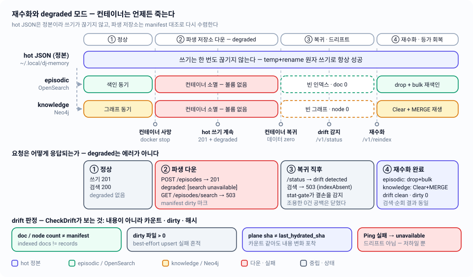

# 07 — 재수화와 degraded 모드: 컨테이너는 언제든 죽는다

파생 저장소(OpenSearch·Neo4j)를 볼륨 없이 띄우고, manifest 대조로 드리프트를 판정해 hot JSON에서 다시 세우며, 파생물이 죽은 동안에도 쓰기를 성공시키는 규칙을 정의한다.

| 항목 | 내용 |
|---|---|
| 관련 코드 | `internal/rehydrate/rehydrate.go` · `internal/rehydrate/manifest.go` · `internal/server/startup.go` · `internal/server/degraded.go` · `internal/server/handlers_ops.go` · `deploy/docker-compose.yml` |
| 관련 스펙 | [02-storage-model](02-storage-model.md)(manifest·hot 정본) · [04-episodic-search](04-episodic-search.md)(bulk 색인) · [05-knowledge-graph](05-knowledge-graph.md)(MERGE 멱등성) · [06-documents](06-documents.md)(문서 ingest 저하) · [08-http-api](08-http-api.md)(봉투·상태코드) · [10-operations](10-operations.md) · [11-testing](11-testing.md) · 인덱스: [README](README.md) |
| 상태 | 구현 완료. 단위 테스트 `internal/rehydrate/*_test.go`, 블랙박스 `TestScenario05_Rehydration` / `TestScenario07_DegradedMode` / `TestScenario08_Honesty` |



---

## 1. 볼륨을 붙이지 않는 결정

`deploy/docker-compose.yml`에는 두 서비스 모두 `volumes:` 항목이 없다. 파일 첫 줄 주석이 그 이유를 못 박는다.

```
# Derived stores only (architecture-v2.md §8). Both containers are intentionally
# NON-persistent: no volumes. The hot JSON store owns all content; rehydration
# rebuilds these from scratch at any time (§5).
```

| 구성요소 | 실행 위치 | 영속성 |
|---|---|---|
| memory-mcp 서버 | 호스트 프로세스 (`make run` / `make start`) | — |
| `dj-memory-opensearch` (`deploy/opensearch/` 커스텀 이미지, nori 플러그인) | Docker | 없음 |
| `dj-memory-neo4j` (`neo4j:5-community`) | Docker | 없음 |
| hot 정본 `~/.local/dj-memory/` | 호스트 파일시스템 | 있음 (유일한 정본) |

이 결정이 안전한 근거는 세 가지다.

1. **콘텐츠 소유권이 hot에 있다.** `internal/hotstore`가 모든 쓰기를 temp+rename 원자 쓰기로 처리하고, 패키지 주석은 "content that exists only in a derived store is a bug"라고 못 박는다.
2. **두 평면 모두 hot에서 전량 재구성 가능하다.** episodic은 인덱스를 통째로 버리고 `IndexRecords`로 다시 넣고, knowledge는 `MERGE` 멱등 upsert를 재생한다(§5).
3. **불일치를 사람의 감이 아니라 manifest로 판정한다.** 카운트·dirty·해시 세 가지 결정적 신호만 본다(§3).

서버 프로세스는 파생 저장소가 죽어 있어도 **부팅한다**. `cmd/memory-mcp/main.go`는 `search.NewClient` / `graph.NewClient` / `cold.NewS3` 실패를 `logger.Warn`으로만 남기고 해당 `Deps` 필드를 nil로 둔 채 계속 진행한다. 생성자는 I/O를 하지 않으므로, 실제 다운은 첫 `Ping`/요청에서 드러난다.

---

## 2. manifest — 대조의 유일한 근거

`~/.local/dj-memory/manifest.json` (`hotstore.Manifest`)

```go
type Manifest struct {
    Files     map[string]FileState  `json:"files"`    // "{plane}/{ws}/{team}/{proj}"
    Indexes   map[string]IndexState `json:"indexes"`  // "opensearch" | "neo4j"
    UpdatedAt time.Time             `json:"updated_at"`
}

type FileState struct {
    SHA256      string    `json:"sha256"`
    RecordCount int       `json:"record_count"` // episodic=record 수, knowledge=NODE 수(엣지 제외)
    IndexedAt   time.Time `json:"indexed_at"`
    Dirty       bool      `json:"dirty"`
}

type IndexState struct {
    LastHydratedSHA string `json:"last_hydrated_sha"`
}
```

- 파일 키는 `hotstore.ManifestFileKey(plane, key)` = `rehydrate.FileKey(plane, key)` — 둘 다 `"{plane}/{ws}/{team}/{proj}"`를 만든다.
- 인덱스 키는 `rehydrate.IndexKeyEpisodic = "opensearch"`, `rehydrate.IndexKeyKnowledge = "neo4j"`. 평면→키 변환은 `rehydrate.IndexKeyFor(plane)`.
- `RecordCount`가 knowledge에서 **노드 수**인 이유는 `graph.NodeCount`와 직접 비교하기 위해서다(`FileState` 주석).
- 해시가 안정적인 이유: 모든 hot 파일은 `hotstore.marshalCanonical`(= `json.MarshalIndent(v, "", "  ")` + 개행 1개)로만 직렬화된다. 같은 내용은 항상 같은 sha256이 된다.

### 2.1 필드별 갱신 책임

| 누가 | 언제 | 무엇을 쓰는가 |
|---|---|---|
| `FileStore.updateFileStateLocked` (`AppendEpisode`/`WriteKnowledge` 경로) | hot 파일 바이트가 바뀔 때마다 | `SHA256`, `RecordCount`만. **`IndexedAt`·`Dirty`는 보존** — 파생 동기 상태는 다른 흐름의 소유물이다 |
| `server.markIndexed` | best-effort 파생 upsert **성공** 시 | `Dirty=false`, `IndexedAt=now`, `Indexes[plane].LastHydratedSHA = PlaneStateSHA(...)` |
| `server.markDirty` → `FileStore.MarkDirty` | best-effort 파생 upsert **실패** 시 | `Dirty=true` (엔트리가 없으면 생성) |
| `rehydrate.commitManifest` | 재수화 후 | 수렴한 프로젝트만 `touchFile`(Dirty 해제 + IndexedAt 갱신), **평면 전체가 수렴했을 때만** `Indexes[plane].LastHydratedSHA` 갱신 |

`markIndexed`/`markDirty`는 실패해도 `Logger.Error`만 남긴다. hot 쓰기가 이미 성공한 요청을 manifest 부기 실패로 뒤엎지 않는다.

### 2.2 `PlaneStateSHA` — 카운트가 못 잡는 것을 잡는다

```go
func PlaneStateSHA(m hotstore.Manifest, plane hotstore.Plane) string
```

한 평면(`"episodic/"` 또는 `"knowledge/"` 접두사)에 속한 manifest 파일 엔트리만 골라 키를 정렬한 뒤 `key \0 sha256 \n`을 이어 sha256을 낸다. 재수화가 끝나면 이 값이 `IndexState.LastHydratedSHA`로 저장된다. 레코드 수는 그대로인데 내용만 바뀐 경우(수정·교체)는 카운트 비교로 잡히지 않으므로, 이 digest가 그 구멍을 메운다. `TestPlaneStateSHA`가 결정성과 평면 격리(다른 평면 변경에 영향받지 않음)를 고정한다.

---

## 3. 드리프트 판정 — `CheckDrift`

```go
type Drift struct {
    Detected    bool   `json:"detected"`
    Reason      string `json:"reason,omitempty"`
    Unavailable bool   `json:"unavailable"`
}
type DriftReport struct {
    Episodic  Drift `json:"episodic"`
    Knowledge Drift `json:"knowledge"`
}

func (r *Runner) CheckDrift(ctx context.Context) (DriftReport, error)
```

`CheckDrift`는 **아무것도 변경하지 않는다**. manifest를 읽고 두 평면을 각각 판정한다. manifest 읽기 실패만 error로 올라간다(`"rehydrate: read manifest: %w"`).

### 3.1 episodic 판정 (`episodicDrift`) — 순서대로 평가

| 조건 | 결과 | `Reason` |
|---|---|---|
| `r.index == nil` | `Unavailable` | `opensearch not configured` |
| `index.Ping(ctx)` 실패 | `Unavailable` | `opensearch unreachable` |
| `index.DocCount(ctx, ProjectKey{})` error | `Detected` | `episodic index absent or uncountable` |
| `got != want` (`want` = manifest의 episodic 평면 `RecordCount` 합) | `Detected` | `indexed docs %d != manifest records %d` |
| dirty episodic 파일 수 > 0 | `Detected` | `%d dirty episodic file(s) await rehydration` |
| `Indexes["opensearch"].LastHydratedSHA != PlaneStateSHA(m, episodic)` (기존 값이 비어있지 않을 때만) | `Detected` | `episodic hot content changed since last hydration` |

`want`/`dirty` 집계는 `planeTotals(m, plane)` — manifest 키 접두사로만 걸러낸다. `DocCount`는 zero-value `ProjectKey`를 넘겨 **전 프로젝트 합계**를 센다.

### 3.2 knowledge 판정 (`knowledgeDrift`)

| 조건 | 결과 | `Reason` |
|---|---|---|
| `r.graph == nil` | `Unavailable` | `neo4j not configured` |
| `graph.Ping(ctx)` 실패 | `Unavailable` | `neo4j unreachable` |
| hot 노드 수 집계 실패 | `Detected` | `hot knowledge unreadable: <err>` |
| `graph.NodeCount(ctx, ProjectKey{})` error | `Detected` | `knowledge graph uncountable` |
| `got != want` | `Detected` | `graph nodes %d != hot nodes %d` |
| dirty knowledge 파일 수 > 0 | `Detected` | `%d dirty knowledge file(s) await rehydration` |
| `Indexes["neo4j"].LastHydratedSHA` 불일치 | `Detected` | `knowledge hot content changed since last hydration` |

episodic과 달리 기대값(`want`)을 manifest가 아니라 **hot 파일에서 직접 센다** — `hotNodeCount`가 `store.ListProjects` → `store.ReadKnowledge`를 돌며 `len(g.Nodes)`를 더한다. 코드 주석은 그 이유를 "hotstore가 knowledge 레코드를 어떻게 집계하든 이 검사는 독립적으로 유지하려고"라고 밝힌다.

### 3.3 `Detected` ≠ `Unavailable`

- **`Detected`** = 파생 저장소는 살아 있는데 내용이 hot과 다르다 → **재수화 대상**.
- **`Unavailable`** = 파생 저장소에 닿을 수 없다 → **저하 상태일 뿐 재수화 대상이 아니다.** 재수화할 상대가 없기 때문이다.

`Server.Startup`은 이 구분을 그대로 따른다: `if !drift.Episodic.Detected && !drift.Knowledge.Detected { return }` — 두 저장소가 모두 죽어 `Unavailable`만 뜬 상태로 부팅하면 로그만 남기고 바로 서빙을 시작한다.

---

## 4. 세 개의 재수화 경로

| 경로 | 진입점 | 범위 | 트리거 조건 | 실패 처리 |
|---|---|---|---|---|
| startup | `Server.Startup(ctx)` ← `main.go`, `ListenAndServe` 직전 | 전체 | `CheckDrift`에서 어느 평면이든 `Detected` | 로그만. 절대 fatal 아님 |
| 요청 진입 stat-gate | `Server.statGate` → `Rehydrator.StatGate` | 프로젝트 1개 | 2초 디바운스 통과 + `needsRehydration` | `Logger.Warn`만, 요청은 계속 진행 |
| 강제 재수화 | `POST /v1/reindex[?verify=true]` → `RehydrateAll` | 전체 | 명시적 호출 | 200 + `Report.Failures`에 나열 |

### 4.1 startup

```go
func (s *Server) Startup(ctx context.Context)
```

`CheckDrift` → 로그(6개 필드: 평면별 `detected`/`reason`/`unavailable`) → `Detected`가 있으면 `RehydrateAll(ctx, false)` → 결과 로그 + 실패 항목별 `Warn`. `Rehydrator`가 nil이면 `"startup: rehydrator not configured; derived stores unmanaged"`만 남기고 반환한다. 어떤 경로에서도 프로세스를 죽이지 않는다 — 파생 저장소가 죽었다고 hot 쓰기까지 막을 수는 없기 때문이다.

### 4.2 요청 진입 stat-gate (2초 디바운스)

```go
const DebounceInterval = 2 * time.Second   // internal/rehydrate/manifest.go
func (r *Runner) StatGate(ctx context.Context, key hotstore.ProjectKey) error
```

1. `Runner.mu`로 보호되는 `lastGate map[string]time.Time`에서 프로젝트별 마지막 통과 시각을 본다. `now.Sub(last) < 2s`면 즉시 반환(디바운스).
2. manifest를 읽고 `needsRehydration`으로 값싼 신선도만 판단한다:
   - 해당 평면 파일이 manifest에 `Dirty`로 표시돼 있거나,
   - `store.FileInfo`의 **mtime이 `FileState.IndexedAt`보다 최신**이거나,
   - hot 파일은 있는데 manifest가 **한 번도 본 적 없는** 파일(`!tracked`)일 때 → 재수화 필요.
   - 파일이 없거나 읽을 수 없으면 그 평면은 건너뛴다(수렴시킬 대상이 없음).
3. 필요하면 `RehydrateProject(ctx, key)` — **해당 프로젝트만** 부분 재수화.

호출 지점은 **읽기 3곳뿐**이다:

| 핸들러 | 파일:라인 |
|---|---|
| `handleSearchEpisodes` | `internal/server/handlers_episodic.go:186` |
| `handleSearchKnowledge` | `internal/server/handlers_knowledge.go:375` |
| `handleKnowledgeGraph` | `internal/server/handlers_knowledge.go:432` |

쓰기 핸들러·`GET .../episodes/{id}`·문서 엔드포인트는 stat-gate를 타지 않는다. 쓰기는 자기 결과를 `markIndexed`/`markDirty`로 직접 manifest에 반영하므로 게이트가 필요 없다.

> **중요**: `needsRehydration`의 신호는 전부 **hot 파일 기준**이다. 컨테이너가 비어서 돌아왔더라도 그 사이 hot 파일이 바뀌지 않았다면 stat-gate는 **아무것도 하지 않는다**. 컨테이너 소멸 자체를 감지하는 책임은 `CheckDrift`(startup·`/v1/status`)와 `/v1/reindex`에 있다. §8 참조.

### 4.3 `POST /v1/reindex`

```go
func (s *Server) handleReindex(w http.ResponseWriter, r *http.Request)   // handlers_ops.go
```

- `Rehydrator`가 nil이면 503 `"rehydrator unavailable"`.
- `?verify=true`일 때만 전량 감사 모드로 돈다.
- `RehydrateAll`은 프로젝트 목록 조회 실패 외에는 error를 올리지 않는다. 부분 실패는 **200 + `Report.Failures[]`**로 정직하게 보고한다.

```go
type Report struct {
    EpisodesIndexed int      `json:"episodes_indexed"`
    NodesUpserted   int      `json:"nodes_upserted"`
    EdgesUpserted   int      `json:"edges_upserted"`
    Verified        bool     `json:"verified"`
    Failures        []string `json:"failures"`
}
```

---

## 5. 평면별 재구축 전략

두 평면은 재구축 방식이 다르다. 그 차이는 저장소 성격에서 온다.

| | episodic (OpenSearch) | knowledge (Neo4j) |
|---|---|---|
| 전체 경로 선행 작업 | `index.Drop(ctx)` — 인덱스 통째 삭제 | `graph.Clear(ctx)` — `MATCH (n:KnowledgeNode) DETACH DELETE n` |
| 스키마 보장 | `index.EnsureIndex(ctx)` (nori 매핑) | `Client.ensureSchema`가 upsert 직전 lazy 실행 |
| 재적재 | 프로젝트별 `ListEpisodes` → `IndexRecords` | 프로젝트별 `ReadKnowledge` → `UpsertNodes` → `UpsertEdges` |
| 부분 경로 선행 작업 | `index.DeleteProject(key)` — 프로젝트 범위 `_delete_by_query` | `graph.DeleteMissing(key, keep)` — 프로젝트 범위 `DETACH DELETE` (§5.1) |
| 멱등성 원천 | 인덱스를 버리므로 자명 | `MERGE (k:KnowledgeNode {id, ws, team, proj})` + 전 속성 `SET` |
| verify 감사 | `DocCount(p) == len(recs)` | `NodeCount(p) == len(g.Nodes)` |
| 실패 격리 | `Drop` 실패는 **비치명**(첫 수화 전 인덱스 부재가 정상) — Failures에만 기록하고 계속. `EnsureIndex` 실패는 평면 포기 | `Clear` 실패는 `full=false`로 표시하되 replay는 계속 |

### 5.1 왜 knowledge도 Clear가 필요한가

`MERGE`만으로는 **추가·수정**밖에 못 한다. hot에서 사라진 노드(purge 등)는 replay를 몇 번 돌려도 Neo4j에 남고, 그러면 `CheckDrift`가 `graph nodes N != hot nodes M`을 영원히 보고하며 어떤 재수화도 그것을 지울 수 없다. 그래서 **전체 경로(`RehydrateAll`)만** `Clear` 후 replay한다 — 코드 주석이 이 논리를 그대로 담고 있다.

`RehydrateProject`(부분 경로)는 `Drop`도 `Clear`도 호출하지 않는다. 한 프로젝트를 수렴시키려고 다른 프로젝트의 파생 데이터를 지울 수는 없기 때문이다. 대신 **프로젝트 범위로 좁힌 삭제**를 쓴다.

| | episodic | knowledge |
|---|---|---|
| 삭제 | `Index.DeleteProject(key)` — `_delete_by_query`가 `workspace/team/project` 필터에만 걸린다. hot 레코드가 0건이어도 호출한다(전부 에이징된 상태가 바로 색인이 통째로 낡은 상태다) | `Graph.DeleteMissing(key, keep)` — `MATCH (n {ws,team,proj}) WHERE NOT n.id IN $keep DETACH DELETE n` |
| 순서 | 삭제 → `IndexRecords` (전체 경로의 drop → bulk와 같은 모양) | upsert → 삭제 (중간 실패 시 데이터가 모자라는 쪽이 아니라 남는 쪽으로 기운다) |
| 없으면 생기는 일 | cold로 내려간 episode가 영원히 검색된다 — `commitManifest`가 dirty를 지워버려 그것을 고칠 신호마저 사라진다 | Neo4j 삭제가 실패한 purge 노드가 모든 replay를 살아남아 파생물에만 존재하는 콘텐츠가 된다(§0 원칙 1 위반) |

삭제가 실패하면 `ok[key]`를 세우지 않으므로 `touchFile`이 돌지 않고 **dirty가 그대로 남는다** — 수렴하지 못한 평면이 깨끗하다고 기록되는 일은 없다.

### 5.2 수렴 후 manifest 커밋

`commitManifest(ctx, projects, epOK, knOK, epFull, knFull)`

- 프로젝트별 `epOK`/`knOK`가 true인 항목만 `touchFile` → `Dirty=false`, `IndexedAt=now`.
- **평면 전체가 수렴(`epFull`/`knFull`)했을 때만** `Indexes[key] = IndexState{LastHydratedSHA: PlaneStateSHA(nm, plane)}`. 일부 프로젝트가 실패했는데 평면 해시를 최신으로 찍어버리면 다음 `CheckDrift`가 문제를 못 보기 때문이다.
- 전체가 아니라 `cloneManifest`로 깊은 복사한 뒤 갱신한다(불변 규칙).

`RehydrateProject`는 그 프로젝트가 곧 전부이므로 `epFull = epOK[key]`, `knFull = knOK[key]`를 그대로 넘긴다. 또한 실패가 하나라도 있으면 `errors.New("rehydrate: " + strings.Join(failures, "; "))`를 반환해 stat-gate가 `Warn`을 남길 수 있게 한다.

---

## 6. degraded 의미론 — degraded는 에러가 아니다

```go
// internal/server/degraded.go
const (
    degradedSearch = "search unavailable"
    degradedGraph  = "graph unavailable"
    degradedCold   = "cold storage unavailable"
)
```

원칙: **hot 쓰기가 성공했으면 요청은 성공이다.** 파생 저장소 실패는 응답 본문의 `degraded` 배열로 보고할 뿐 상태코드를 바꾸지 않는다. 반대로 파생 저장소를 읽어야 하는 요청은 대신 지어낼 것이 없으므로 503으로 정직하게 실패한다.

### 6.1 쓰기 경로 — 200/201 + `degraded`

| 엔드포인트 | hot 쓰기 실패 | 파생 실패 시 상태코드 | `degraded` 값 | 부수 효과 |
|---|---|---|---|---|
| `POST /v1/{ws}/{team}/{proj}/episodes` | 500 `failed to persist episode` | **201** | `["search unavailable"]` | `markDirty(episodic)` |
| `POST .../knowledge/nodes` | 500 | **201** | `["graph unavailable"]` | `markDirty(knowledge)` |
| `POST .../knowledge/edges` | 500 | **201** | `["graph unavailable"]` | `markDirty(knowledge)` |
| `PATCH .../knowledge/nodes/{id}` | 500 | **200** | `["graph unavailable"]` | `markDirty(knowledge)` |
| `DELETE .../knowledge/nodes/{id}?confirm=true` | 500 | **200** | `["graph unavailable"]` | `markDirty(knowledge)` |

knowledge 계열은 전부 `mirrorKnowledge(r, key, nodes, edges)` 한 곳을 지난다(purge만 `DeleteNode`를 직접 호출). `Deps.Index`/`Deps.Graph`가 **nil인 경우와 호출이 실패한 경우를 동일하게** 처리한다 — 둘 다 "파생물에 못 넣었다"는 같은 사실이다.

degraded 쓰기 응답 예:

```json
{
  "success": true,
  "data": {
    "record": { "id": "01JD…", "kind": "observation", "text": "…", "consolidated": false },
    "degraded": ["search unavailable"]
  }
}
```

`CreateEpisodeResponse.Degraded` / `NodeResponse.Degraded` / `EdgeResponse.Degraded` / `PurgeNodeResponse.Degraded`는 모두 `json:"degraded,omitempty"` — 정상일 때는 필드 자체가 사라진다.

### 6.2 읽기 경로 — 503

| 엔드포인트 | 503 조건 | 본문 `error` |
|---|---|---|
| `GET .../episodes/search` | `Deps.Index == nil` 또는 `errors.Is(err, search.ErrUnavailable)` | `search unavailable` |
| `GET .../knowledge/search` | `Deps.Graph == nil` 또는 `errors.Is(err, graph.ErrUnavailable)` | `graph unavailable` |
| `GET .../knowledge/graph` | 위와 동일 | `graph unavailable` |
| `POST .../documents` | `Deps.Documents == nil` / `Deps.Archiver == nil` | `document pipeline unavailable` / `cold storage unavailable` |
| `POST /v1/consolidate` | `Deps.Consolidator == nil` | `consolidation unavailable` |
| `POST /v1/reindex` | `Deps.Rehydrator == nil` | `rehydrator unavailable` |

503 응답 봉투:

```json
{ "success": false, "data": null, "error": "search unavailable" }
```

`search.ErrUnavailable`은 `search.Client.do`가 전송 오류·5xx를 감싸며 만들고, `graph.ErrUnavailable`은 `graph.mapErr`가 `neo4j.IsConnectivityError` 또는 `context.DeadlineExceeded`일 때만 붙인다. 진짜 질의 오류는 그대로 통과해 500이 된다 — 저하와 버그를 섞지 않는다.

### 6.3 예외: 문서 ingest는 cold-first라 저하가 없다

`POST .../documents`는 `Deps.Archiver`가 없으면 **503 `cold storage unavailable`**로 거절한다. §6 파이프라인의 2단계(S3 blob 업로드)는 best-effort가 아니라 계약이기 때문이다. 반면 청크 색인(`Ingestor.indexBestEffort`)과 문서 노드 미러(`upsertNodeBestEffort`)는 실패해도 `slog.Warn` + `Store.MarkDirty`만 하고 ingest는 201로 끝난다.

### 6.4 저하 → 수렴의 고리

```
파생 upsert 실패 → markDirty(plane) → manifest Files[key].Dirty = true
   ├─ CheckDrift: "N dirty …file(s) await rehydration" → /status가 노출
   ├─ needsRehydration: dirty=true → 다음 stat-gate가 그 프로젝트만 부분 재수화
   └─ RehydrateAll: 전체 재수화 후 commitManifest가 dirty 해제
```

블랙박스 `TestScenario07_DegradedMode`가 이 고리를 통째로 검증한다: `docker stop dj-memory-opensearch` → 쓰기 201 + degraded → hot에 레코드 존재 확인 → 검색 503 → `docker start` → `POST /v1/reindex` → 같은 레코드가 검색에 잡힘.

---

## 7. `/v1/status` — 정직성 보고

```go
type StatusReport struct {
    Drift               rehydrate.DriftReport `json:"drift"`
    Unconsolidated      int                   `json:"unconsolidated"`
    StaleUnconsolidated int                   `json:"stale_unconsolidated"`
    ManifestUpdatedAt   time.Time             `json:"manifest_updated_at"`
    DirtyFiles          []string              `json:"dirty_files"`
    S3                  S3SyncStatus          `json:"s3"`
    Degraded            []string              `json:"degraded"`
}
```

- `Drift`는 매 요청 `CheckDrift`를 실제로 돌려 채운다. `Rehydrator`가 없거나 `CheckDrift`가 실패하면 두 평면 모두 `Unavailable`에 `rehydrator not configured` / `drift check failed`를 적는다.
- `Degraded[]` 채우기 순서: 드리프트가 `Unavailable`이면 `search unavailable` → `graph unavailable`, cold 도달 불가면 `cold storage unavailable`, 그 뒤 집계 실패가 있으면 `unconsolidated count unavailable` / `unconsolidated count incomplete: <project>`.
- `DirtyFiles`는 manifest 키 그대로(`"episodic/ws/team/proj"`)를 정렬해 노출한다.
- cold 도달성은 `coldReachable`이 `Archiver.FetchBlob(ctx, emptySHA256)`으로 **GET** 프로브를 한다. HEAD는 존재하지 않는 버킷과 없는 키를 구분하지 못해 "없는 버킷을 reachable로 보고"하기 때문. `cold.ErrNotFound`가 오면 버킷은 살아 있는 것으로 판정한다.
- `/status`는 hot store 자체가 nil일 때(503)와 manifest를 못 읽을 때(500)를 빼면 **항상 200으로 답한다.** 부분 실패는 `Degraded`에 실어 보낸다.

---

## 8. 알려진 공백과 주의점

### 8.1 컨테이너가 비어서 돌아온 창(window)에서 검색은 조용히 0건이다

stat-gate의 판단 근거는 hot 파일의 dirty/mtime뿐이다(§4.2). 그래서 다음 시퀀스가 성립한다.

1. 컨테이너가 죽었다가 빈 상태로 돌아온다. hot 파일은 그동안 바뀌지 않았다.
2. `GET .../episodes/search` → `statGate`는 `needsRehydration=false`로 no-op.
3. `search.Client.Search`가 인덱스 404를 받고 **`[]Hit{}`를 반환** → HTTP **200 + 빈 배열**.

즉 "인덱스가 사라졌다"와 "히트가 없다"가 응답만으로는 구분되지 않는다. 감지 책임은 전적으로 `GET /v1/status`(드리프트 보고)와 `POST /v1/reindex`(복구)에 있고, 블랙박스 시나리오 5도 그래서 `/v1/reindex?verify=true`를 **명시적으로** 호출한다. 운영 절차는 [10-operations](10-operations.md)를 따른다.

### 8.2 `episodic index absent or uncountable` 분기는 실제로는 인덱스 부재로 도달하지 않는다

`episodicDrift`의 해당 분기 주석은 "인덱스 자체가 없어 셀 수 없는 경우"를 말하지만, 실제 `search.Client.DocCount`는 404를 **`(0, nil)`로 정상 반환**한다("No index means zero docs — a legitimate drift signal, not an error"). 따라서 신선한 컨테이너의 인덱스 부재는 `got != want`(=`indexed docs 0 != manifest records N`)로 잡히고, 해당 분기는 404가 아닌 비정상 상태코드나 응답 디코드 실패에서만 발동한다.

- 부수 효과: hot이 완전히 비어 있으면(`want == 0`) 인덱스가 없어도 드리프트가 아니다 — 재구성할 것이 없으므로 의도된 동작이다.

### 8.3 문서 ingest 직후에는 일시적으로 드리프트가 보고된다

`Ingestor`는 색인/미러가 **성공한 경우** `markIndexed`에 해당하는 갱신을 하지 않는다. hot 파일 sha는 바뀌었는데 `Indexes[*].LastHydratedSHA`는 그대로이므로, 업로드 직후 `/status`가 `episodic hot content changed since last hydration`(및 knowledge 쪽 동일 사유)을 보고한다. 다음 검색 요청의 stat-gate가 mtime 변화를 보고 해당 프로젝트를 부분 재수화하면서 수렴하지만, 그 한 번은 잉여 재색인이다.

### 8.4 `⚠️ 설계 문서와 차이`

| 항목 | `architecture-v2.md` §5 | 실제 코드 |
|---|---|---|
| manifest 파일 상태 | `{sha256, record_count, indexed_at}` | `dirty bool`이 추가되어 있다(§1의 dirty 마크와 통합된 형태) |
| startup 재수화 조건 | "인덱스 존재·doc count, 노드 count를 manifest와 대조 → 불일치 시 전체 재수화" | `Detected`일 때만 재수화. `Unavailable`(핑 실패)만인 경우 로그만 남기고 서빙 시작 |
| knowledge 재수화 | "`MERGE` 멱등 upsert" | 전체 경로는 `graph.Clear` **후** MERGE replay. 순수 MERGE는 부분 경로(`RehydrateProject`)에만 남아 있다 |
| 요청 진입 게이트 | "manifest 나이 2초 디바운스" | 디바운스는 **프로젝트별 마지막 게이트 통과 시각** 기준(`Runner.lastGate`)이며, manifest의 `UpdatedAt` 나이를 보지 않는다 |
| `code-standards.md` §2 에러 계층 | `internal/errs` + `internal/server/apierr`, `From(err)` 단일 변환점 | 두 패키지 모두 **존재하지 않는다.** 저하 판정은 패키지 센티넬(`search.ErrUnavailable`, `graph.ErrUnavailable`, `hotstore.ErrNotFound`, `cold.ErrNotFound`)과 핸들러의 `errors.Is` 분기로 직접 구현돼 있다. 다만 규약의 핵심("쓰기 성공 + 파생 실패 = 에러 아님")은 코드가 지킨다 |
| `code-standards.md` §4 중복 헬퍼 통합 | 같은 일을 하는 함수는 하나로 | `rehydrate.FileKey`와 `hotstore.ManifestFileKey`가 동일 문자열을 만드는 중복 헬퍼로 공존한다 |

---

## 9. 검증

| 대상 | 테스트 |
|---|---|
| 드리프트 6종 판정 | `TestCheckDrift` (table-driven, `internal/rehydrate/rehydrate_test.go`) |
| 파생 저장소 도달 불가 | `TestDriftWhenDerivedStoresUnreachable`, `TestCheckDriftManifestReadFailure`, `TestKnowledgeDriftHotReadFailure` |
| 전체 재수화 + verify | `TestRehydrateAll`, `TestRehydrateAllVerifyMismatch` |
| 부분 실패 격리 | `TestRehydrateAllDropFailureIsNonFatal`, `TestRehydrateAllEnsureIndexFailure`, `TestRehydrateAllEpisodeListingFailureIsPerProject`, `TestRehydrateKnowledgeFailures` |
| 부분 재수화 · 저하 | `TestRehydrateProject`, `TestRehydrateProjectDegraded`, `TestRehydrateProjectWithNoHotContent` |
| 2초 디바운스 | `TestStatGate` (dirty 트리거 / 1초 후 무시 / 3초 후 재수렴 / mtime 트리거 / 신선하면 no-op) |
| 평면 해시 | `TestPlaneStateSHA` |
| 컨테이너 소멸 → 등가 회복 | `TestScenario05_Rehydration` — `docker compose down --remove-orphans && up -d --build` → Neo4j 노드 0 확인 → `/status` 드리프트 → `/v1/reindex?verify=true` → nori 검색 히트와 supersede 체인이 이전과 동일 |
| 저하 모드 왕복 | `TestScenario07_DegradedMode` |
| 정직성 총괄 | `TestScenario08_Honesty` — 최종 상태에서 드리프트 clean, `dirty_files` 비어 있음, `degraded` 비어 있음 |

실행: 단위는 `make test`(컨테이너·AWS 불필요), 블랙박스는 `make blackbox`(실제 컨테이너 + 실제 S3).

---

## 10. 코드 위치

| 개념 | 파일 | 심볼 |
|---|---|---|
| 비영속 컨테이너 정의 | `deploy/docker-compose.yml` | `opensearch`, `neo4j` (볼륨 없음) |
| 재수화 계약 | `internal/rehydrate/rehydrate.go` | `Rehydrator` 인터페이스, `Runner` |
| 드리프트 판정 | `internal/rehydrate/rehydrate.go` | `CheckDrift`, `episodicDrift`, `knowledgeDrift`, `hotNodeCount`, `planeTotals` |
| 전체 재수화 | `internal/rehydrate/rehydrate.go` | `RehydrateAll`, `rehydrateEpisodicAll`, `rehydrateKnowledgeAll` |
| 부분 재수화 · 게이트 | `internal/rehydrate/rehydrate.go` | `RehydrateProject`, `StatGate`, `needsRehydration` |
| manifest 커밋 | `internal/rehydrate/rehydrate.go` | `commitManifest`, `touchFile`, `cloneManifest` |
| manifest 키 · 해시 · 디바운스 상수 | `internal/rehydrate/manifest.go` | `IndexKeyEpisodic`, `IndexKeyKnowledge`, `DebounceInterval`, `FileKey`, `IndexKeyFor`, `PlaneStateSHA` |
| manifest 자료구조 | `internal/hotstore/hotstore.go` | `Manifest`, `FileState`, `IndexState`, `ManifestFileKey`, `Plane` |
| manifest 영속화 | `internal/hotstore/filestore.go` | `updateFileStateLocked`, `updateManifestLocked`, `MarkDirty`, `FileInfo`, `marshalCanonical` |
| 부팅 시 대조 | `internal/server/startup.go` | `Server.Startup` |
| 저하 표기 · 게이트 호출 | `internal/server/degraded.go` | `degradedSearch`, `degradedGraph`, `degradedCold`, `markIndexed`, `markDirty`, `statGate` |
| 저하 쓰기 (episodic) | `internal/server/handlers_episodic.go` | `handleCreateEpisode`, `CreateEpisodeResponse.Degraded` |
| 저하 쓰기 (knowledge) | `internal/server/handlers_knowledge.go` | `mirrorKnowledge`, `handleCreateNode`, `handleCreateEdge`, `handlePatchNode`, `handlePurgeNode` |
| 503 읽기 경로 | `internal/server/handlers_episodic.go`, `handlers_knowledge.go` | `handleSearchEpisodes`, `handleSearchKnowledge`, `handleKnowledgeGraph` |
| 상태 보고 · 강제 재수화 | `internal/server/handlers_ops.go` | `StatusReport`, `handleStatus`, `coldReachable`, `handleReindex` |
| 저하 센티넬 | `internal/search/search.go`, `internal/graph/graph.go` | `search.ErrUnavailable`, `graph.ErrUnavailable`, `graph.mapErr` |
| 인덱스 재구축 원시 연산 | `internal/search/client.go` | `Drop`, `EnsureIndex`, `IndexRecords`, `DocCount` |
| 그래프 재구축 원시 연산 | `internal/graph/graph.go` | `Clear`, `UpsertNodes`, `UpsertEdges`, `NodeCount` |
| 의존성 배선 | `cmd/memory-mcp/main.go` | `rehydrate.New(store, deps.Index, deps.Graph, clock)`, `srv.Startup(ctx)` |
