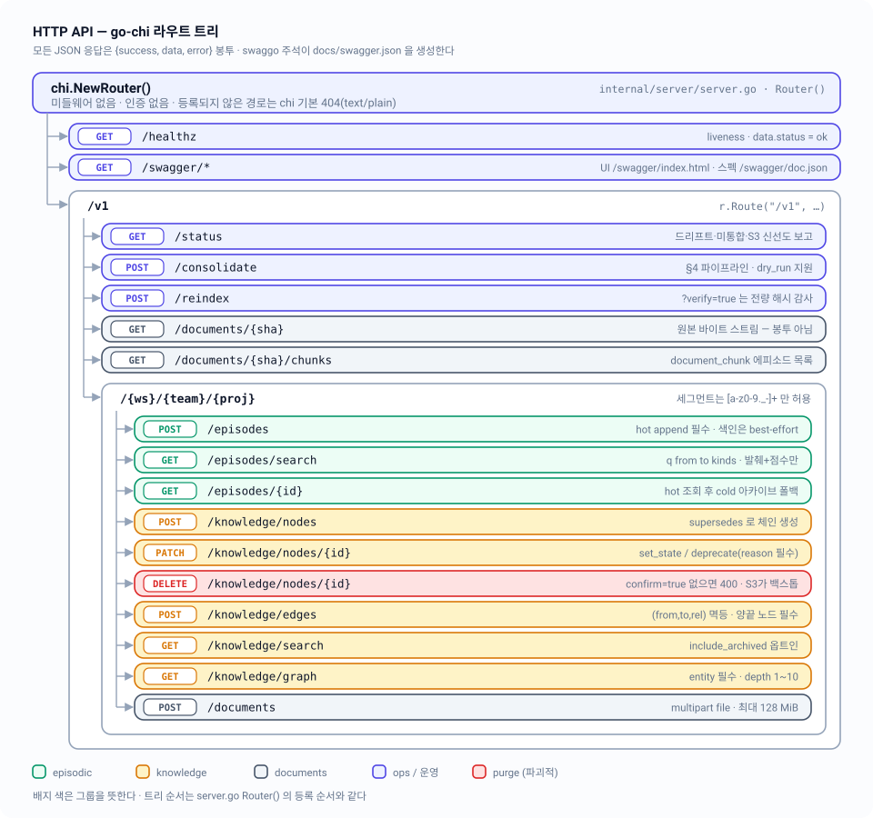

# 08 — HTTP API: go-chi 라우팅과 Swagger

루프백에만 묶인 go-chi 라우터가 16개 엔드포인트를 `{success, data, error}` 봉투로 노출하고, swaggo 주석이 그 스펙을 `docs/swagger.json`으로 생성한다.

| 항목 | 내용 |
|---|---|
| 관련 코드 | [`internal/server/server.go`](../../internal/server/server.go) · [`respond.go`](../../internal/server/respond.go) · [`validate.go`](../../internal/server/validate.go) · [`degraded.go`](../../internal/server/degraded.go) · [`handlers_episodic.go`](../../internal/server/handlers_episodic.go) · [`handlers_knowledge.go`](../../internal/server/handlers_knowledge.go) · [`handlers_documents.go`](../../internal/server/handlers_documents.go) · [`handlers_ops.go`](../../internal/server/handlers_ops.go) · [`cmd/memory-mcp/main.go`](../../cmd/memory-mcp/main.go) · [`internal/config/config.go`](../../internal/config/config.go) |
| 관련 스펙 | [01-overview](01-overview.md) · [03-lifecycle](03-lifecycle.md) · [04-episodic-search](04-episodic-search.md) · [05-knowledge-graph](05-knowledge-graph.md) · [06-documents](06-documents.md) · [07-rehydration](07-rehydration.md) · [10-operations](10-operations.md) · [11-testing](11-testing.md) · 인덱스: [README](README.md) |
| 상태 | 구현 완료 — 라우트 16개 + `/swagger/*`, 전부 핸들러 본체 존재. `docs/swagger.json`은 라우터와 1:1 동기 상태 |



---

## 1. 바인딩과 신뢰 경계 — 인증이 없는 이유

인증 코드가 없는 것이 아니라, **인증이 필요 없는 곳에만 뜨도록 설정 단계에서 강제**한다.

```go
// internal/config/config.go
const DefaultListenAddr = "127.0.0.1:8420"

func (c Config) Validate() error {
	if !strings.HasPrefix(c.ListenAddr, "127.0.0.1:") && !strings.HasPrefix(c.ListenAddr, "localhost:") {
		return fmt.Errorf("config: listen addr %q must bind loopback only (§7)", c.ListenAddr)
	}
	...
}
```

- 주소는 `DJ_MEMORY_LISTEN_ADDR`로 바꿀 수 있지만 `127.0.0.1:` 또는 `localhost:` 접두사가 아니면 `config.Load()`가 에러를 내고 `main`이 `os.Exit(1)` 한다. `0.0.0.0:8420`으로 띄우는 경로 자체가 없다.
- 따라서 요청자는 항상 같은 호스트의 프로세스다. 토큰·세션·CORS·CSRF 계층이 전부 빠져 있고, 그 대신 파괴적 연산은 **명시적 확인 파라미터**로 막는다(`DELETE …?confirm=true`).
- 라우터에는 미들웨어가 하나도 없다. `chi.NewRouter()` 직후 바로 라우트를 붙인다 — 로깅·RequestID·Recoverer·CORS·rate limit 모두 없음. 관측은 핸들러 안의 `slog` 호출로만 한다.

```go
// internal/server/server.go — ListenAndServe
httpServer := &http.Server{
	Addr:              s.cfg.ListenAddr,
	Handler:           s.Router(),
	ReadHeaderTimeout: 5 * time.Second,
}
```

`ctx` 취소(SIGINT/SIGTERM) 시 10초 grace로 `Shutdown`. 요청 단위 타임아웃은 없다 — 대용량 문서 인제스트가 초 단위를 넘길 수 있기 때문이다.

> `Router()`가 반환하는 것은 `http.Handler`이므로 테스트는 `httptest.NewServer(srv.Router())`로 같은 트리를 그대로 띄운다([11-testing](11-testing.md)).

---

## 2. 응답 봉투 `{success, data, error}`

```go
// internal/server/respond.go
type Envelope struct {
	Success bool   `json:"success"`
	Data    any    `json:"data"`
	Error   string `json:"error,omitempty"`
}
```

핸들러가 직접 `json.NewEncoder`를 만지는 곳은 없다. 전부 두 함수만 쓴다.

| 함수 | 출력 | 비고 |
|---|---|---|
| `writeJSON(w, status, data)` | `{"success":true,"data":…}` | `error`는 `omitempty`로 생략 |
| `writeError(w, status, msg)` | `{"success":false,"data":null,"error":"…"}` | `Data`에 `omitempty`가 없어 **에러 응답에는 항상 `"data":null`이 들어간다** |

`Content-Type: application/json`은 두 함수가 직접 세팅한다. 에러 문구는 사용자 대상 문장만 담고, 원인은 `s.deps.Logger.Error(...)`로 서버 쪽에만 남긴다(예: OpenSearch 응답 본문이 클라이언트로 새지 않는다).

**봉투가 아닌 두 경우가 있다.**

1. `GET /v1/documents/{sha}` 성공 응답은 `application/octet-stream` 원본 바이트 스트림이다(실패 시에만 봉투).
2. 라우터에 등록되지 않은 경로/메서드는 chi 기본 핸들러가 처리한다 — `404 page not found`, `405 method not allowed`, 둘 다 `text/plain`. 커스텀 `NotFound`/`MethodNotAllowed`를 붙이지 않았다.

> `respond.go`의 `notImplemented()`(501 스텁)는 스캐폴딩 잔재로, 프로덕션 경로에서는 호출되지 않고 `validate_test.go`에서만 검증된다.

---

## 3. 라우트 표면 — `Router()` 등록 순서 그대로

```go
r.Get("/healthz", s.handleHealthz)
r.Get("/swagger/*", httpSwagger.WrapHandler)

r.Route("/v1", func(r chi.Router) {
	r.Get("/status", s.handleStatus)
	r.Post("/consolidate", s.handleConsolidate)
	r.Post("/reindex", s.handleReindex)

	r.Get("/documents/{sha}", s.handleGetDocument)
	r.Get("/documents/{sha}/chunks", s.handleGetDocumentChunks)

	r.Route("/{ws}/{team}/{proj}", func(r chi.Router) { … })
})
```

프로젝트 스코프 경로 파라미터는 `projectKey(r)` 하나로 뽑는다.

```go
func projectKey(r *http.Request) hotstore.ProjectKey {
	return hotstore.ProjectKey{
		Workspace: chi.URLParam(r, "ws"),
		Team:      chi.URLParam(r, "team"),
		Project:   chi.URLParam(r, "proj"),
	}
}
```

`/v1/documents/...`(정적)와 `/v1/{ws}/...`(파라미터)가 같은 세그먼트를 두고 겹치지만, chi는 정적 노드를 먼저 시도하고 하위 매칭이 실패하면 파라미터 노드로 되돌아간다(`chi/v5 tree.go findRoute`). 즉 `documents`라는 이름의 워크스페이스도 정상 라우팅된다.

### 3.1 episodic

| 메서드 | 경로 | 주요 파라미터 | 성공 | 실패 |
|---|---|---|---|---|
| POST | `/v1/{ws}/{team}/{proj}/episodes` | body `CreateEpisodeRequest` | 201 `{record, degraded?}` | 400 검증, 503 hot store 없음, 500 hot 쓰기 실패 |
| GET | `/v1/{ws}/{team}/{proj}/episodes/search` | `q`(필수) · `from` · `to`(RFC3339) · `kinds`(콤마) | 200 `[]search.Hit` | 400 검증, 503 인덱스 불가, 500 기타 |
| GET | `/v1/{ws}/{team}/{proj}/episodes/{id}` | `id`(ULID) | 200 `episodic.Record` | 400, 503 hot store 없음, 404 hot·cold 모두 없음, 500 |

- **쓰기 계약**: 서버가 ULID를 발급하고(`ulid.At(now.UnixMilli())`) `consolidated:false`로 고정한다. `occurred_at`이 zero면 현재 시각으로 채운다. hot append가 성공해야만 201이고, OpenSearch 업서트는 best-effort — 실패 시 `degraded:["search unavailable"]`을 실어 보내고 매니페스트에 dirty 마킹만 한다.
- **body 검증**(`CreateEpisodeRequest.validate`): `kind ∈ {event, conversation, decision, observation, document_chunk}`, `actor ∈ {agent, user, system}`, `text` 비어 있으면 안 됨. `kind=document_chunk`일 때만 `refs` 필수(`refs.doc_sha`는 소문자 hex sha256, `chunk_seq >= 0`), 그 외 kind에 `refs`가 있으면 400.
- **검색 계약**: 요청 진입 시 `statGate`(재수화 디바운스, [07-rehydration](07-rehydration.md))를 먼저 돌린다. 응답 `Hit`은 `record`(본문 `text`는 비워짐) + `excerpt` + `score`뿐이다 — 본문 전문 주입 없음. `Query.Size`를 핸들러가 설정하지 않으므로 상한은 `search.DefaultSearchSize = 20`건.
- 검색 성공 후 히트한 레코드의 `recall_count`/`last_recalled`를 best-effort로 올린다(`bumpRecall`). 실패해도 응답은 그대로 200.
- **조회 계약**: hot 미스면 `Archiver.FetchArchivedEpisode`로 S3 아카이브를 뒤진다. 에피소드가 cold로 가라앉아도 provenance 링크가 계속 해석되도록 하기 위함([03-lifecycle](03-lifecycle.md)).

```bash
# 저장
curl -sS -X POST http://127.0.0.1:8420/v1/vms/ai/memory-mcp/episodes \
  -H 'Content-Type: application/json' \
  -d '{"kind":"decision","actor":"user",
       "occurred_at":"2026-08-25T10:00:00Z",
       "text":"블랙박스 검증은 실버킷 프리픽스를 쓰기로 결정했다",
       "entities":["blackbox","s3"]}'
# {"success":true,"data":{"record":{"id":"01K...","kind":"decision","consolidated":false,
#   "recall_count":0,"last_recalled":""}}}

# 형태소 검색 (nori — "끄는"으로 저장된 "끄고"를 찾는다)
curl -sS -G http://127.0.0.1:8420/v1/vms/ai/memory-mcp/episodes/search \
  --data-urlencode 'q=보안을 끄는' \
  --data-urlencode 'kinds=decision,observation' \
  --data-urlencode 'from=2026-08-01T00:00:00Z'
```

### 3.2 knowledge

| 메서드 | 경로 | 주요 파라미터 | 성공 | 실패 |
|---|---|---|---|---|
| POST | `…/knowledge/nodes` | body `CreateNodeRequest` | 201 `{node, degraded?}` | 400, 503, 404 supersede 대상 없음, 500 |
| PATCH | `…/knowledge/nodes/{id}` | body `PatchNodeRequest` | 200 `{node, degraded?}` | 400, 503, 404, **409 불법 전이**, 500 |
| DELETE | `…/knowledge/nodes/{id}` | `confirm=true`(필수) | 200 `{purged_id, removed_edges, degraded?}` | 400 confirm 누락, 503, 404, 500 |
| POST | `…/knowledge/edges` | body `knowledge.Edge` | 201 `{edge, degraded?}` | 400, 503, 404 끝점 노드 없음, 500 |
| GET | `…/knowledge/search` | `q`(필수) · `include_archived` | 200 `[]knowledge.Node` | 400, 503, 500 |
| GET | `…/knowledge/graph` | `entity`(필수) · `depth`(1~10) | 200 `knowledge.Graph` | 400, 503, 500 |

- **노드 생성**: `kind ∈ {entity, fact, lesson, preference, document}`, `name` 비어 있으면 안 되고, `trust ∈ {user-stated, agent-inferred, imported}`. `provenance`/`supersedes`의 각 원소는 ULID여야 한다. `review_after`는 RFC3339이거나 빈 문자열. 상태는 항상 `active`로 시작한다.
- `supersedes`가 비어 있지 않으면 `knowledge.Supersede(graph, node, ids, now)`를 hot 그래프에 적용한다 — 판정은 호출자 몫이고 서버는 시키는 대로만 한다. 대상 노드가 없으면 404.
- **쓰기 순서**는 전 엔드포인트 동일: hot JSON 원자 쓰기 성공 → Neo4j MERGE는 best-effort(`mirrorKnowledge`). Neo4j가 죽어 있으면 `degraded:["graph unavailable"]` + dirty 마킹, 그래도 201/200.
- **엣지**: `from`/`to`는 ULID, `rel ∈ {relates_to, derived_from, supersedes, about}`, `confidence ∈ [0,1]`, 양끝 노드가 hot 그래프에 실제로 있어야 한다(없으면 404). `(from, to, rel)` 조합은 멱등 — 다시 POST하면 기존 엣지를 교체한다.
- **PATCH**: `op`는 `set_state`(`state ∈ {active, archived, deprecated}`) 또는 `deprecate`. 목표 상태가 `deprecated`면 `reason`이 필수다. 전이 합법성은 `knowledge.Transition`이 판정하며 `ErrInvalidTransition`은 **409**로 매핑된다.
- **DELETE(purge)**: `confirm=true` 검사가 **id 검증보다 먼저** 실행된다. 노드와 그 노드에 걸린 모든 엣지를 hot에서 제거하고 제거된 엣지 수를 반환하며, Neo4j에서도 best-effort로 지운다. 복구는 S3 버저닝이 백스톱이다([02-storage-model](02-storage-model.md)).
- **검색/순회**: 둘 다 진입 시 `statGate`를 돈다. `include_archived`는 문자열 `"true"`일 때만 참으로 본다. Cypher 전문검색은 `LIMIT 50`, 순회 깊이는 서버에서 1~10으로 강제되고 Neo4j 쪽에서도 한 번 더 clamp 된다([05-knowledge-graph](05-knowledge-graph.md)).

```bash
# 사실 등록 + 기존 사실 supersede
curl -sS -X POST http://127.0.0.1:8420/v1/vms/ai/memory-mcp/knowledge/nodes \
  -H 'Content-Type: application/json' \
  -d '{"kind":"fact","name":"S3 리전","body":"버킷 리전은 ap-northeast-2 이다",
       "trust":"user-stated","provenance":["01K3ABC..."],"supersedes":["01K3OLD..."]}'

# 상태 전이 (reason 없으면 400)
curl -sS -X PATCH http://127.0.0.1:8420/v1/vms/ai/memory-mcp/knowledge/nodes/01K3OLD... \
  -H 'Content-Type: application/json' \
  -d '{"op":"deprecate","reason":"프로파일 기본 리전과 혼동한 오기록"}'

# 이웃 순회
curl -sS -G http://127.0.0.1:8420/v1/vms/ai/memory-mcp/knowledge/graph \
  --data-urlencode 'entity=OpenSearch' --data-urlencode 'depth=2'

# purge — confirm 없으면 400
curl -sS -X DELETE 'http://127.0.0.1:8420/v1/vms/ai/memory-mcp/knowledge/nodes/01K3OLD...?confirm=true'
```

### 3.3 documents

| 메서드 | 경로 | 주요 파라미터 | 성공 | 실패 |
|---|---|---|---|---|
| POST | `/v1/{ws}/{team}/{proj}/documents` | multipart `file` | 201 `document.IngestResult` | 400, 503 파이프라인/S3 없음, 500 |
| GET | `/v1/documents/{sha}` | `sha`(64 hex) | 200 원본 바이트 | 400, 503, 404, 500 |
| GET | `/v1/documents/{sha}/chunks` | `sha`(64 hex) | 200 `[]episodic.Record` | 400, 503, 404, 500 |

- 조회 두 개는 **프로젝트 스코프 밖**이다. blob은 content-addressed라 sha만으로 전역 유일하다.
- 인제스트는 `Documents`와 `Archiver`가 **둘 다** 있어야 한다. S3가 없으면 `503 "cold storage unavailable"` — §6의 blob 업로드가 cold-first라서 S3 없이는 계약이 성립하지 않기 때문이다.
- 업로드 상한: `http.MaxBytesReader`로 128 MiB, `ParseMultipartForm` 메모리 임계 32 MiB. 초과하면 `400 "multipart form unreadable or too large"`.
- 폼 필드 이름은 `file` 고정이고 파일명이 비면 400.
- 응답 `IngestResult`는 `sha`·`blob_key`·`node_id`·`extractable`·`chunk_ids[]`·`truncated?`. 텍스트 레이어가 없는 스캔 PDF는 `extractable:false`로 **정직하게** 보고하고 서버가 OCR로 추측하지 않는다([06-documents](06-documents.md)).
- 원본 다운로드는 로컬 blob 캐시 우선, 미스 시 S3 재수화. 스트리밍 도중 끊기면 헤더가 이미 나갔으므로 로그만 남긴다.

```bash
# 인제스트
curl -sS -X POST http://127.0.0.1:8420/v1/vms/ai/memory-mcp/documents \
  -F 'file=@architecture-v2.pdf'
# {"success":true,"data":{"sha":"9f2b…","blob_key":"jin/blobs/9f2b…",
#   "node_id":"01K…","extractable":true,"chunk_ids":["01K…","01K…"]}}

# 원본 바이트 (봉투 아님)
curl -sS -o restored.pdf http://127.0.0.1:8420/v1/documents/9f2b…

# 이 문서에서 나온 청크 에피소드
curl -sS http://127.0.0.1:8420/v1/documents/9f2b…/chunks
```

### 3.4 ops

| 메서드 | 경로 | 주요 파라미터 | 성공 | 실패 |
|---|---|---|---|---|
| GET | `/healthz` | — | 200 `{"status":"ok"}` | — |
| GET | `/v1/status` | — | 200 `StatusReport` | 503 hot store 없음, 500 매니페스트 불가 |
| POST | `/v1/consolidate` | body `ConsolidateRequest`(선택) | 200 `consolidate.Report` | 400 프로젝트 셀렉터 오류, 503, 500 |
| POST | `/v1/reindex` | `verify=true`(선택) | 200 `rehydrate.Report` | 503, 500 |

- `/healthz`는 의존성을 하나도 보지 않는다. 프로세스가 살아 있으면 200 — liveness 전용이고 readiness가 아니다. 실제 건강 상태는 `/v1/status`가 말한다.
- `StatusReport`는 정직성 계약 그 자체다: `drift`(episodic/knowledge 각각 `detected`·`reason`·`unavailable`), `unconsolidated`, `stale_unconsolidated`(TTL 초과했는데 미통합이라 가라앉지 못하는 건수), `manifest_updated_at`, `dirty_files[]`(정렬됨), `s3{reachable,bucket,last_archive_at,last_snapshot_at}`, `degraded[]`.
- S3 도달성 판정은 `BlobExists(sha256(""))` 프로브 한 방이다 — 존재하지 않아도 에러 없이 false를 돌려주면 도달 가능으로 본다.
- 미통합 카운트는 전 프로젝트의 hot 에피소드를 훑는다. 부분 실패는 `degraded`에 문자열로 남기고 `/status` 자체는 계속 200을 답한다.
- `/v1/consolidate`의 body는 **비어 있어도 된다**(`decodeJSON(..., allowEmpty=true)`). `projects`는 `"ws/team/proj"` 문자열 배열이며 형식이 틀리면 400. `dry_run:true`면 무엇이 가라앉을지만 계산한다.
- 통합 실행 후 `ArchiveKeys`/`SnapshotKeys`가 비어 있지 않으면 `/status`가 보고하는 `last_archive_at`/`last_snapshot_at`을 갱신한다(프로세스 메모리, 뮤텍스 보호).
- `/v1/reindex`는 `verify` 쿼리가 정확히 `"true"`일 때만 전량 해시 감사를 켠다.

```bash
curl -sS http://127.0.0.1:8420/healthz
# {"success":true,"data":{"status":"ok"}}

curl -sS http://127.0.0.1:8420/v1/status
# {"success":true,"data":{"drift":{"episodic":{"detected":false,"unavailable":false},…},
#   "unconsolidated":12,"stale_unconsolidated":0,"dirty_files":[],
#   "s3":{"reachable":true,"bucket":"vms-memory-mcp",…},"degraded":[]}}

curl -sS -X POST http://127.0.0.1:8420/v1/consolidate \
  -H 'Content-Type: application/json' \
  -d '{"projects":["vms/ai/memory-mcp"],"dry_run":true}'

curl -sS -X POST 'http://127.0.0.1:8420/v1/reindex?verify=true'
```

---

## 4. 경계 검증과 상한값

`internal/server/validate.go`가 모든 HTTP 경계 검증을 모아 둔다. 같은 규칙을 `hotstore`가 자기 경계에서 한 번 더 검사한다(이중 방어).

| 대상 | 규칙 | 위반 시 |
|---|---|---|
| `{ws}` `{team}` `{proj}` | `^[a-z0-9._-]+$`, 빈 문자열·`.`·`..` 금지 | 400 |
| `{sha}` | `^[0-9a-f]{64}$` | 400 |
| `{id}`(episode·node) | `ulid.IsULID` | 400 |
| `provenance` / `supersedes` 원소 | 전부 ULID | 400, 어긋난 값을 문구에 포함 |
| JSON body | `maxJSONBodyBytes = 1 MiB`, 빈 body 금지(`/v1/consolidate` 제외) | 400 |
| multipart | `maxUploadBytes = 128 MiB`, `multipartMemoryBytes = 32 MiB` | 400 |
| `depth` | `defaultGraphDepth = 1`, `maxGraphDepth = 10` | 400 |
| `from` / `to` | RFC3339 | 400 |
| `kinds` | 콤마 분리, 각 값이 알려진 kind | 400 |

- `decodeJSON`은 `Content-Type`을 **검사하지 않는다**. 본문이 유효한 JSON이면 통과한다.
- `normalizeStrings`는 문자열 배열의 공백을 다듬고 빈 값을 버리며 **항상 non-nil 슬라이스**를 돌려준다 — hot JSON에 `null` 배열이 남지 않도록.
- 불리언 쿼리(`confirm`, `verify`, `include_archived`)는 전부 `== "true"` 정확 비교다. `1`·`TRUE`·`yes`는 false로 취급된다.

---

## 5. degraded 규칙 — 쓰기는 살고 파생 읽기는 죽는다

`Deps`의 모든 필드는 인터페이스이고 nil일 수 있다. 파생 저장소가 죽어 있어도 서버는 부팅한다([07-rehydration](07-rehydration.md), [10-operations](10-operations.md)).

| 상황 | 쓰기 엔드포인트 | 파생 읽기 엔드포인트 |
|---|---|---|
| OpenSearch 불가 | 201 + `degraded:["search unavailable"]` + dirty 마킹 | `GET …/episodes/search` → 503 |
| Neo4j 불가 | 201/200 + `degraded:["graph unavailable"]` + dirty 마킹 | `GET …/knowledge/search`·`graph` → 503 |
| S3 불가 | 문서 인제스트만 503 `cold storage unavailable` | `GET …/episodes/{id}`의 cold 폴백 불가 → 404 |
| hot store 불가 | 503 (`hot store unavailable`) | 503 |

문구 상수는 `degraded.go`에 세 개뿐이다: `"search unavailable"`, `"graph unavailable"`, `"cold storage unavailable"`. degraded 노트와 503 본문이 **같은 문자열**을 쓴다.

---

## 6. swaggo — 주석에서 스펙, 스펙에서 UI

**① 전역 API 정보**는 `cmd/memory-mcp/main.go`의 주석 블록에 있다.

```go
//	@title			memory-mcp v2 API
//	@version		2.0
//	@description	Local personal memory server: episodic (OpenSearch) + knowledge (Neo4j) …
//	@host			127.0.0.1:8420
//	@BasePath		/
```

**② 엔드포인트 주석**은 각 핸들러 위 `godoc` 블록에 붙는다. 응답은 제네릭 합성으로 쓴다.

```go
//	@Success	201	{object}	Envelope{data=CreateEpisodeResponse}
//	@Failure	503	{object}	Envelope	"index unavailable (§5)"
//	@Router		/v1/{ws}/{team}/{proj}/episodes [post]
```

이 표기는 `swagger.json`에서 `allOf: [ {$ref: server.Envelope}, {properties: {data: {$ref: server.CreateEpisodeResponse}}} ]`로 전개된다. 봉투 구조가 스펙에서도 그대로 보인다.

**③ 생성**은 `make swagger`.

```make
swagger: ## Regenerate docs/ (swagger.json + docs.go) from swag annotations
	$(GO) run github.com/swaggo/swag/cmd/swag init -g cmd/memory-mcp/main.go -o docs --parseInternal
	$(GO) run github.com/swaggo/swag/cmd/swag fmt -d internal/server,cmd/memory-mcp
```

- `--parseInternal`이 필수다. DTO(`server.*`)와 도메인 타입(`episodic.Record`, `knowledge.Node`, `search.Hit`, `document.IngestResult`, `consolidate.Report`, `rehydrate.Report` …)이 전부 `internal/` 아래에 있어서, 이 플래그가 없으면 정의가 비어 버린다.
- swag CLI 버전은 `tools.go`(`//go:build tools`)가 `go.mod`에 못 박는다 — 현재 `github.com/swaggo/swag v1.16.6`.
- 산출물은 `docs/docs.go`, `docs/swagger.json`, `docs/swagger.yaml`. 현재 스펙에는 **16개 오퍼레이션과 31개 definition**이 들어 있고, `/swagger/*` 자신은 문서화 대상이 아니다.

**④ 등록**은 blank import 하나로 끝난다.

```go
_ "github.com/drakejin/memory-mcp/docs" // swag-generated OpenAPI spec
```

`docs.init()`이 `swag.Register("swagger", SwaggerInfo)`를 호출하고, 핸들러는 그 인스턴스를 읽는다.

**⑤ 서빙**은 `r.Get("/swagger/*", httpSwagger.WrapHandler)` 한 줄이다. `swaggo/http-swagger/v2 v2.0.2`의 기본 설정(`URL: "doc.json"`)으로 동작하며 경로 꼬리표에 따라 갈린다.

| 요청 | 응답 |
|---|---|
| `/swagger/index.html` | Swagger UI HTML(내장 템플릿) |
| `/swagger/doc.json` | `swag.ReadDoc("swagger")` 결과 = 생성된 OpenAPI 2.0 문서 |
| `/swagger/swagger-ui-bundle.js` 등 | `swaggo/files/v2`에 임베드된 정적 자산 |
| `/swagger/` | `index.html`로 301 리다이렉트 |
| GET 이외 메서드 | 핸들러가 `405 Method not allowed`(chi에도 GET만 등록되어 있음) |

블랙박스 시나리오 1이 부팅 직후 `GET /swagger/doc.json`이 200이고 OpenAPI 문서로 파싱되는지 검사한다([11-testing](11-testing.md)).

---

## 7. ⚠️ 설계 문서와 차이

설계 문서 §7과 실제 코드가 어긋나거나, 문서가 말하지 않은 실제 동작들.

1. **swaggo 주석의 응답 코드는 실제 반환 코드의 부분집합이다.** 거의 모든 핸들러가 의존성 nil일 때 503을, 내부 실패에 500을 반환하지만 주석에는 빠져 있다. 예: `POST …/episodes`는 `@Failure 400/500`만 선언하는데 `Store == nil`이면 503, `GET …/episodes/{id}`도 마찬가지, `GET /v1/status`는 200만 선언하지만 503/500을 낼 수 있다. `docs/swagger.json`을 클라이언트 생성기에 그대로 먹이면 이 경로들이 누락된다.
2. **`GET …/knowledge/graph`의 미존재 entity는 404가 아니라 500이다.** `graph.Client.Neighborhood`는 `knowledge.ErrNodeNotFound`를 감싸 돌려주지만, 핸들러는 `graph.ErrUnavailable`만 분기하고 나머지를 `500 "knowledge traversal failed"`로 뭉갠다.
3. **설계 문서의 "`include_archived` 옵트인"은 knowledge 검색에만 있다.** episodic 검색에는 해당 파라미터가 없다 — episodic record에는 state 개념 자체가 없기 때문이다. 문서의 recall 문단이 두 평면을 뭉뚱그린 표현이다.
4. **"모든 응답 `{success, data, error}` 봉투"에는 예외가 둘 있다.** `GET /v1/documents/{sha}`의 성공 응답(원본 바이트)과, 라우터 레벨 404/405(chi 기본 `text/plain`).
5. **에러 봉투에는 `"data": null`이 항상 들어간다.** `Envelope.Data`에 `omitempty`가 없기 때문이며, 설계 문서는 이 필드의 존재 여부를 규정하지 않는다.
6. 설계 문서 §7 표는 `DELETE …/knowledge/nodes/{id}?confirm=true`만 적지만, 코드는 **confirm 검사를 id 검증보다 먼저** 수행한다 — 잘못된 id + confirm 누락이면 에러 문구가 confirm 쪽으로 나온다.

---

## 8. 코드 위치

| 개념 | 파일 | 심볼 |
|---|---|---|
| 라우트 트리 | `internal/server/server.go` | `(*Server).Router` |
| 서버 수명주기 | `internal/server/server.go` | `(*Server).ListenAndServe`, `New`, `Deps` |
| 부팅 드리프트 점검 | `internal/server/startup.go` | `(*Server).Startup` |
| 응답 봉투 | `internal/server/respond.go` | `Envelope`, `writeJSON`, `writeError` |
| 경계 검증·상한 | `internal/server/validate.go` | `validateProjectKey`, `validateSHA`, `decodeJSON`, `parseKindsParam`, `maxUploadBytes` |
| degraded 문구·매니페스트 | `internal/server/degraded.go` | `degradedSearch`, `degradedGraph`, `degradedCold`, `markDirty`, `markIndexed`, `statGate` |
| episodic 핸들러 | `internal/server/handlers_episodic.go` | `handleCreateEpisode`, `handleSearchEpisodes`, `handleGetEpisode`, `bumpRecall` |
| knowledge 핸들러 | `internal/server/handlers_knowledge.go` | `handleCreateNode`, `handleCreateEdge`, `handlePatchNode`, `handlePurgeNode`, `handleSearchKnowledge`, `handleKnowledgeGraph`, `mirrorKnowledge` |
| documents 핸들러 | `internal/server/handlers_documents.go` | `handleIngestDocument`, `handleGetDocument`, `handleGetDocumentChunks` |
| ops 핸들러 | `internal/server/handlers_ops.go` | `handleStatus`, `handleConsolidate`, `handleReindex`, `StatusReport`, `S3SyncStatus` |
| 전역 swagger 주석·조립 | `cmd/memory-mcp/main.go` | `@title`/`@host`/`@BasePath`, `_ "…/docs"` |
| 바인딩 강제 | `internal/config/config.go` | `DefaultListenAddr`, `(Config).Validate` |
| 생성된 스펙 | `docs/docs.go`, `docs/swagger.json`, `docs/swagger.yaml` | `SwaggerInfo`, `docTemplate` |
| swag CLI 핀 | `tools.go`, `Makefile` | `//go:build tools`, `make swagger` |
| API 블랙박스 | `test/blackbox/blackbox_test.go`, `harness_test.go` | `TestScenario01_…`, `postJSON`, `postMultipart`, `projPath` |
