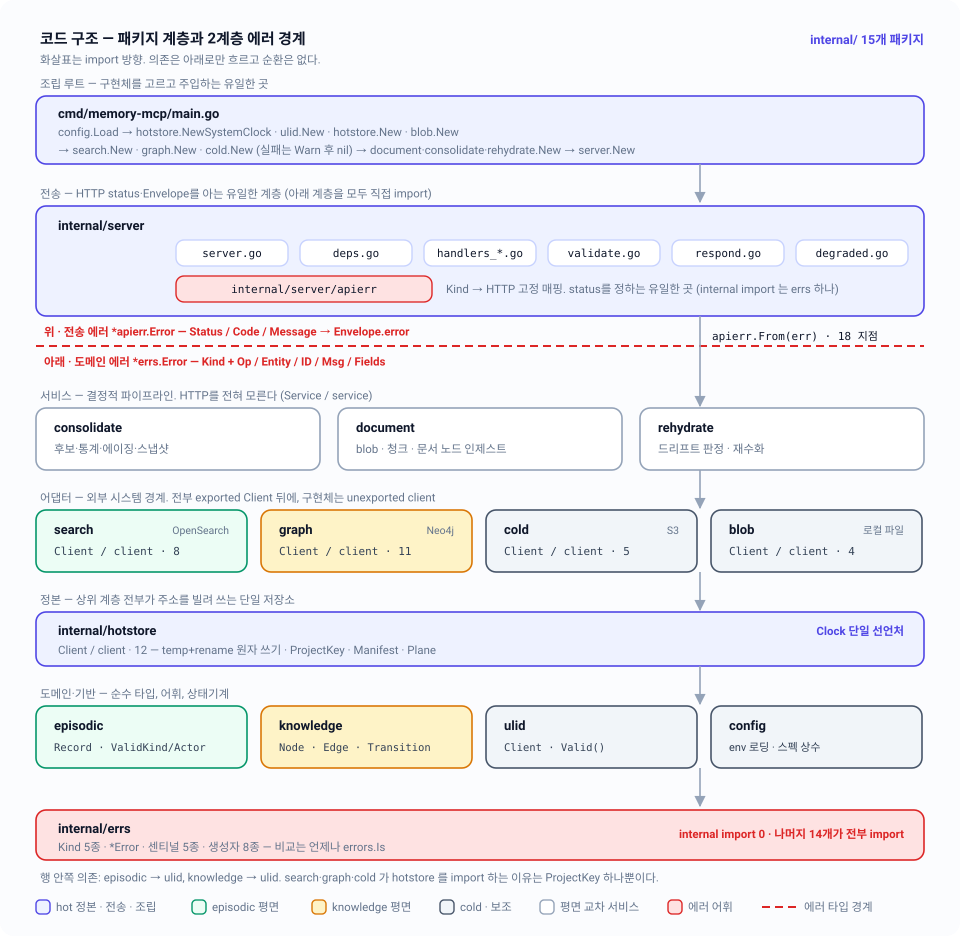

# 09 — 코드 구조: 패키지 경계·인터페이스·에러 계층

`internal/` 13개 패키지가 어떤 단일 책임을 지고, 어느 방향으로만 의존하며, 에러가 어느 한 지점에서 도메인 의미에서 HTTP 전송으로 바뀌는지.

| 항목 | 내용 |
|---|---|
| 관련 코드 | `cmd/memory-mcp/main.go` · `internal/{blob,cold,config,consolidate,document,episodic,graph,hotstore,knowledge,rehydrate,search,server,ulid}` |
| 관련 스펙 | [01-overview](01-overview.md) · [02-storage-model](02-storage-model.md) · [07-rehydration](07-rehydration.md) · [08-http-api](08-http-api.md) · [10-operations](10-operations.md) · [11-testing](11-testing.md) · 인덱스: [README](README.md) |
| 상태 | 계층·인터페이스·주입은 **구현됨**. 2계층 에러 타입(`internal/errs` / `internal/server/apierr`)은 **미구현** — §5.1 참조 |



---

## 1. 패키지 지도 — 단일 책임과 의존 방향

`go.mod` 모듈 경로는 `github.com/drakejin/memory-mcp`, Go 1.25.9. 아래 "internal 의존"은 테스트 파일을 제외한 실제 import 목록이다.

| 계층 | 패키지 | 단일 책임 | internal 의존 |
|---|---|---|---|
| L6 조립 | `cmd/memory-mcp` | 구현체 선택·배선·시그널 처리. 유일한 composition root | blob, cold, config, consolidate, document, graph, hotstore, rehydrate, search, server |
| L5 전송 | `internal/server` | chi 라우팅, 요청 검증, HTTP status, `{success,data,error}` 봉투, degraded 표기 | (아래 전부) cold, config, consolidate, document, episodic, graph, hotstore, knowledge, rehydrate, search, ulid |
| L4 서비스 | `internal/consolidate` | §4 파이프라인 — 증류 후보 클러스터링, entity 통계, 에이징, 스냅샷 | cold, config, episodic, hotstore, search |
| L4 서비스 | `internal/document` | §6 인제스트 — sha256, blob cold-first 업로드, 결정적 추출, 청킹, 문서 노드 | blob, cold, config, episodic, hotstore, knowledge, ulid |
| L4 서비스 | `internal/rehydrate` | §5 드리프트 판정, 전체/부분 재수화, stat-gate 디바운스 | graph, hotstore, search |
| L3 어댑터 | `internal/search` | OpenSearch — nori 질의, bulk 색인, doc count, 인덱스 drop | episodic, hotstore |
| L3 어댑터 | `internal/graph` | Neo4j — MERGE upsert, 이웃 순회, supersede 체인, node count | hotstore, knowledge |
| L3 어댑터 | `internal/cold` | S3 — 오브젝트 IO(`Storage`) + 아카이브 포맷·키 레이아웃(`Archiver`) | episodic, hotstore, knowledge |
| L3 어댑터 | `internal/blob` | 로컬 content-addressed 캐시 `{home}/blobs/{sha256}` | **없음** |
| L2 정본 | `internal/hotstore` | 정본 JSON 저장소 — 원자 쓰기, manifest, `ProjectKey` 검증, `Clock` 선언 | episodic, knowledge |
| L1 도메인 | `internal/episodic` | episodic record 타입·검증 | ulid |
| L1 도메인 | `internal/knowledge` | 노드·엣지 타입, 상태기계(`Transition`), `Supersede` | ulid |
| L0 기반 | `internal/ulid` | Crockford base32 ULID 생성·검증 (프로세스 모노토닉) | **없음** |
| L0 기반 | `internal/config` | env 로딩·검증 + 스펙 상수(`MaxDocumentChunks`, `MaxProjectRecords`, …) | **없음** |

### 1.1 의존 규칙

1. **아래로만 흐른다.** L(n)은 L(n-1) 이하만 import한다. 위 표의 의존 목록에 계층 역행이 없다 = 순환이 없다.
2. **어댑터끼리는 서로 모른다.** `search`↔`graph`↔`cold`↔`blob` 사이에 import가 없다. 두 어댑터를 함께 쓰는 조합은 L4 서비스나 L5에서만 일어난다.
3. **서비스끼리도 서로 모른다.** `consolidate`↔`document`↔`rehydrate` 사이에 import가 없다.
4. **`hotstore`가 허브다.** L2 위의 모든 패키지가 `hotstore.ProjectKey`(주소)와 `hotstore.Clock`(시계)을 공유하기 때문에 어댑터·서비스 전부가 hotstore를 import한다. 도메인 타입(`episodic`,`knowledge`)을 통과시키기 위한 것이기도 하다.
5. **`document`만 `cold`와 `blob`을 동시에 안다.** blob은 cold-first 정책(§6 step 2)의 로컬 캐시일 뿐이므로 두 계층을 잇는 책임이 document에 몰려 있다.

검증 방법 (`go`가 있는 환경):

```bash
go list -deps ./internal/... >/dev/null   # 순환이면 컴파일 자체가 실패한다
go vet ./...
```

Go 컴파일러가 패키지 순환을 금지하므로 `make build`가 통과하는 한 §1.1-1은 자동 보장된다. 계층 역행(예: `hotstore`가 `search`를 import)은 컴파일은 되지만 규약 위반이므로 리뷰에서 잡는다.

---

## 2. Interface / 구현체 규약 — 코드의 실제 모습

외부 세계(OpenSearch·Neo4j·S3·파일시스템·시계)에 닿는 컴포넌트는 전부 **인터페이스 + 구현체 struct** 쌍이고, 각 구현체는 컴파일타임 계약 체크를 갖는다.

| 패키지 | 인터페이스 | 구현체 | 생성자 | 계약 체크 |
|---|---|---|---|---|
| `hotstore` | `Store` | `*FileStore` | `New(home string, clock Clock) *FileStore` | `var _ Store = (*FileStore)(nil)` |
| `hotstore` | `Clock` | `SystemClock` (값 타입) | — | — |
| `search` | `Index` | `*Client` | `NewClient(url string) (*Client, error)` | `var _ Index = (*Client)(nil)` |
| `graph` | `Store` | `*Client` | `NewClient(url, user, password string) (*Client, error)` | `var _ Store = (*Client)(nil)` |
| `cold` | `Storage` | `*S3Storage` | `NewS3(ctx, profile, region, bucket string) (*S3Storage, error)` | `var _ Storage = (*S3Storage)(nil)` |
| `cold` | `Archiver` | `*S3Archiver` | `NewArchiver(storage Storage, username string) *S3Archiver` | `var _ Archiver = (*S3Archiver)(nil)` |
| `blob` | `Cache` | `*FileCache` | `New(dir string) *FileCache` | `var _ Cache = (*FileCache)(nil)` |
| `document` | `Service` | `*Ingestor` | `NewIngestor(deps Deps) *Ingestor` | `var _ Service = (*Ingestor)(nil)` |
| `document` | `Extractor` | `DefaultExtractor` (값 타입) | — | `var _ Extractor = DefaultExtractor{}` |
| `consolidate` | `Consolidator` | `*Runner` | `New(store, index, archiver, clock, ttlDays) *Runner` | `var _ Consolidator = (*Runner)(nil)` |
| `rehydrate` | `Rehydrator` | `*Runner` | `New(store, index, gr, clock) *Runner` | `var _ Rehydrator = (*Runner)(nil)` |
| `server` | — | `*Server` | `New(cfg config.Config, deps Deps) *Server` | — |

지켜지고 있는 부분:

- **생성자는 I/O를 하지 않는다.** `search.NewClient`/`graph.NewClient`는 다이얼하지 않고 클라이언트 객체만 만든다. 연결 확인은 `Ping(ctx)`. `cold.NewS3`도 shared config만 읽고 첫 호출 전까지 네트워크를 건드리지 않는다.
- **테스트 fake가 같은 인터페이스를 구현한다.** 프로덕션 코드에 테스트 분기가 없다 (`internal/server/fakes_test.go`의 `fakeStore`/`fakeIndex`/`fakeGraph`/`fakeClock`).
- **파생 저장소가 nil이어도 부팅된다.** `main.go`는 `search.NewClient`/`graph.NewClient`/`cold.NewS3` 실패를 `logger.Warn`으로만 처리하고 해당 `Deps` 필드를 nil로 남긴다. degraded 판단은 핸들러와 `rehydrate.Runner`가 nil 체크로 수행한다.

### 2.1 ⚠️ 설계 문서와 차이

[code-standards.md §1](../design/code-standards.md)은 `Client`/`client` 이름 통일, unexported 구현체, `New(cfg Config) (Client, error)` 단일 생성자를 요구한다. **코드는 전부 다르다.**

| 규약 | 실제 코드 | 비고 |
|---|---|---|
| 인터페이스 이름 = `Client` | 역할 이름 — `Store`, `Index`, `Storage`, `Archiver`, `Cache`, `Service`, `Consolidator`, `Rehydrator`, `Extractor` | `search.Index`/`graph.Store`가 `search.Client`/`graph.Client`보다 역할을 정확히 말한다. 다만 `Client`라는 이름은 **구현체**가 가져가 버려서 규약과 정반대다 |
| 구현체는 unexported (`client`) | 전부 exported — `FileStore`, `Client`, `S3Storage`, `S3Archiver`, `FileCache`, `Ingestor`, `Runner` | `graph.Client.Close(ctx)`처럼 인터페이스에 없는 메서드를 `main.go`가 직접 부르기 때문에 exported가 필요했다 |
| 생성자는 `New(cfg Config) (Client, error)` 하나 | 이름이 5종(`New`, `NewClient`, `NewS3`, `NewArchiver`, `NewIngestor`), 반환형이 **구현체 포인터**, 인자는 위치 인자 | `Config` struct 인자는 `document.NewIngestor(Deps)`와 `server.New(cfg, Deps)` 두 곳만 |
| 생성자가 인터페이스를 반환 | 구현체를 반환 (`*Client`, `*Runner`, …) | Go 관용("구조체를 반환하고 인터페이스를 받는다")에는 맞지만 규약 문구와는 다르다 |

이 차이는 **버그가 아니라 규약 미수렴**이다. 코드가 일관되게 "역할 인터페이스 + exported 구현체 + 구현체 반환 생성자" 형태로 통일돼 있으므로, 정리한다면 규약 문서를 코드 쪽으로 맞추는 편이 변경 폭이 작다.

추가 차이: code-standards.md의 예시는 `EnsureIndex(ctx, key hotstore.ProjectKey)`처럼 프로젝트별 인덱스를 가정하지만, 실제 `search.Index.EnsureIndex(ctx)`는 인자가 없다 — 인덱스는 `IndexName = "dj-memory-episodic"` 하나이고 프로젝트 스코프는 `workspace`/`team`/`project` keyword 필드로 잡는다 (`internal/search/mapping.go`).

---

## 3. 소비자 측 narrow interface (duck typing)

인터페이스는 **쓰는 쪽이 필요한 만큼만** 다시 선언한다. 코드 안의 정본 예시는 `internal/document/document.go`다 — 4개의 좁은 인터페이스를 직접 선언하고 `Deps`로 주입받는다.

```go
// internal/document/document.go:105-140
type Deps struct {
	Store     hotstore.Store
	Cache     BlobCache
	Archiver  BlobArchiver
	Index     RecordIndexer
	Graph     NodeUpserter
	Extractor Extractor
	Clock     hotstore.Clock
}

// BlobCache is the subset of blob.Cache the pipeline needs (kept local to
// avoid a dependency knot; blob.FileCache satisfies it).
type BlobCache interface {
	Put(ctx context.Context, data io.Reader) (sha string, size int64, err error)
	Get(ctx context.Context, sha string) (io.ReadCloser, error)
}

// BlobArchiver is the subset of cold.Archiver the pipeline needs.
type BlobArchiver interface {
	UploadBlob(ctx context.Context, sha string, r io.Reader) (s3Key string, err error)
	FetchBlob(ctx context.Context, sha string) (io.ReadCloser, error)
	BlobExists(ctx context.Context, sha string) (bool, error)
}

// RecordIndexer is the subset of search.Index the pipeline needs (best-effort;
// failure marks manifest dirty, never fails the ingest).
type RecordIndexer interface {
	IndexRecords(ctx context.Context, key hotstore.ProjectKey, recs []episodic.Record) error
}

// NodeUpserter is the subset of graph.Store the pipeline needs to mirror the
// auto-created document node (best-effort).
type NodeUpserter interface {
	UpsertNodes(ctx context.Context, key hotstore.ProjectKey, nodes []knowledge.Node) error
}
```

효과가 실측된다:

- `blob.Cache`는 4개 메서드(`Put`/`Get`/`Has`/`Evict`)지만 document가 요구하는 건 2개다 → document 단위 테스트의 fake는 2개만 구현하면 된다.
- `cold.Archiver`는 6개 메서드지만 document가 요구하는 건 blob 관련 3개다. `ArchiveEpisodes`/`SnapshotKnowledge`는 document의 관심사가 아니다.
- `search.Index`는 7개 메서드지만 document가 쓰는 건 `IndexRecords` 하나다.
- `main.go`는 `document.Deps{Cache: cache, Archiver: deps.Archiver, Index: deps.Index, Graph: deps.Graph, ...}`로 **넓은 구현체를 그냥 꽂는다** — Go의 구조적 타이핑이 자동으로 만족시킨다. 어댑터 코드도, 캐스팅도 없다.

### 3.1 ⚠️ narrow interface가 적용되지 않은 곳

code-standards.md §1.1이 예시로 든 `consolidate.EpisodeIndexer` / `ColdArchiver`는 **코드에 없다.** 실제 `consolidate.Runner`는 넓은 인터페이스를 통째로 받는다.

```go
// internal/consolidate/consolidate.go:74-87
type Runner struct {
	store    hotstore.Store
	index    search.Index    // ← 실제 사용: DeleteRecords 1개
	archiver cold.Archiver   // ← 실제 사용: ArchiveEpisodes, SnapshotKnowledge 2개
	clock    hotstore.Clock
	ttlDays  int
}

func New(store hotstore.Store, index search.Index, archiver cold.Archiver, clock hotstore.Clock, ttlDays int) *Runner
```

같은 패턴이 `rehydrate.Runner`(넓은 `search.Index` + `graph.Store`)와 `server.Deps`(모든 필드가 제공자 패키지의 넓은 인터페이스)에도 있다. `server.Deps`는 전송 계층이 실제로 라우팅되는 엔드포인트 전부를 커버해야 하므로 넓은 게 자연스럽지만, `consolidate`/`rehydrate`는 규약대로면 좁혀야 한다. 대가는 `internal/consolidate/run_test.go`·`internal/rehydrate/rehydrate_test.go`의 fake가 쓰지도 않는 메서드를 전부 구현해야 한다는 점으로 이미 드러나 있다.

---

## 4. 주입 — Clock, Logger, 전역 금지

### 4.1 Clock

`Clock`은 프로젝트 전체에 **하나만** 선언돼 있다 (`internal/hotstore/hotstore.go:22`), 별도 패키지를 만들지 않았다.

```go
// internal/hotstore/hotstore.go:20-30
// Clock abstracts wall-clock time so unit tests across all packages can use a
// fixed fake. This is the single shared clock interface for the project.
type Clock interface {
	Now() time.Time
}

type SystemClock struct{}

func (SystemClock) Now() time.Time { return time.Now() }
```

주입 지점: `hotstore.New(home, clock)`, `consolidate.New(..., clock, ttlDays)`, `rehydrate.New(..., clock)`, `document.Deps.Clock`, `server.Deps.Clock`. `main.go`가 `clock := hotstore.SystemClock{}` 하나를 만들어 전부에 같은 값을 넘긴다.

**`time.Now()` 직접 호출은 전 코드베이스에 딱 두 군데**다:

| 위치 | 이유 |
|---|---|
| `internal/hotstore/hotstore.go:30` | `SystemClock.Now()` 본체 — 규약이 허용하는 유일한 지점 |
| `internal/ulid/ulid.go:32` | `ulid.New()`가 `At(time.Now().UnixMilli())`를 호출. 시각 주입이 필요한 경로는 전부 `ulid.At(millis)`를 쓴다 (예: `handlers_episodic.go`가 `ulid.At(now.UnixMilli())`) |

핸들러는 `s.deps.Clock.Now().UTC()`로 시각을 얻고, 그 값에서 파생된 밀리초를 `ulid.At`에 넘긴다 — 즉 **테스트에서 fake clock을 넣으면 ULID까지 결정적**이다. `internal/server/fakes_test.go`의 `fixedNow = 2026-08-25T02:00:00Z`가 그 전제를 쓴다.

### 4.2 Logger

`server.Deps.Logger *slog.Logger`가 유일한 주입 로거다. `server.New`가 nil이면 `slog.Default()`로 폴백한다.

```go
// internal/server/server.go:56-63
func New(cfg config.Config, deps Deps) *Server {
	if deps.Logger == nil {
		deps.Logger = slog.Default()
	}
	if deps.Clock == nil {
		deps.Clock = hotstore.SystemClock{}
	}
	return &Server{cfg: cfg, deps: deps}
}
```

**⚠️ 설계 문서와 차이** — code-standards.md §3은 "로거는 주입, 전역 금지"라고 하지만 `server` 밖에서는 전역 `slog`를 쓴다:

| 위치 | 호출 |
|---|---|
| `internal/graph/graph.go:147, 308` | `slog.Warn` / `slog.Debug` |
| `internal/consolidate/consolidate.go:222` | `slog.Warn` |
| `internal/document/document.go:272, 275, 326, 329, 370` | `slog.Warn` |
| `internal/search/client.go:156` | `slog.Warn` |
| `internal/server/respond.go:22, 32` | `slog.Error` (패키지 함수라 `*Server` 리시버가 없다) |

`main.go`가 `slog.SetDefault(logger)`를 하므로 실제 출력은 같은 핸들러로 나가지만, 테스트에서 로그를 격리하거나 요청 단위 필드를 붙일 수 없다. `fmt.Print*`/`log.*` 사용은 0건이므로 "slog만 쓴다"는 규약은 지켜졌다.

### 4.3 전역 상태

프로덕션 코드의 패키지 레벨 mutable 상태는 두 곳뿐이다.

| 위치 | 상태 | 판단 |
|---|---|---|
| `internal/ulid/ulid.go:23-27` | `mu sync.Mutex`, `lastTime int64`, `lastRandom []byte` | **의도된 예외.** 같은 밀리초 안의 ULID 단조 증가를 프로세스 전역으로 보장해야 하므로 인스턴스화할 수 없다. 뮤텍스로 보호되고 주석에 근거가 있다 |
| `internal/server/handlers_knowledge.go:21-24` | `supersedeGraph = knowledge.Supersede`, `transitionNode = knowledge.Transition` (함수 변수) | **테스트 seam.** 주석("unit tests may substitute fakes")에 근거가 있지만, 패키지 전역 mutable 변수라 테스트가 병렬이면 서로 간섭한다. 좁은 인터페이스를 `Deps`에 넣는 편이 규약에 맞다 |

나머지 패키지 레벨 `var`는 전부 immutable — 센티널 에러, 컴파일된 정규식(`segmentPattern`, `shaPattern`, `keySegmentPattern`, `shaHexPattern`, `pattern`), 닫힌 값 집합 맵(`nodeKinds`, `states`, `trusts`, `rels`, `transitions`), 계약 체크 `var _ Iface = ...`. `init()` 부작용은 0건이다.

---

## 5. 에러 — 2계층 설계와 실제 구현

### 5.1 ⚠️ GAP — `internal/errs` / `internal/server/apierr` 는 존재하지 않는다

code-standards.md §2가 규정한 두 패키지가 **코드에 없다.**

```
$ ls internal/errs internal/server/apierr
ls: internal/errs: No such file or directory
ls: internal/server/apierr: No such file or directory
```

따라서 다음은 전부 **미구현 규약**이다 — 코드 어디에도 없다:

| 규약 요소 | 상태 |
|---|---|
| `errs.Kind` 타입과 `KindInvalid`/`KindNotFound`/`KindConflict`/`KindUnavailable`/`KindInternal` | 없음 |
| `errs.Error{Kind, Op, Entity, ID, Msg, Fields, err}` 구조화 에러 | 없음 |
| 공용 센티널 `errs.ErrNotFound` 등 5종 | 없음 (패키지별 센티널로 분산 — §5.2) |
| 생성자 `errs.Invalid/NotFound/Conflict/Unavailable/Internal/Wrap` | 없음 |
| `apierr.Error{Status, Code, Message, Details, cause}` | 없음 |
| `apierr.From(err) *Error` 단일 변환 함수 | 없음 (핸들러마다 인라인 — §5.3) |
| 응답 봉투의 `error.code` 필드 | 없음 (`Envelope.Error`는 평문 `string`) |

아래 §5.2~§5.4는 **코드가 실제로 하는 일**을 기술한다. 규약을 도입하려면 §5.5의 갭 목록을 그대로 작업 항목으로 쓰면 된다.

### 5.2 아래 계층 — 패키지별 센티널 + `%w` 래핑

핸들러 아래 계층은 `errs.Error` 대신 **패키지 소유 센티널 에러 + `fmt.Errorf("...%w", Sentinel)` 래핑**을 쓴다. 규약의 `Kind`에 해당하는 의미가 센티널 이름에 들어 있다.

| 센티널 | 선언 위치 | 의미 (규약상 Kind) |
|---|---|---|
| `hotstore.ErrNotFound` | `internal/hotstore/hotstore.go:133` | `KindNotFound` |
| `cold.ErrNotFound` | `internal/cold/cold.go:19` | `KindNotFound` |
| `knowledge.ErrNodeNotFound` | `internal/knowledge/knowledge.go:101` | `KindNotFound` |
| `blob.ErrNotCached` | `internal/blob/blob.go:21` | `KindNotFound` (내부 폴백 신호) |
| `search.ErrUnavailable` | `internal/search/search.go:21` | `KindUnavailable` |
| `graph.ErrUnavailable` | `internal/graph/graph.go:22` | `KindUnavailable` |
| `document.ErrColdUnavailable` | `internal/document/document.go:152` | `KindUnavailable` |
| `episodic.ErrInvalidRecord` | `internal/episodic/record.go:73` | `KindInvalid` |
| `knowledge.ErrInvalidNode` | `internal/knowledge/knowledge.go:98` | `KindInvalid` |
| `knowledge.ErrInvalidEdge` | `internal/knowledge/knowledge.go:99` | `KindInvalid` |
| `knowledge.ErrInvalidTransition` | `internal/knowledge/knowledge.go:100` | `KindConflict` (상태기계 위반) |

규약이 지켜진 부분:

- **하위 계층에 HTTP 개념이 0건이다.** `internal/{blob,cold,config,consolidate,document,episodic,graph,hotstore,knowledge,rehydrate,search}` 어디에도 `net/http` status, `http.Error`, 헤더 조작이 없다. `search`가 `net/http`를 import하는 건 OpenSearch 요청을 만들기 위해서지 응답 상태를 정하기 위해서가 아니다.
- **`%w`로 원인을 보존한다.** `search.Client.do`는 전송 실패와 5xx를 `fmt.Errorf("%w: %s %s: %w", ErrUnavailable, method, path, err)`로 감싸 `errors.Is(err, search.ErrUnavailable)`가 상위에서 성립하게 한다.
- **`errors.Is`/`errors.As`로 비교한다.** 문자열 비교는 없다. `cold.isNotFoundErr`는 `errors.As`로 `*types.NoSuchKey`/`*types.NotFound`를 잡고, 그래도 안 잡히면 smithy `ErrorCode()` 인터페이스를 `errors.As`로 추출한다 (`internal/cold/cold.go:124-152`).
- **에러 문자열은 소문자 시작, 마침표 없음.** `"hotstore: not found"`, `"search: opensearch unavailable"` — 패키지 접두사 관용도 일관된다.

규약과 다른 부분:

- `Op`/`Entity`/`ID`/`Fields` 같은 **구조화 필드가 없다.** 호출 경로는 `fmt.Errorf` 문자열로만 남는다 (`"consolidate: list projects: %w"`, `"cold: put s3://%s/%s: %w"`).
- `consolidate.Runner.deleteFromIndex`는 자기 의존이 nil일 때 **남의 패키지 센티널**(`search.ErrUnavailable`)을 반환한다 (`internal/consolidate/consolidate.go:230`). 공용 `errs.Unavailable(op, cause)`가 있었다면 필요 없는 결합이다.

### 5.3 변환 경계 — 핸들러 안, 인라인

경계는 규약대로 **핸들러 한 곳**이지만, 함수 하나(`apierr.From`)가 아니라 각 핸들러의 `errors.Is` 분기다. 전송 표현은 `internal/server/respond.go`가 소유한다.

```go
// internal/server/respond.go
type Envelope struct {
	Success bool   `json:"success"`
	Data    any    `json:"data"`
	Error   string `json:"error,omitempty"`
}

func writeJSON(w http.ResponseWriter, status int, data any)   // {success:true, data}
func writeError(w http.ResponseWriter, status int, message string) // {success:false, error}
```

경계를 넘는 지점은 전 코드베이스에 **9곳**이다 (`errors.Is` 호출 기준, `server.go:119`의 `http.ErrServerClosed`는 서버 수명 처리라 제외):

| 파일:줄 | 판정 | → HTTP |
|---|---|---|
| `handlers_episodic.go:189` | `search.ErrUnavailable` | 503 `"search unavailable"` |
| `handlers_episodic.go:262` | `!hotstore.ErrNotFound` (그 외 = 진짜 실패) | 500 |
| `handlers_episodic.go:277` | `cold.ErrNotFound` \|\| `hotstore.ErrNotFound` | 404 |
| `handlers_knowledge.go:158` | `knowledge.ErrNodeNotFound` | 404 |
| `handlers_knowledge.go:378` | `graph.ErrUnavailable` | 503 `"graph unavailable"` |
| `handlers_knowledge.go:435` | `graph.ErrUnavailable` | 503 `"graph unavailable"` |
| `handlers_knowledge.go:525` | `knowledge.ErrInvalidTransition` | **409** |
| `handlers_documents.go:98` | `hotstore.ErrNotFound` \|\| `cold.ErrNotFound` | 404 |
| `handlers_documents.go:137` | `hotstore.ErrNotFound` | 404 |

나머지 실패는 전부 "로그 남기고 500". 패턴이 고정돼 있다:

```go
// internal/server/handlers_episodic.go — 대표 형태
if err := s.deps.Store.AppendEpisode(r.Context(), key, rec); err != nil {
	s.deps.Logger.Error("episode hot append failed", "project", key.String(), "error", err)
	writeError(w, http.StatusInternalServerError, "failed to persist episode")
	return
}
```

**내부 원인은 절대 응답에 나가지 않는다** — `err`는 `slog`로만 가고, 클라이언트는 고정 문구를 받는다. 규약의 "cause는 로깅 전용" 요구는 지켜진다. 예외는 두 가지로, 둘 다 의도적으로 공개하는 값이다: (1) 요청 검증 실패(`writeError(w, 400, err.Error())`)는 클라이언트가 고쳐야 할 내용, (2) `knowledge.ErrInvalidTransition`의 메시지(`"cannot transition active -> active"` 등)는 상태기계 규칙 자체라 공개해도 된다.

### 5.4 Kind → HTTP 매핑

규약이 고정한 표(왼쪽)와 **코드가 실제로 만드는 매핑**(오른쪽):

| 규약 Kind | 규약 HTTP / code | 실제 트리거 | 실제 HTTP | 실제 `Envelope.error` |
|---|---|---|---|---|
| `KindInvalid` | 400 `invalid_request` | `validateProjectKey`, `validateSHA`, `decodeJSON`, `req.validate()`, 쿼리 파라미터 파싱 | 400 | 검증 함수의 `err.Error()` 원문 |
| `KindNotFound` | 404 `not_found` | `hotstore.ErrNotFound`, `cold.ErrNotFound`, `knowledge.ErrNodeNotFound`, 그래프 내 id 미발견 | 404 | `"episode not found"`, `"node not found"`, `"document not found"` … |
| `KindConflict` | 409 `conflict` | `knowledge.ErrInvalidTransition` **단 하나** | 409 | 상태기계 위반 원문 |
| `KindUnavailable` | 503 `unavailable` | `search.ErrUnavailable`, `graph.ErrUnavailable`, `s.deps.X == nil` | 503 | `degradedSearch`/`degradedGraph`/`degradedCold` 상수 또는 `"hot store unavailable"` 등 |
| `KindInternal` / 미분류 | 500 `internal` | 그 외 전부 | 500 | 핸들러별 고정 문구 |

차이는 **`code` 필드가 없다는 것 하나**다. 상태 코드 매핑 자체는 규약과 일치한다. 클라이언트는 `error` 문자열이 아니라 HTTP status로 분기해야 한다.

degraded 문구는 상수로 고정돼 있다 (`internal/server/degraded.go:12-16`):

```go
const (
	degradedSearch = "search unavailable"
	degradedGraph  = "graph unavailable"
	degradedCold   = "cold storage unavailable"
)
```

같은 문자열이 두 역할을 겸한다 — 읽기 검색 실패 시엔 503 본문, 쓰기 성공 시엔 `data.degraded[]` 원소.

### 5.5 degraded는 에러가 아니다 (규약 §2.2 마지막 항목)

hot 쓰기가 성공했는데 파생 저장소 upsert가 실패하면 **에러가 아니다.** 201/200 + `data.degraded: [...]`로 보고하고, manifest에 dirty를 찍어 다음 재수화가 수렴시킨다.

```go
// internal/server/handlers_episodic.go — hot append 성공 이후
resp := CreateEpisodeResponse{Record: rec}
if s.deps.Index == nil {
	resp.Degraded = append(resp.Degraded, degradedSearch)
	s.markDirty(r.Context(), key, hotstore.PlaneEpisodic)
} else if err := s.deps.Index.IndexRecords(r.Context(), key, []episodic.Record{rec}); err != nil {
	s.deps.Logger.Warn("episode index upsert failed; degraded", "project", key.String(), "error", err)
	resp.Degraded = append(resp.Degraded, degradedSearch)
	s.markDirty(r.Context(), key, hotstore.PlaneEpisodic)
} else {
	s.markIndexed(r.Context(), key, hotstore.PlaneEpisodic)
}
writeJSON(w, http.StatusCreated, resp)   // ← 503이 아니라 201
```

`markIndexed`/`markDirty`/`statGate`는 전부 **실패해도 요청을 실패시키지 않는다** — 로그만 남긴다 (`internal/server/degraded.go`). 같은 규칙이 knowledge 쓰기(`mirrorKnowledge`, `handlers_knowledge.go:229-248`)와 recall 카운터 갱신(`bumpRecall`)에도 적용된다. 자세한 동작은 [03-lifecycle](03-lifecycle.md)·[07-rehydration](07-rehydration.md) 참조.

`KindUnavailable`이 503이 되는 경로는 **읽기 검색뿐**이다: `GET .../episodes/search`, `GET .../knowledge/search`, `GET .../knowledge/graph`, 그리고 의존 자체가 nil인 경우.

---

## 6. 규약 준수 현황 요약

code-standards.md §5 리뷰 체크리스트를 코드에 대조한 결과.

| # | 체크 항목 | 상태 | 근거 |
|---|---|---|---|
| 1 | 외부 의존이 인터페이스/구현체 쌍, 생성자 하나 | ⚠️ 부분 | 쌍은 전부 존재 + 계약 체크. 이름·시그니처는 규약과 다름 (§2.1) |
| 2 | 소비자가 narrow interface 선언 | ⚠️ 부분 | `document`만 준수(§3). `consolidate`/`rehydrate`/`server`는 넓은 인터페이스(§3.1) |
| 3 | 서비스 이하에 HTTP 개념 없음 | ✅ | L4 이하 11개 패키지에 status/`http.Error` 0건 |
| 4 | 모든 에러가 의미를 가진 타입 | ⚠️ | `*errs.Error`는 없고 패키지별 센티널 + `%w` (§5.2). 맨 `errors.New`가 검증 함수에서 전송 계층으로 새어 나가는 사례 있음 (`validate.go`) |
| 5 | `errors.Is/As`로 비교 | ✅ | 문자열/Kind 직접 비교 0건 |
| 6 | degraded와 실패를 구분 | ✅ | §5.5 |
| 7 | `time.Now()`/전역/`init()` 부작용 없음 | ⚠️ | `time.Now()` 2곳(둘 다 정당), `init()` 0건, 전역 mutable 2곳(§4.3), 전역 `slog` 다수(§4.2) |
| 8 | 데드코드·미사용 export 없음 | ❌ | §6.1 |
| 9 | 테이블 주도 테스트 + fake 주입 | ✅ | [11-testing](11-testing.md) |
| 10 | 파일 크기 800줄 이하 | ✅ | 최대 `internal/search/client_test.go` 858줄(테스트), 프로덕션 최대 `internal/server/handlers_knowledge.go` 625줄 |
| 11 | `fmt.Print*`/`log.*` 금지 | ✅ | 0건, `log/slog`만 |
| 12 | 컨텍스트가 첫 인자, struct 필드 보관 금지 | ✅ | 모든 I/O 메서드가 `ctx context.Context` 우선. `ctx`를 필드로 든 struct 없음 |

### 6.1 데드코드 (code-standards.md §4 기준)

정적 도구 없이 교차 확인한 미사용 exported API:

| 심볼 | 위치 | 상태 |
|---|---|---|
| `episodic.Record.Validate()` | `internal/episodic/record.go:81` | 프로덕션 호출 0건. 전송 계층이 `CreateEpisodeRequest.validate()`로 따로 검증한다 |
| `knowledge.Node.Validate()` | `internal/knowledge/knowledge.go:133` | 프로덕션 호출 0건. `handlers_knowledge.go`가 `isNodeKind`/`isTrust`/`isNodeState`로 따로 검증한다 |
| `knowledge.Edge.Validate()` | `internal/knowledge/knowledge.go:166` | 프로덕션 호출 0건. 핸들러가 `isRel` + confidence 범위를 따로 본다 |
| `episodic.NewRecord(...)` | `internal/episodic/record.go:123` | 프로덕션 호출 0건. 핸들러가 `episodic.Record{...}` 리터럴로 조립한다 |
| `server.notImplemented(w)` | `internal/server/respond.go:37` | 프로덕션 호출 0건 — `validate_test.go:296`만 참조. 스캐폴딩 잔재 |

앞의 4개는 단순한 데드코드가 아니라 **검증 로직 이중화**다. 도메인 불변식(§2.1/§2.2)이 도메인 패키지와 전송 계층 양쪽에 각각 구현돼 있어 드리프트 위험이 있다 — 예를 들어 `knowledge.Node.Validate()`는 "active 노드는 `superseded_by`를 가질 수 없다"를 검사하지만 핸들러는 이를 검사하지 않는다. 통합 방향은 핸들러가 도메인 `Validate()`를 호출하고 그 에러를 400으로 매핑하는 것이다 (§4 "중복 헬퍼는 삭제가 아니라 통합").

`hotstore.ProjectKey.Validate()`는 반대로 정상이다 — 전송 계층의 `validateProjectKey`(경로 파라미터 방어)와 `FileStore`의 `key.Validate()`(파일 경로 방어)는 **서로 다른 두 신뢰 경계**를 지키므로 중복이 아니다. `internal/server/validate.go:32-35` 주석이 그 근거를 명시한다.

---

## 7. 코드 위치

| 개념 | 파일 | 앵커 |
|---|---|---|
| 조립 루트 (모든 배선) | `cmd/memory-mcp/main.go` | `main()` |
| 서버 의존 묶음 | `internal/server/server.go` | `type Deps` (31), `func New` (56) |
| 라우팅 테이블 | `internal/server/server.go` | `func (*Server) Router` (68) |
| 응답 봉투 · 전송 에러 | `internal/server/respond.go` | `Envelope`, `writeJSON`, `writeError` |
| degraded 상수 · manifest 기록 | `internal/server/degraded.go` | `degradedSearch/Graph/Cold` (12), `markIndexed` (22), `markDirty` (52), `statGate` (60) |
| 전송 계층 입력 검증 | `internal/server/validate.go` | `validateProjectKey` (41), `validateSHA` (55), `decodeJSON` (84) |
| 에러 변환 경계 (9지점) | `internal/server/handlers_*.go` | `errors.Is` 호출부 — §5.3 표 |
| 상태기계 위반 → 409 | `internal/server/handlers_knowledge.go` | 525 |
| 테스트 seam 함수 변수 | `internal/server/handlers_knowledge.go` | `supersedeGraph`, `transitionNode` (21) |
| 정본 저장소 계약 | `internal/hotstore/hotstore.go` | `type Store` (137) |
| 공용 시계 | `internal/hotstore/hotstore.go` | `type Clock` (22), `SystemClock` (26) |
| 정본 저장소 구현 | `internal/hotstore/filestore.go` | `type FileStore` (39), `New` (50) |
| episodic 인덱스 계약 | `internal/search/search.go` | `type Index` (47), `type Client` (69), `NewClient` (88) |
| knowledge 그래프 계약 | `internal/graph/graph.go` | `type Store` (26), `type Client` (62), `NewClient` (77) |
| S3 오브젝트 IO | `internal/cold/cold.go` | `type Storage` (23), `NewS3` (47) |
| S3 아카이브 포맷 | `internal/cold/archive.go` | `type Archiver` (22), `NewArchiver` (54) |
| 로컬 blob 캐시 | `internal/blob/blob.go` | `type Cache` (25), `New` (66) |
| narrow interface 정본 예시 | `internal/document/document.go` | `Deps` (105), `BlobCache` (117), `BlobArchiver` (123), `RecordIndexer` (131), `NodeUpserter` (137) |
| 문서 추출 seam | `internal/document/extract.go` | `type Extractor` (22), `DefaultExtractor` (32) |
| 통합 파이프라인 계약 | `internal/consolidate/consolidate.go` | `type Consolidator` (66), `Runner` (74), `New` (86) |
| 재수화 계약 | `internal/rehydrate/rehydrate.go` | `type Rehydrator` (53), `Runner` (71), `New` (88) |
| 도메인 센티널 (episodic) | `internal/episodic/record.go` | `ErrInvalidRecord` (73) |
| 도메인 센티널 (knowledge) | `internal/knowledge/knowledge.go` | `ErrInvalidNode`/`ErrInvalidEdge`/`ErrInvalidTransition`/`ErrNodeNotFound` (97-102) |
| 상태 전이 규칙 | `internal/knowledge/knowledge.go` | `transitions` (124), `Transition` (192), `Supersede` (225) |
| ULID 전역 모노토닉 상태 | `internal/ulid/ulid.go` | `mu`/`lastTime`/`lastRandom` (23), `New` (31), `At` (37) |
| 결정적 상수 · env 로딩 | `internal/config/config.go` | `const` 블록 (17-34), `Load` (64), `Validate` (112) |
| 빌드·검증 타깃 | `Makefile` | `build`, `vet`, `test`, `blackbox` |
