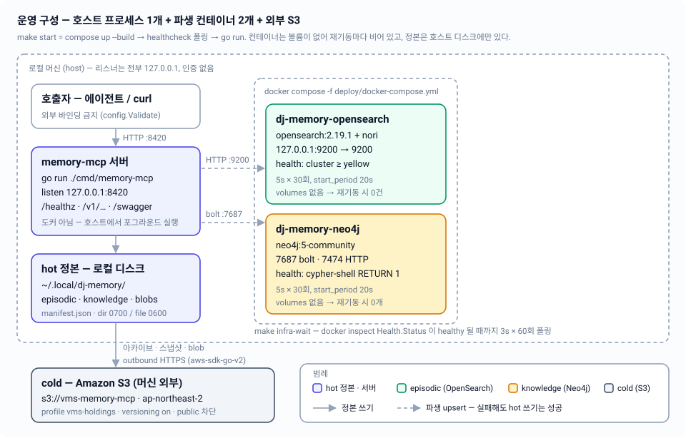

# 10. 운영 — 기동·설정·인프라

`make start` 한 줄로 파생 컨테이너 2개를 띄우고 헬스체크를 기다린 뒤 호스트에서 서버를 실행하기까지, 실제 코드가 읽는 설정·포트·자격증명과 실패했을 때 보이는 문자열을 정리한다.

| 항목 | 내용 |
|---|---|
| 관련 코드 | [`Makefile`](../../Makefile) · [`deploy/docker-compose.yml`](../../deploy/docker-compose.yml) · [`deploy/opensearch/Dockerfile`](../../deploy/opensearch/Dockerfile) · [`internal/config/config.go`](../../internal/config/config.go) · [`cmd/memory-mcp/main.go`](../../cmd/memory-mcp/main.go) · [`internal/cold/cold.go`](../../internal/cold/cold.go) · [`internal/server/startup.go`](../../internal/server/startup.go) |
| 관련 스펙 | [01-overview.md](01-overview.md) · [02-storage-model.md](02-storage-model.md) · [07-rehydration.md](07-rehydration.md) · [08-http-api.md](08-http-api.md) · [09-code-structure.md](09-code-structure.md) · [11-testing.md](11-testing.md) |
| 설계 근거 | [architecture-v2.md](../design/architecture-v2.md) §8(인프라) · §5(재수화) · §10.1(기동 수용 기준) |
| 상태 | 구현 완료 — Makefile 15개 타깃, compose 서비스 2개, env 9개 모두 코드에 존재 |



---

## 1. make 타깃

### 1.1 변수

`Makefile` 상단의 3개가 전부다. 전부 `?=`이므로 환경변수나 `make VAR=...`로 덮어쓸 수 있다.

| 변수 | 기본값 | 쓰이는 곳 |
|---|---|---|
| `GO` | `go` | `run` / `build` / `vet` / `test` / `swagger` / `blackbox` |
| `COMPOSE` | `docker compose -f deploy/docker-compose.yml` | `infra-up` / `infra-down` / `logs` / `status` |
| `LISTEN` | `127.0.0.1:8420` | **출력 문구와 `make status`의 curl 대상뿐** |

> **함정**: `LISTEN`은 서버에 전달되지 않는다. 서버가 실제로 바인딩하는 주소는 `DJ_MEMORY_LISTEN_ADDR`(§4)이다. `make LISTEN=127.0.0.1:9000 start`는 안내 문구만 9000으로 바뀌고 서버는 여전히 8420에 뜬다. 포트를 바꾸려면 **둘 다** 설정해야 한다.

### 1.2 타깃

| 타깃 | 선행 조건 | 실제 실행 | 비고 |
|---|---|---|---|
| `help` | — | `grep -hE '^[a-zA-Z_-]+:.*?## '` + awk 정렬 출력 | `## ` 주석이 달린 타깃만 보인다 |
| `start` | `infra-up` `infra-wait` | 안내 2줄 echo → `go run ./cmd/memory-mcp` | **포그라운드**. 아래 §2 참조 |
| `stop` | `infra-down` | 컨테이너만 내린다 | 서버는 포그라운드이므로 Ctrl-C |
| `restart` | `stop` `start` | 그대로 이어붙임 | `start`가 블로킹이라 `restart`도 블로킹 |
| `status` | — | `docker compose ps` + `curl -fsS http://$(LISTEN)/healthz` | 서버가 없으면 `not running` 출력 |
| `logs` | — | `docker compose logs -f` | 컨테이너 로그만. 서버 로그는 stderr |
| `infra-up` | — | `docker compose up -d --build` | `--build`이므로 nori 플러그인 이미지가 없으면 여기서 빌드 |
| `infra-down` | — | `docker compose down` | 볼륨이 없으니 데이터도 함께 사라진다(의도) |
| `infra-wait` | — | `docker inspect -f '{{.State.Health.Status}}'` 폴링 | 3초 × 60회 = 최대 180초 |
| `run` | — | `go run ./cmd/memory-mcp` | 인프라가 이미 떠 있다고 가정. 안 떠 있어도 서버는 뜬다(저하 모드) |
| `build` | — | `go build ./...` | |
| `vet` | — | `go vet ./...` | |
| `test` | — | `go test ./...` | fake만 사용. 컨테이너·AWS 불필요 |
| `swagger` | — | `go run .../swag init -g cmd/memory-mcp/main.go -o docs --parseInternal` + `swag fmt -d internal/server,cmd/memory-mcp` | §6.7 |
| `blackbox` | `infra-up` `infra-wait` | `go test -tags blackbox -count=1 -v ./test/blackbox/...` | 실 컨테이너 + **실 S3 버킷** 사용 → [11-testing.md](11-testing.md) |

`.PHONY`에 `help start stop restart status logs run build vet test swagger blackbox infra-up infra-down infra-wait`가 모두 등록되어 있다.

---

## 2. `make start`가 실제로 하는 일

### 2.1 Make 단계

```
make start
 ├─ (1) infra-up    : docker compose -f deploy/docker-compose.yml up -d --build
 ├─ (2) infra-wait  : docker inspect 폴링 (3s × 60)
 ├─ (3) echo        : "==> derived stores healthy; starting memory-mcp on http://127.0.0.1:8420"
 │                    "==> swagger UI: http://127.0.0.1:8420/swagger/index.html"
 └─ (4) go run ./cmd/memory-mcp   ← 포그라운드, 여기서 블로킹
```

**(1) `infra-up`** — `--build`이므로 `deploy/opensearch/Dockerfile`을 먼저 빌드한다. 이 Dockerfile은 `opensearchproject/opensearch:2.19.1` 위에서 `opensearch-plugin install --batch analysis-nori`를 실행하므로 **첫 실행은 이미지 pull + 플러그인 다운로드로 수 분** 걸릴 수 있다. 이 시간은 `up`이 반환하기 전에 소모되므로 (2)의 180초 예산에는 포함되지 않는다.

**(2) `infra-wait`** — 컨테이너 이름을 하드코딩해서 헬스 상태를 폴링한다.

```sh
for i in $(seq 1 60); do
  os=$(docker inspect -f '{{.State.Health.Status}}' dj-memory-opensearch 2>/dev/null || echo missing)
  nj=$(docker inspect -f '{{.State.Health.Status}}' dj-memory-neo4j     2>/dev/null || echo missing)
  if [ "$os" = healthy ] && [ "$nj" = healthy ]; then ... exit 0; fi
  printf '\r    opensearch: %-9s neo4j: %-9s (%ss)' "$os" "$nj" "$((i*3))"
  sleep 3
done
echo "\n!! containers did not become healthy — check 'make logs'"; exit 1
```

- 컨테이너가 없으면 `docker inspect`가 실패하고 상태는 `missing`으로 표시된다.
- 180초 안에 둘 다 `healthy`가 되지 않으면 **exit 1**이므로 `make`가 여기서 멈추고 (4)는 실행되지 않는다.
- 컨테이너 쪽 헬스체크 예산은 `start_period 20s + interval 5s × retries 30 ≈ 170초`로, make의 180초와 대략 맞춰져 있다.

**(4) `go run ./cmd/memory-mcp`** — 컴파일 후 바이너리를 포그라운드로 실행한다. 서버가 종료될 때까지 make가 반환하지 않으므로, 컨테이너를 내리려면 **다른 셸에서** `make stop`을 실행한다.

### 2.2 서버 부팅 단계 (`cmd/memory-mcp/main.go`)

| 순서 | 코드 | 실패하면 |
|---|---|---|
| 1 | `slog.New(slog.NewTextHandler(os.Stderr, nil))` → `slog.SetDefault` | — (모든 로그는 **stderr** 텍스트 포맷) |
| 2 | `config.Load()` | `config load failed` 로그 후 **`os.Exit(1)`** — 부팅 중 유일한 치명 경로 |
| 3 | `signal.NotifyContext(ctx, os.Interrupt, syscall.SIGTERM)` | — |
| 4 | `hotstore.New(cfg.Home, clock)` / `blob.New(cfg.Home + "/blobs")` | 디스크를 건드리지 않음. 디렉터리는 첫 쓰기 때 lazily 생성 |
| 5 | `search.NewClient(cfg.OpenSearchURL)` | `opensearch client init failed; episodic search degraded` **Warn**, `deps.Index = nil` |
| 6 | `graph.NewClient(cfg.Neo4jURL, "neo4j", "djmemory-local")` | `neo4j client init failed; knowledge graph degraded` **Warn**, `deps.Graph = nil` |
| 7 | `cold.NewS3(ctx, cfg.AWSProfile, cfg.S3Region, cfg.S3Bucket)` | `s3 init failed; cold archive degraded` **Warn**, `deps.Archiver = nil` |
| 8 | `document.NewIngestor` / `consolidate.New(..., cfg.EpisodicTTLDays)` / `rehydrate.New` | — |
| 9 | `srv.Startup(ctx)` — `CheckDrift` → 드리프트 감지 시 `RehydrateAll(ctx, false)` | 로그만 남기고 계속. **절대 치명이 아니다** |
| 10 | `srv.ListenAndServe(ctx)` | 에러 반환 시 `server exited` 로그 후 `os.Exit(1)` |

**핵심 성질 3가지**

1. **5·6·7의 생성자는 네트워크를 건드리지 않는다.** `search.NewClient`는 주소 파싱만, `graph.NewClient`는 드라이버 객체만, `cold.NewS3`는 `awsconfig.LoadDefaultConfig`(로컬 `~/.aws/*` 읽기)만 한다. 따라서 **컨테이너가 전부 죽어 있어도 `make run`은 성공**하고, 연결 실패는 첫 사용 시점 또는 `/v1/status`에서 드러난다.
2. **부팅 중 exit는 config 검증 실패와 리스닝 실패 두 곳뿐이다.** 파생 저장소 부재는 저하(degraded)이지 실패가 아니다 ([03-lifecycle.md](03-lifecycle.md), [07-rehydration.md](07-rehydration.md)).
3. **Ctrl-C** → SIGINT → ctx 취소 → `httpServer.Shutdown`(10초 예산) → main 반환 → `defer gr.Close(context.Background())`. 단 `ListenAndServe`가 에러를 반환하면 `os.Exit(1)`이므로 **defer는 실행되지 않는다**(포트 충돌 시 Neo4j 드라이버가 정식으로 닫히지 않음 — 프로세스 종료로 정리됨).

`ListenAndServe`의 고정값: `ReadHeaderTimeout 5s`, 셧다운 유예 `10s`. 기동 로그는 `memory-mcp listening addr=127.0.0.1:8420`.

---

## 3. docker-compose — 파생 저장소 2개

`deploy/docker-compose.yml`에는 서비스 2개뿐이고, **서버는 여기 없다**(호스트 실행).

| | `opensearch` | `neo4j` |
|---|---|---|
| container_name | `dj-memory-opensearch` | `dj-memory-neo4j` |
| 이미지 | `build: ./opensearch` → `opensearchproject/opensearch:2.19.1` + `analysis-nori` | `neo4j:5-community` |
| 포트 | `127.0.0.1:9200:9200` | `127.0.0.1:7474:7474`(HTTP 브라우저), `127.0.0.1:7687:7687`(bolt) |
| 환경 | `discovery.type=single-node`<br>`DISABLE_SECURITY_PLUGIN=true`<br>`DISABLE_INSTALL_DEMO_CONFIG=true`<br>`OPENSEARCH_JAVA_OPTS=-Xms512m -Xmx512m` | `NEO4J_AUTH=neo4j/djmemory-local` |
| healthcheck | `curl -fsS http://localhost:9200/_cluster/health \| grep -qE '"status":"(green\|yellow)"'` | `cypher-shell -u neo4j -p djmemory-local 'RETURN 1' \|\| exit 1` |
| interval / timeout / retries / start_period | 5s / 5s / 30 / 20s | 5s / 10s / 30 / 20s |
| volumes | **없음** | **없음** |

**포트 바인딩이 전부 `127.0.0.1:` 접두사**라는 점이 중요하다. compose가 `0.0.0.0`에 노출하지 않으므로 같은 네트워크의 다른 기기가 인증 없는 OpenSearch/Neo4j에 접근할 수 없다. 서버의 loopback 강제(§4.2)와 같은 원칙이다.

### 3.1 볼륨이 없다는 것의 의미

의도적 비영속이다(설계 §11 비목표: "OpenSearch/Neo4j 데이터 볼륨 영속화"). 결과:

- `make stop && make start` 또는 `docker compose down && up` 이후 **인덱스 0건, 그래프 노드 0개**로 시작한다.
- 이때 콘텐츠가 사라지는 것이 아니다. 정본은 `~/.local/dj-memory/`의 JSON이고([02-storage-model.md](02-storage-model.md)), 부팅 시 `Startup`이 manifest와 대조해 드리프트를 감지하면 전체 재수화한다([07-rehydration.md](07-rehydration.md)).
- 그래서 "컨테이너를 지웠는데 검색이 안 된다"는 정상 상태가 아니라 **재수화가 아직 안 돌았거나 실패한 것**이다. `/v1/status`의 `drift.episodic.reason`이 이유를 말해준다.
- 반대로 **파생 저장소에만 존재하는 콘텐츠는 버그다.** 컨테이너를 마음대로 날려도 되는 것이 이 구조의 안전장치다.

OpenSearch 인덱스는 프로젝트별로 나뉘지 않고 `dj-memory-episodic` 하나를 `workspace`/`team`/`project` keyword 필드로 스코핑한다(`internal/search/mapping.go`). 한 번의 bulk 재수화로 전부 재구성하기 위한 설계다.

---

## 4. 환경변수 (`internal/config`)

### 4.1 표

`config.Load()`가 읽는 전부다. `envOr` 헬퍼는 **빈 문자열을 미설정으로 취급**하므로 `DJ_MEMORY_S3_BUCKET=`은 기본값으로 폴백한다.

| env | 기본값 | Config 필드 | 쓰이는 곳 |
|---|---|---|---|
| `DJ_MEMORY_HOME` | `filepath.Join(os.UserHomeDir(), ".local", "dj-memory")` | `Home` | hot 정본 루트, `{Home}/blobs` 캐시 |
| `DJ_MEMORY_USERNAME` | `user.Current().Username` | `Username` | **모든 S3 키의 첫 세그먼트** (`cold/keys.go`) |
| `DJ_MEMORY_S3_BUCKET` | `vms-memory-mcp` | `S3Bucket` | `cold.NewS3`, `/v1/status`의 `s3.bucket` |
| `DJ_MEMORY_S3_REGION` | `ap-northeast-2` (`config.DefaultS3Region`) | `S3Region` | `awsconfig.WithRegion` — §5.2 |
| `AWS_PROFILE` | `vms-holdings` | `AWSProfile` | `awsconfig.WithSharedConfigProfile` |
| `DJ_MEMORY_OPENSEARCH_URL` | `http://127.0.0.1:9200` | `OpenSearchURL` | `search.NewClient` |
| `DJ_MEMORY_NEO4J_URL` | `bolt://127.0.0.1:7687` | `Neo4jURL` | `graph.NewClient` |
| `DJ_MEMORY_EPISODIC_TTL_DAYS` | `30` (`config.DefaultEpisodicTTLDays`) | `EpisodicTTLDays` | 에이징 판정, `/v1/status`의 `stale_unconsolidated` |
| `DJ_MEMORY_LISTEN_ADDR` | `127.0.0.1:8420` (`config.DefaultListenAddr`) | `ListenAddr` | `http.Server.Addr` |

`AWS_PROFILE`은 이 프로젝트 전용 접두사를 쓰지 않는 유일한 변수다(AWS SDK 표준 이름을 그대로 재사용).

### 4.2 검증 규칙 (`Config.Validate`)

`Load()`는 마지막에 `Validate()`를 호출하고, 실패하면 `Config{}`와 에러를 반환한다 → main이 exit 1.

| 규칙 | 위반 시 메시지 |
|---|---|
| `Home`, `Username`, `S3Bucket` 모두 non-empty | `config: home, username and s3 bucket must be non-empty` |
| `ListenAddr`가 `127.0.0.1:` 또는 `localhost:` 로 **시작**해야 함 | `config: listen addr "0.0.0.0:8420" must bind loopback only (§7)` |
| `EpisodicTTLDays > 0` | `config: episodic TTL days must be positive, got -1` |
| TTL 파싱: `strconv.Atoi` 성공 **그리고** `> 0` | `config: DJ_MEMORY_EPISODIC_TTL_DAYS must be a positive integer, got "abc"` |
| home 해석 실패 | `config: resolve home dir: ...` |
| OS 사용자 해석 실패 | `config: resolve OS user: ...` |

**loopback 검사는 접두사 문자열 비교**다. 따라서 `[::1]:8420`, `::1:8420`, `0.0.0.0:8420`, `192.168.x.x:8420`은 전부 거부된다. IPv6 loopback으로 띄울 방법은 없다 — 인증이 없는 로컬 도구이므로 의도적이다([08-http-api.md](08-http-api.md)).

**검증하지 않는 값**: `S3Region`, `AWSProfile`, `OpenSearchURL`, `Neo4jURL`. 오타는 부팅 시 조용히 통과하고, 저하 모드 경고나 첫 요청 실패로만 드러난다.

### 4.3 env로 바꿀 수 없는 값

| 값 | 위치 | 비고 |
|---|---|---|
| Neo4j 계정 `neo4j` / `djmemory-local` | `config.go` 하드코딩 | compose의 `NEO4J_AUTH`와 짝. 로컬 고정이며 비밀이 아니다 |
| `MaxProjectFileBytes` = `5 << 20`(5 MiB) | `config.go` const | episodic 압박 임계 |
| `MaxProjectRecords` = 5000 | `config.go` const | episodic 압박 임계 |
| `DocumentChunkBytes` = 2048 | `config.go` const | 문서 청킹 목표 크기 ([06-documents.md](06-documents.md)) |
| `MaxDocumentChunks` = 500 | `config.go` const | 청크 상한, 초과분은 `truncated`로 정직 보고 |
| 인덱스 이름 `dj-memory-episodic` | `search/mapping.go` | 전역 단일 인덱스 |
| 검색 기본 size 20 | `search.DefaultSearchSize` | |

즉 **튜닝 가능한 임계값은 TTL 하나뿐**이다.

### 4.4 테스트 전용 env

| env | 읽는 곳 | 조건 | 효과 |
|---|---|---|---|
| `DJ_TEST_LIVE` | `internal/search/live_test.go` | `== "1"` | 실 OpenSearch 통합 테스트 실행 (스크래치 인덱스 `dj-memory-episodic-livetest` 사용 후 drop) |
| `DJ_MEMORY_LIVE_TEST` | `internal/graph/live_test.go` | `!= ""` | 실 Neo4j 통합 테스트 실행 |
| `BLACKBOX_KEEP` | `test/blackbox/harness_test.go` | `!= ""` | 성공해도 임시 `DJ_MEMORY_HOME`과 `server.log`를 남긴다 |

두 live 테스트의 게이트 이름과 판정 방식이 서로 다르다(§7 참조). 둘 다 `t.Skip`이므로 `make test`는 컨테이너 없이 통과한다.

---

## 5. AWS — cold store

### 5.1 준비물

| 항목 | 값 |
|---|---|
| 프로파일 | `vms-holdings` (`~/.aws/config`의 `[profile vms-holdings]`) |
| 버킷 | `vms-memory-mcp` |
| 리전 | `ap-northeast-2` |
| 버저닝 | **on** — purge의 백스톱 ([03-lifecycle.md](03-lifecycle.md)) |
| 퍼블릭 액세스 | 차단 |

버킷이 없을 때 블랙박스 하니스가 로그로 그대로 뱉는 복구 명령:

```bash
aws --profile vms-holdings s3api create-bucket \
  --bucket vms-memory-mcp --region ap-northeast-2 \
  --create-bucket-configuration LocationConstraint=ap-northeast-2

aws --profile vms-holdings s3api put-bucket-versioning \
  --bucket vms-memory-mcp --versioning-configuration Status=Enabled
```

서버는 버킷을 만들지 않는다. `cold.NewS3`는 자격증명 로딩만 하고, 실제 키는 `internal/cold/keys.go`가 `{username}/episodic/...`, `{username}/knowledge/...`, `{username}/blobs/{sha[:2]}/{sha}` 형태로 조립한다.

### 5.2 리전 명시 함정 (중요)

```go
cfg, err := awsconfig.LoadDefaultConfig(ctx,
    awsconfig.WithRegion(region),                 // ← cfg.S3Region, 기본 ap-northeast-2
    awsconfig.WithSharedConfigProfile(profile),   // ← AWS_PROFILE, 기본 vms-holdings
)
```

`WithRegion`이 프로파일의 리전보다 우선한다. `config.go`의 상수 주석이 이유를 명시한다:

> `DefaultS3Region is the region of bucket vms-memory-mcp (§8). It is set explicitly rather than inherited from the AWS profile, whose default region differs — inheriting it yields PermanentRedirect on every call.`

설계 문서 §8은 프로파일 기본 리전을 `ap-southeast-1`로 특정한다. **프로파일 리전을 상속하면 버킷이 있는 리전과 달라 모든 S3 호출이 `PermanentRedirect`로 실패한다.** 그래서 `DJ_MEMORY_S3_REGION`은 "비워두면 알아서 되는" 값이 아니라 코드에 하드 기본값을 둔 값이다. 다른 리전의 버킷을 쓰려면 `DJ_MEMORY_S3_BUCKET`과 `DJ_MEMORY_S3_REGION`을 **반드시 함께** 바꿔야 한다.

### 5.3 블랙박스가 쓰는 실 버킷 프리픽스

블랙박스 하니스는 `DJ_MEMORY_USERNAME=jin/blackbox-test`를 주입한다. `cold/keys.go`가 username을 키 첫 세그먼트로 쓰기 때문에 모든 객체가 `s3://vms-memory-mcp/jin/blackbox-test/` 아래로 떨어지고, `TestMain`이 실행 전후로 `aws s3 rm --recursive`로 청소한다. 하니스는 시작 시 `aws s3api head-bucket`으로 프리플라이트를 돌려 자격증명·버킷 문제를 **시나리오 중간이 아니라 시작 지점에서** 실패시킨다.

---

## 6. 트러블슈팅

### 6.1 `!! containers did not become healthy — check 'make logs'`

`infra-wait`가 180초를 넘겼다. 진행 표시줄에 찍힌 마지막 상태로 원인을 나눈다.

| 마지막 상태 | 원인 | 확인 |
|---|---|---|
| `missing` | 컨테이너가 아예 안 떴다 (compose 실패, 포트 충돌) | `docker compose -f deploy/docker-compose.yml ps -a`, `make logs` |
| `starting` 고정 | 부팅 중 OOM 또는 느린 초기화 | `docker inspect -f '{{json .State.Health}}' dj-memory-opensearch` |
| `unhealthy` | 헬스체크 명령 자체가 실패 | 위 명령의 `Log[].Output` |

자주 나오는 것들:

- **OpenSearch 메모리** — `-Xms512m -Xmx512m`이지만 컨테이너 총 사용량은 그보다 크다. Docker Desktop 메모리 할당이 부족하면 부팅 중 죽는다.
- **Linux 호스트의 `vm.max_map_count`** — OpenSearch는 최소 262144를 요구한다. `sudo sysctl -w vm.max_map_count=262144`.
- **포트 선점** — 다른 OpenSearch/Elasticsearch가 이미 9200을, 다른 Neo4j가 7687을 쓰고 있으면 compose가 바인딩에 실패한다.
- **Neo4j 헬스체크 타임아웃** — `cypher-shell`은 첫 부팅 시 느리다. `timeout: 10s`로 이미 완화되어 있으나 느린 디스크에서는 재시도 30회를 다 쓸 수 있다.

### 6.2 서버가 부팅 즉시 exit 1

```
level=ERROR msg="config load failed" error="config: listen addr \"0.0.0.0:8420\" must bind loopback only (§7)"
```

`DJ_MEMORY_LISTEN_ADDR`은 `127.0.0.1:` 또는 `localhost:`로 시작해야 한다(§4.2). TTL도 마찬가지로 `config: DJ_MEMORY_EPISODIC_TTL_DAYS must be a positive integer, got "..."`로 즉시 죽는다. **config 실패는 부팅 중 유일한 치명 경로**이므로, exit 1이 나면 먼저 env부터 본다.

### 6.3 `server exited` + `address already in use`

이전 실행이 살아 있다. 블랙박스 하니스가 쓰는 방식이 그대로 유효하다.

```bash
lsof -ti :8420 | xargs kill -9
```

`make status`의 `server:` 줄로 먼저 확인한다. 단 §1.1의 `LISTEN` 함정에 주의 — 서버를 다른 포트로 띄웠다면 `make status`는 `not running`이라고 거짓말한다.

### 6.4 `opensearch client init failed` / `neo4j client init failed` / `s3 init failed`

전부 **Warn이고 서버는 계속 뜬다.** 해당 `deps` 필드가 nil로 남아 저하 모드가 된다.

| 죽은 것 | 쓰기 | 읽기 | `/v1/status` |
|---|---|---|---|
| OpenSearch | 200 + `degraded: ["search unavailable"]` | `GET .../episodes/search` → **503** `search unavailable` | `degraded`에 `search unavailable`, `drift.episodic.unavailable=true` |
| Neo4j | 200 + `degraded: ["graph unavailable"]` | `GET .../knowledge/search`, `.../knowledge/graph` → **503** `graph unavailable` | `drift.knowledge.unavailable=true` |
| S3 | 문서 업로드는 **503** `cold storage unavailable`(blob은 cold-first라 우회 불가) | — | `s3.reachable=false`, `degraded`에 `cold storage unavailable` |

`drift.*.reason`이 둘을 구분해준다 (`internal/rehydrate/rehydrate.go`):

| reason | 의미 |
|---|---|
| `opensearch not configured` / `neo4j not configured` | 생성자가 실패해 `deps` 필드가 nil — **부팅 로그에 Warn이 있다** |
| `opensearch unreachable` / `neo4j unreachable` | 객체는 있는데 `Ping` 실패 — URL은 맞고 서비스가 죽었거나 주소가 틀렸다 |

생성자가 다이얼하지 않으므로 **형식이 멀쩡한 URL 오타는 부팅 로그에 안 나온다.** `http://127.0.0.1:9999`는 조용히 통과하고 `unreachable`로만 드러난다. S3도 프로파일이 존재하면 부팅은 통과하고, 만료된 자격증명은 첫 `Put`/`Head`에서 터진다(`/v1/status`는 `sha256("")` 키로 `BlobExists`를 던져 도달성을 확인한다).

### 6.5 `PermanentRedirect` / `301` on S3

리전이 버킷과 다르다. §5.2. `DJ_MEMORY_S3_REGION`을 비우면 코드 기본값 `ap-northeast-2`로 돌아간다 — 프로파일 리전을 상속시키지 말 것.

### 6.6 한국어 검색이 안 잡힌다

로그에 이 줄이 있는지 본다.

```
level=WARN msg="search: episodic index lacks the nori mapping; dropping and recreating" index=dj-memory-episodic analyzer=korean
```

원인은 **`_bulk`가 인덱스를 자동 생성한 경우**다. 매핑 없는 동적 인덱스에는 `korean` 분석기가 없어 형태소 매칭("보안을 끄고" ↔ "보안을 끄는")이 조용히 깨진다. 방어책으로 모든 쓰기 경로(`IndexRecords`/`DeleteRecords`)가 `ensureSchema`를 먼저 호출한다 — 프로세스당 한 번 `_settings`를 읽어 `korean` 분석기가 없으면 **인덱스를 drop하고 재생성**하고, 성공하면 `schemaReady`를 래치해 이후 왕복을 생략한다(파생물이므로 허용되는 복구). 그래도 안 되면:

1. `curl 127.0.0.1:9200/dj-memory-episodic/_settings | grep korean` 으로 분석기 존재 확인
2. 없으면 `POST /v1/reindex`로 강제 전체 재수화
3. nori 플러그인 자체가 빠진 경우 — `make infra-down && make infra-up`으로 이미지를 다시 빌드 (`docker exec dj-memory-opensearch bin/opensearch-plugin list`로 확인)

자세한 매핑은 [04-episodic-search.md](04-episodic-search.md).

### 6.7 swagger 관련

- `make swagger`는 `docs/docs.go`, `docs/swagger.json`, `docs/swagger.yaml`을 재생성한다.
- `cmd/memory-mcp/main.go`가 `_ "github.com/drakejin/memory-mcp/docs"`로 blank import하므로 **`docs/`를 지우면 빌드가 깨진다.** 지웠다면 `make swagger`로 되살린다.
- swag CLI 버전은 `tools.go`(build tag `tools`)가 go.mod에 고정한다(`swaggo/swag v1.16.6`). 전역 설치본이 아니라 레포 고정 버전이 쓰인다.
- `--parseInternal`이 필요하다. 응답 타입 대부분이 `internal/` 아래에 있어 이 플래그 없이는 스펙이 비어 나온다.
- 확인: `curl -s 127.0.0.1:8420/swagger/doc.json | head -c 100` — 블랙박스 시나리오 1이 이걸 검증한다.

### 6.8 컨테이너를 재시작했더니 검색/그래프가 비었다

정상이다(§3.1). 수렴 경로는 3개다.

1. **서버 재기동** — `Startup`이 `CheckDrift` → `RehydrateAll(false)`. 로그: `startup drift check ... episodic_reason="indexed docs 0 != manifest records 42"` → `startup rehydration complete episodes_indexed=42`.
2. **서버는 그대로 두고 요청** — stat-gate가 프로젝트 단위로 부분 재수화한다.
3. **강제** — `POST /v1/reindex` (`?verify=true`면 전량 해시 감사).

`startup: rehydrator not configured; derived stores unmanaged` 경고가 보이면 재수화가 아예 비활성 상태다.

### 6.9 hot 디렉터리가 안 보인다

`hotstore.New`는 디스크를 건드리지 않는다. `~/.local/dj-memory/`는 **첫 쓰기 때** 생성된다(디렉터리 0700, 파일 0600). 서버만 띄우고 아무것도 저장하지 않았다면 없는 것이 정상이다.

### 6.10 블랙박스가 시작도 못 한다

| 로그 | 의미 |
|---|---|
| `prerequisite missing tool="docker version"` 등 | `docker`, `docker compose`, `aws`, `go` 중 하나가 PATH에 없다 (exit 2) |
| `cold store unreachable — blackbox cannot verify §10.4/6/8` | `head-bucket` 실패. 로그의 `fix` 필드에 생성 명령이 그대로 들어 있다 (exit 2) |
| `port 8420 already serving — killing stale listener` | 정상. 하니스가 이전 실행의 좀비를 죽이고 진행한다 |

---

## 7. ⚠️ 설계 문서와 차이

1. **§8의 env 목록이 불완전하다.** 설계 문서 §8은 `DJ_MEMORY_HOME`, `DJ_MEMORY_USERNAME`, `DJ_MEMORY_S3_BUCKET`, `DJ_MEMORY_S3_REGION`, `AWS_PROFILE`, `DJ_MEMORY_OPENSEARCH_URL`, `DJ_MEMORY_NEO4J_URL` 7개만 나열한다. 코드에는 `DJ_MEMORY_LISTEN_ADDR`(§8에 없음, §7의 바인딩 규칙만 서술)과 `DJ_MEMORY_EPISODIC_TTL_DAYS`(§3.1에만 등장)가 추가로 있다. **본 문서 §4.1의 9개가 실제다.**
2. **`make LISTEN=...`은 서버에 전달되지 않는다.** Makefile의 `LISTEN`은 안내 문구와 `make status`의 curl 대상에만 쓰이고, 서버는 `DJ_MEMORY_LISTEN_ADDR`을 읽는다. 설계 문서에는 이 이중 경로에 대한 언급이 없다. 포트를 바꾸려면 둘 다 설정해야 한다.
3. **live 테스트 게이트 이름이 패키지마다 다르다.** `internal/search`는 `DJ_TEST_LIVE == "1"`, `internal/graph`는 `DJ_MEMORY_LIVE_TEST != ""`. 접두사도 판정 방식(정확히 "1" vs 비어 있지 않음)도 다르다. 설계 문서에는 규정이 없고, 코드 규약 §3의 "균일한 코드 패턴"에 비추면 통일 대상이다.
4. **`make run`과 `make start`.** 설계 문서 §8은 "서버 자체는 호스트에서 실행(`make run`)"이라고 쓰지만, 실제 진입점은 인프라 기동·헬스 대기를 포함한 `make start`다. `make run`은 인프라가 이미 떠 있다고 가정하는 개발 루프용 타깃이다.

---

## 코드 위치

| 개념 | 파일 | 앵커 |
|---|---|---|
| make 타깃 전체 | [`Makefile`](../../Makefile) | `start`, `infra-wait`, `blackbox` |
| 컨테이너 정의·헬스체크·포트 | [`deploy/docker-compose.yml`](../../deploy/docker-compose.yml) | `services.opensearch`, `services.neo4j` |
| nori 플러그인 이미지 | [`deploy/opensearch/Dockerfile`](../../deploy/opensearch/Dockerfile) | `opensearch-plugin install --batch analysis-nori` |
| env 로딩·기본값 | [`internal/config/config.go`](../../internal/config/config.go) | `Load()`, `envOr()` |
| env 검증(loopback 강제, TTL) | [`internal/config/config.go`](../../internal/config/config.go) | `Config.Validate()` |
| 튜닝 불가 상수 | [`internal/config/config.go`](../../internal/config/config.go) | `DefaultListenAddr`, `MaxProjectFileBytes`, `MaxDocumentChunks`, `DefaultS3Region` |
| 부팅 순서·저하 경고 | [`cmd/memory-mcp/main.go`](../../cmd/memory-mcp/main.go) | `main()` |
| 리스닝·그레이스풀 셧다운 | [`internal/server/server.go`](../../internal/server/server.go) | `ListenAndServe()` |
| 부팅 드리프트 체크·재수화 | [`internal/server/startup.go`](../../internal/server/startup.go) | `Startup()` |
| 저하 문자열 | [`internal/server/degraded.go`](../../internal/server/degraded.go) | `degradedSearch`, `degradedGraph`, `degradedCold` |
| `/v1/status` 리포트 | [`internal/server/handlers_ops.go`](../../internal/server/handlers_ops.go) | `StatusReport`, `S3SyncStatus`, `handleStatus()` |
| S3 클라이언트·리전 명시 | [`internal/cold/cold.go`](../../internal/cold/cold.go) | `NewS3()` |
| S3 키 레이아웃 | [`internal/cold/keys.go`](../../internal/cold/keys.go) | `EpisodeArchiveKey`, `BlobKey` |
| OpenSearch 인덱스명·매핑 | [`internal/search/mapping.go`](../../internal/search/mapping.go) | `IndexName`, `indexBody` |
| nori 매핑 자동 복구 | [`internal/search/client.go`](../../internal/search/client.go) | `ensureSchema()`, `ensureIndexLocked()` |
| Neo4j 드라이버 생성 | [`internal/graph/graph.go`](../../internal/graph/graph.go) | `NewClient()` |
| hot 디렉터리 퍼미션 | [`internal/hotstore/filestore.go`](../../internal/hotstore/filestore.go) | `dirPerm`, `filePerm` |
| swag CLI 버전 고정 | [`tools.go`](../../tools.go) | build tag `tools` |
| 블랙박스 env 주입·S3 프리플라이트 | [`test/blackbox/harness_test.go`](../../test/blackbox/harness_test.go) | `TestMain()`, `startServer()` |
