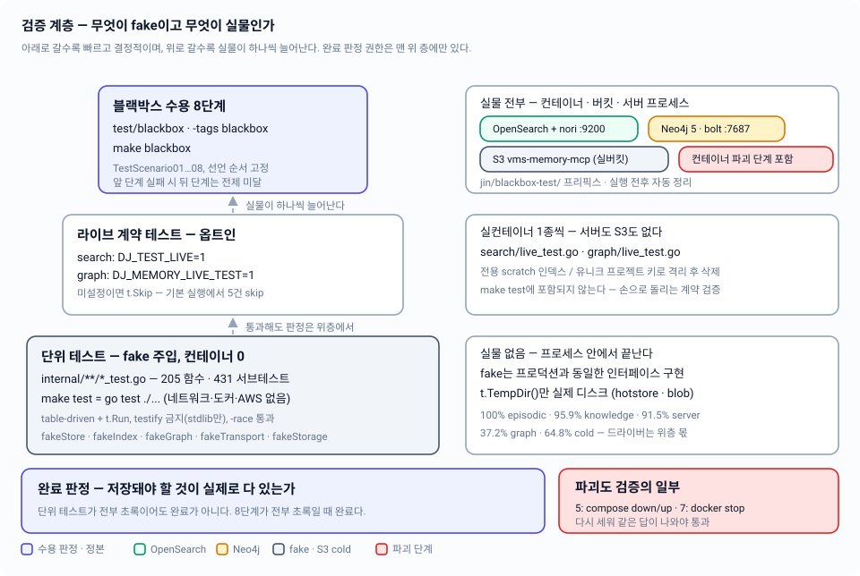

# 11 — 검증: 단위 테스트와 블랙박스 수용 기준

단위 테스트는 fake를 주입해 로직을 컨테이너 없이 고정하고, `test/blackbox`의 8단계는 실제 컨테이너·실제 S3 버킷·실제 서버 프로세스를 상대로 "저장돼야 할 것이 실제로 다 있는가"를 증명한다 — 완료 판정 권한은 후자에만 있다.

| 항목 | 내용 |
|---|---|
| 관련 코드 | `test/blackbox/{blackbox_test.go,harness_test.go,fixtures_test.go,pdf.go,pdf_test.go}` · `internal/**/*_test.go` (24개) · `internal/search/live_test.go` · `internal/graph/live_test.go` · `Makefile`(`test`, `blackbox`) |
| 관련 스펙 | [01-overview](01-overview.md) · [03-lifecycle](03-lifecycle.md) · [04-episodic-search](04-episodic-search.md) · [05-knowledge-graph](05-knowledge-graph.md) · [06-documents](06-documents.md) · [07-rehydration](07-rehydration.md) · [08-http-api](08-http-api.md) · [09-code-structure](09-code-structure.md) · [10-operations](10-operations.md) · 인덱스: [README](README.md) |
| 상태 | 단위 층은 코드 반영 완료(실측 커버리지 §7). 블랙박스 8단계는 코드로 존재하며 docker + AWS 자격증명이 있는 환경에서만 실행 가능 — 이 문서 작성 시점에는 실행하지 않았다. 설계 문서와의 차이는 §8 |



---

## 1. 세 층과 각 층의 권한

| 층 | 실행 | 실물 | 판정하는 것 | 실패의 의미 |
|---|---|---|---|---|
| 단위 | `make test` = `go test ./...` | 없음 (fake + `t.TempDir()`) | 함수·핸들러의 결정적 동작, 에러 분기, 봉투 형태 | 로직이 틀렸다 |
| 라이브 계약 | `DJ_TEST_LIVE=1` / `DJ_MEMORY_LIVE_TEST=1` + 수동 | OpenSearch 또는 Neo4j 컨테이너 1종 | 드라이버가 실제 저장소와 맺은 계약(nori 형태소, `MERGE` 멱등, fulltext, `ErrUnavailable`) | 우리 가정이 저장소 실제 동작과 다르다 |
| 블랙박스 수용 | `make blackbox` = `go test -tags blackbox -count=1 -v ./test/blackbox/...` | 컨테이너 2종 + `s3://vms-memory-mcp` 실버킷 + 서버 서브프로세스 | 시스템 전체가 §10의 8단계를 통과하는가 | **아직 완성이 아니다** |

핵심은 권한 분배다. 단위 층은 "이 함수가 맞나"만 답하고, 완료 여부는 답하지 않는다. 컨테이너를 파괴했다가 다시 세워도 같은 답이 나오는지(5단계), 파생 저장소가 죽은 채로 쓴 기록이 나중에 수렴하는지(7단계)는 fake로는 원리적으로 증명할 수 없기 때문이다.

## 2. 단위 층 — 같은 인터페이스를 구현한 fake

### 2.1 fake는 프로덕션 인터페이스를 그대로 구현한다

코드 규약 §1.5의 "테스트 fake는 같은 인터페이스를 구현한다. 프로덕션 코드에 테스트용 분기를 넣지 않는다"가 실제로 지켜진다. 프로덕션 코드에 `if testing` 류 분기는 없고, 대신 생성자 주입 지점에 fake를 꽂는다.

| fake | 대체 대상 | 파일 | 특징 |
|---|---|---|---|
| `fakeStore` | `hotstore.Store` (12 메서드 전부) | `internal/server/fakes_test.go:71` | in-memory 맵 + `appendErr`/`readErr`/`writeErr`/`getErr`/`listProjErr`/`listEpisErr`/`manifestErr`/`updateEpiErr` 훅으로 실패 분기 유도 |
| `fakeIndex` | `search.Index` | `internal/server/fakes_test.go:235` | `indexErr`/`searchErr`로 degraded·503 경로 재현 |
| `fakeGraph` | `graph.Store` | `internal/server/fakes_test.go:270` | `upsertNodeErr`/`neighborErr`/`deleteErr`, `purged` 기록 |
| `fakeDocuments` | `document.Service` | `internal/server/fakes_test.go:336` | 업로드 바이트를 `lastUpload`에 보관해 멀티파트 파싱 검증 |
| `fakeConsolidator` / `fakeRehydrator` | `consolidate.Consolidator` / `rehydrate.Rehydrator` | `internal/server/fakes_test.go:372,386` | `lastOpts`·`gateCalls`·`lastVerify`로 **핸들러가 무엇을 위임했는지**를 검증 |
| `fakeArchiver` | `cold.Archiver` | `internal/server/fakes_test.go:420` | `FetchBlob`이 `/status`의 S3 도달성 프로브를 겸한다 |
| `fakeRunStore`/`fakeRunIndex`/`fakeRunArchiver` | consolidate의 narrow interface | `internal/consolidate/run_test.go:24~` | 공유 `calls.log`에 `archive:`/`remove:`/`index-delete:`를 순서대로 적재 |
| `fakeStorage` | `cold.Storage` | `internal/cold/archive_test.go:21` | 키별 put 횟수 기록 → 멱등성 검증 |
| `fakeTransport` | `http.RoundTripper` | `internal/search/client_test.go:33` | OpenSearch HTTP 응답을 통째로 재현. 뮤텍스로 보호된 `calls` 슬라이스에 요청을 적재 |
| `fakeCache`/`fakeBlobArchiver`/`fakeIndexer`/`fakeGraph`/`fakeStore` | document의 narrow interface | `internal/document/document_test.go` | cold-first 실패, 색인 실패, 그래프 실패를 각각 격리 |
| `fakeClock` | `hotstore.Clock` | `server`/`rehydrate`/`hotstore` 테스트 | `time.Now()` 직접 호출 금지 규약 덕분에 TTL·에이징이 결정적으로 테스트된다 |

`internal/search/client_test.go`의 `fakeTransport`가 특히 중요하다. OpenSearch 클라이언트는 `opensearch-go` 위에 얹혀 있지만, 테스트는 라이브러리를 모킹하지 않고 **트랜스포트 한 겹만 갈아끼운다**. 그래서 `_bulk` 페이로드의 실제 NDJSON, `PUT /dj-memory-episodic`에 실린 nori 매핑 본문, 쿼리 DSL이 바이트 단위로 검증된다(`TestIndexRecordsBulkPayload`, `TestEnsureIndexCreatesWithNoriMapping`, `TestSearchRequestBody`).

### 2.2 스타일 — table-driven, `t.Run`, testify 금지

- `tests := []struct{...}` 테이블 선언 **72개**, `t.Run` 호출 **93개**. 최상위 테스트 함수 205개가 서브테스트 431개를 돌린다.
- `testify` 의존은 저장소 전체에 **0건**이다(`go.mod`에도 없다). 단언은 전부 `if got != want { t.Errorf(...) }` 형태의 stdlib.
- 에러 비교는 `errors.Is`로 한다(9개 테스트 파일에서 사용). 문자열 비교는 없다.
- 실제 디스크를 쓰는 곳은 두 군데뿐: `internal/hotstore/hotstore_test.go:26`, `internal/blob/blob_test.go:18`의 `t.TempDir()`. 나머지는 프로세스 안에서 끝난다.
- `internal/server`의 HTTP 테스트는 `httptest.NewRequest` + `httptest.NewRecorder`로 라우터를 직접 때린다. 서버를 리스닝시키지 않으므로 포트 충돌이 없다.

### 2.3 단위 층이 실제로 고정하고 있는 불변식

fake만으로도 상당한 도메인 규칙이 고정된다. 대표적인 것들:

| 테스트 | 고정하는 불변식 |
|---|---|
| `TestRunS3FailureBlocksLocalDeletion` | S3 put이 실패하면 hot 제거도 인덱스 삭제도 **일어나지 않는다** (`calls.log`에 `remove:`/`index-delete:` 항목이 하나라도 있으면 실패) |
| `TestRunHotRemoveFailureSkipsIndexDelete` | hot 제거 실패 시 인덱스 삭제로 진행하지 않는다 |
| `TestRunIndexFailureIsDegraded` | 인덱스 삭제 실패는 에이징을 막지 않고 `Failures` + manifest dirty로만 남는다 |
| `TestAgeEligible` | TTL 경계(정확히 30일=적격, 29일=부적격), 미통합은 나이 무관 잔존, 건수·바이트 압박 시 오래된 consolidated부터 |
| `TestCreateEpisodeDegradedWhenIndexDown` | 색인이 죽어도 201 + `degraded` 노트 (503 아님) |
| `TestSearchEpisodesReturns503WhenIndexUnavailable` | 읽기 검색만 503 |
| `TestSearchHitsAreExcerptOnly` | 검색 히트에 본문 전문이 실리지 않는다 |
| `TestNoTempLitterAcrossOperations` | 원자 쓰기가 temp 파일 찌꺼기를 남기지 않는다 |
| `TestSupersede*` / `TestTransition*` | 상태기계와 supersede 체인이 입력을 변형하지 않는다(불변성) |
| `TestEveryRouteIsAnnotated` | 라우터에 붙은 16개 경로/메서드가 생성된 OpenAPI 스펙에 전부 존재하고, 스펙 경로 수가 정확히 15개다 |

`TestEveryRouteIsAnnotated`는 메타 테스트다. `Router()`에 라우트를 추가하면서 swaggo 주석을 빠뜨리면 여기서 깨진다 — [08-http-api](08-http-api.md)의 엔드포인트 표가 코드와 갈라지는 것을 막는 장치다.

### 2.4 `-race`

`Makefile`의 `test` 타깃에는 `-race`가 없다. 수동으로 `go test ./internal/... -race`를 돌리면 **전 패키지 통과**한다(측정: 2026-08-25). `fakeTransport`가 뮤텍스로 `calls`를 보호하는 이유가 이것이다.

## 3. 라이브 층 — 옵트인 플래그

컨테이너가 필요한 테스트는 환경변수로 옵트인한다. 미설정이면 `t.Skip`이므로 `go test ./...`는 컨테이너 없이 초록이 된다(기본 실행에서 5건 skip).

| 파일 | 게이트 | URL 오버라이드 | 격리 방식 |
|---|---|---|---|
| `internal/search/live_test.go` | `DJ_TEST_LIVE=1` | `DJ_MEMORY_OPENSEARCH_URL` (기본 `http://127.0.0.1:9200`) | 전용 인덱스 `dj-memory-episodic-livetest`로 갈아끼운 뒤(`c.index = liveIndexName`) 사전/사후 `Drop` — 프로덕션 인덱스 `dj-memory-episodic`은 건드리지 않는다 |
| `internal/graph/live_test.go` | `DJ_MEMORY_LIVE_TEST` 비어있지 않음 | `DJ_MEMORY_NEO4J_URL` (기본 `bolt://127.0.0.1:7687`) | 매 테스트가 `ProjectKey{livetest, graph, "p"+ulid.New()[20:]}`로 유니크 프로젝트를 잡고, `t.Cleanup`에서 그 프로젝트 노드만 `DETACH DELETE` |

라이브 층이 증명하는 것 — fake로는 절대 알 수 없는 것들:

- `TestLiveEpisodicIndexLifecycle`: 저장 `보안을 끄고` → 질의 `보안을 끄는`이 **실제로** 히트한다(nori 형태소). 프로젝트 스코핑이 다른 프로젝트 문서를 새지 않는다. 재색인이 중복을 만들지 않는다(upsert). `DeleteRecords` 반복 호출이 멱등이다. drop+rebuild 후 같은 검색이 산다.
- `TestLiveUpsertIdempotentAndCount`: `MERGE`를 두 번 돌려도 노드가 2개다(수렴, 중복 아님). alias로도 이웃 조회가 된다. 없는 엔티티는 `knowledge.ErrNodeNotFound`.
- `TestLiveFulltextSearchAndArchivedOptIn`: Neo4j fulltext 인덱스가 **비동기로 채워지므로** 15초 폴링이 필요하다. 기본 검색은 archived를 빼고, `include_archived=true`면 포함한다.
- `TestLiveSupersedeChainAndPurge`: 도메인 함수 `knowledge.Supersede`로 만든 그래프를 재수화와 동일한 경로로 replay한 뒤, 중간 노드에서 3단 체인이 오래된 것부터 나온다.
- `TestLiveUnavailableWrapsErrUnavailable`: 죽은 포트(`bolt://127.0.0.1:1`)에 `Ping`하면 드라이버 원시 에러가 아니라 `graph.ErrUnavailable`이 나온다 — degraded 판단의 근거가 되는 계약.

## 4. 블랙박스 층 — 하네스

### 4.1 빌드 태그와 파일 분할

`blackbox_test.go` / `harness_test.go` / `fixtures_test.go`는 `//go:build blackbox`. 태그 없이는 컴파일 대상이 아니므로 `go test ./...`가 이 디렉토리를 지나가도 컨테이너를 찾지 않는다.

`pdf.go`(+`pdf_test.go`)만 **의도적으로 태그가 없다**. `makeMinimalPDF`는 순수 픽스처 생성기이고, `TestMakeMinimalPDF`가 `ledongthuc/pdf`(문서 추출기가 쓰는 그 라이브러리)로 실제 텍스트 레이어를 읽어낸다. 4단계가 제품 문제가 아니라 **픽스처 문제로 실패하는 것을 미리 배제**하기 위한 가드다.

`harness_test.go` 상단 주석이 `_test.go`여야 하는 이유를 못 박아 둔다 — `TestMain`은 테스트 파일에 선언해야 호출된다. 일반 `.go`에 두면 컴파일은 되지만 실행되지 않아 패키지 전역 `h`가 nil로 남고 첫 사용에서 전부 nil-panic한다.

### 4.2 `TestMain` — 재실행 가능한 셋업/티어다운

1. **전제 도구 검사**: `docker version`, `docker compose version`, `aws --version`, `go version`. 하나라도 없으면 `os.Exit(2)`.
2. **임시 HOME**: `os.MkdirTemp("", "dj-memory-blackbox-")`. 실제 `~/.local/dj-memory`를 절대 건드리지 않는다.
3. **cold 프리플라이트**: `aws --profile vms-holdings --region ap-northeast-2 s3api head-bucket --bucket vms-memory-mcp`. 실패하면 버킷 생성 + versioning 활성화 명령을 그대로 로그에 찍고 종료 — 4/6/8단계가 알 수 없는 중간 실패로 죽는 대신 여기서 실행 가능한 진단을 준다. 이때 임시 HOME도 지워 재실행 가능성을 유지한다.
4. **S3 프리픽스 사전 청소**: `aws s3 rm --recursive s3://vms-memory-mcp/jin/blackbox-test/` — 이전 크래시 잔여물 제거.
5. `m.Run()` → 서버 종료 → **사후 청소**. 실패했거나 `BLACKBOX_KEEP`가 설정되면 임시 HOME과 `server.log`를 남긴다.

컨테이너 자체는 `TestMain`이 관리하지 않는다. 1·5·7단계에서 **컨테이너 생명주기가 곧 검증 대상**이기 때문이다.

### 4.3 프리픽스 격리 트릭

서버는 `DJ_MEMORY_USERNAME=jin/blackbox-test`로 뜬다. `internal/cold/keys.go`가 모든 키를 `{username}/...`로 조립하므로, 이 한 개 환경변수로 모든 S3 객체가 `s3://vms-memory-mcp/jin/blackbox-test/` 아래로 떨어진다. 키 레이아웃 코드를 테스트용으로 분기하지 않고 프리픽스를 격리하는 방법이다.

### 4.4 독립 검증 채널

수용 테스트가 서버 응답만 믿으면 "서버가 성공했다고 말했다"만 증명된다. 그래서 하네스는 서버 코드를 통하지 않는 경로를 따로 갖는다:

| 채널 | 구현 | 쓰이는 단계 |
|---|---|---|
| `aws` CLI | `s3api head-object`, `s3 cp s3://... -`, `s3 rm --recursive` | 4(블랍 존재), 6(아카이브 본문·스냅샷 존재) |
| `cypher-shell` | `docker exec dj-memory-neo4j cypher-shell -u neo4j -p djmemory-local --format plain` | 3(노드 수·관계 존재), 4(문서 노드), 5(빈 컨테이너 확인) |
| hot 파일 원문 | `os.ReadFile` 후 `bytes.Contains` / `knowledge.Graph` 디코드 | 2, 3, 4, 6 |
| 별도 Neo4j 드라이버 | 테스트가 직접 `graph.NewClient(...)` | 3, 5(supersede 체인) |

### 4.5 대기와 증거

- `waitFor(t, desc, timeout, fn)`: 2초 간격 폴링, 실패 시 **마지막 증거 문자열**을 함께 출력한다. 단언 안에 맨 `sleep`은 없다.
- `pass(t, ...)` / `failf(t, ...)`: 모든 로그가 `[PASS]` / `[FAIL]` 접두사를 갖는다. `make blackbox`가 `-v`로 도는 이유 — 통과 로그 자체가 수용 증거다.
- 타임아웃: 컨테이너 기동 240초, 검색 수렴 20~30초, 서버 healthz 30초.
- `ensurePortFree`: 8420에 응답하는 프로세스가 있으면 `lsof -ti :8420` → `kill -9`. 크래시한 이전 실행이 다음 실행을 막지 않는다.

### 4.6 단계 간 상태 의존

시나리오는 **선언 순서대로** 돌고(Go는 파일 내 선언 순서로 실행) `harness` 구조체에 상태를 넘긴다: `epIDs`, `noriHitID`, `chainIDs`, `fact3ID`, `docSHA`, `docNodeID`, `chunkCount`, `oldID`, `staleID`, `degradedID`. 1단계가 `h.ready`를 세우지 못하면 `requireReady`가 나머지를 전제 미달로 즉시 실패시킨다. `-count=1`이 붙는 이유도 캐시된 통과를 재사용하면 안 되기 때문이다.

## 5. 8단계 — 무엇을 증명하고 무엇이면 실패인가

### 1단계 · `TestScenario01_Startup` — 기동

`docker compose down --remove-orphans` → `up -d --build` → OpenSearch가 `http://127.0.0.1:9200`에 200을 줄 때까지, Neo4j가 `RETURN 1;`에 답할 때까지 대기(각 240초) → `go build -o $TMP/memory-mcp-blackbox ./cmd/memory-mcp` → 임시 HOME과 blackbox env로 서브프로세스 기동 → `GET /healthz`가 200 + `{success,data,error}` 봉투 + `data.status == "ok"` → `GET /swagger/doc.json`이 200이고 본문에 `"swagger"` 또는 `"openapi"` 포함.

- **증명**: 볼륨 없는 컨테이너가 맨바닥에서 떠도 서버가 붙는다. Swagger 스펙이 바이너리에 실제로 들어가 서빙된다.
- **실패 조건**: healthcheck 240초 초과, 8420 점유 해소 실패, `make swagger` 누락으로 `docs` 패키지가 비어 `/swagger/doc.json`이 OpenAPI 문서가 아닌 경우, `/healthz`가 봉투를 쓰지 않는 경우.

### 2단계 · `TestScenario02_EpisodicNoriSearch` — episodic + nori

한국어 episode 3건을 `POST /v1/blackbox/qa/v2/episodes`로 저장(각 201, `degraded`가 비어 있어야 함) → hot 파일 `$TMP/episodic/blackbox/qa/v2.json`을 **바이트로 읽어** 3건의 원문과 ID가 전부 들어 있는지 확인 → `?q=보안을 끄는`으로 20초 폴링, 저장된 `…보안을 끄고 단일 노드 모드로…`(index 0)가 히트할 때까지.

- **증명**: hot이 정본이다(파일에 원문이 있다). nori 형태소 분석이 실제로 활성이다(`끄는` ↔ `끄고`). 실시간 색인이 즉시 검색 가능하다.
- **실패 조건**: `degraded`가 비어 있지 않으면 즉시 실패 — 색인이 조용히 실패했다는 뜻. nori 플러그인이 없거나 인덱스가 `_bulk`로 dynamic 자동 생성됐다면 어간 매칭이 안 되어 20초 타임아웃.

### 3단계 · `TestScenario03_KnowledgeSupersedeChain` — knowledge + supersede

fact 3건 생성(f1, f2는 `agent-inferred`, f3는 `user-stated`이며 `supersedes: [f1.ID]`) → 테스트가 직접 연 Neo4j 드라이버로 `SupersedeChain(key, f3.ID)`를 폴링해 f1이 f3보다 앞에 오는지 → `cypher-shell`로 3개 노드가 존재하고 f3—f1 관계가 1개 이상인지 → hot knowledge 파일을 `knowledge.Graph`로 디코드해 f1이 `state=archived` + `superseded_by=f3`, f3가 `state=active` + `supersedes` 포함, 그리고 `supersedes` 엣지 존재.

- **증명**: 상태기계가 hot과 그래프 **양쪽에 일관되게** 적용된다. 서버 API를 거치지 않은 cypher-shell 경로로도 같은 사실이 보인다.
- **실패 조건**: 체인 순서 역전, 엣지 누락, hot 상태 미갱신(그래프에만 반영), `degraded` 존재.

### 4단계 · `TestScenario04_DocumentIngest` — 문서

`makeMinimalPDF`로 만든 텍스트 레이어 PDF를 멀티파트로 업로드(201) → `IngestResult` 검증: sha가 64자 hex, `Extractable == true`, 청크 ≥ 1, `NodeID` 존재, `Truncated == nil` → `res.BlobKey`가 `cold.BlobKey("jin/blackbox-test", sha)`와 정확히 일치 → `aws s3api head-object`로 블랍 실존 확인 → 토큰 `seoulnine`으로 검색해 `kind=document_chunk` + `refs.doc_sha == sha`인 히트 → cypher로 document 노드 존재, hot knowledge에도 `kind=document` → `GET /v1/documents/{sha}`가 **바이트 동일** PDF 반환 → `GET /v1/documents/{sha}/chunks`가 `len(ChunkIDs)`개를 `chunk_seq` 오름차순으로.

- **증명**: 문서 1개 = 블랍(S3) + document 노드(Neo4j + hot) + chunk 레코드(OpenSearch + hot)가 **전부** 실제로 만들어진다. blob은 cold-first다. 원본 왕복이 무손실이다.
- **실패 조건**: `extractable=false`(정직성 역전 — 텍스트 레이어가 있는데 없다고 보고), `BlobKey`가 `cold/keys.go` 레이아웃과 어긋남(키 조립이 두 곳에 있다는 뜻), S3 미업로드, 청크 순서 뒤섞임, 다운로드 바이트 불일치.

### 5단계 · `TestScenario05_Rehydration` — 재수화

`compose down + up`으로 컨테이너를 **파괴하고 새로 만든다** → `MATCH (n) RETURN count(n)`이 0인지 확인(볼륨 없음 검증) → `GET /v1/status`의 `drift.episodic.detected`와 `drift.knowledge.detected`가 **둘 다 true** → `POST /v1/reindex?verify=true`가 200이고 `EpisodesIndexed >= 3 + chunkCount`, `NodesUpserted >= 4`, `Failures`가 비어 있음 → 2단계의 같은 nori 질의가 같은 ID를 히트, 3단계의 supersede 체인이 같은 순서.

- **증명**: 파생물은 언제 죽어도 된다. hot만으로 완전 재구성된다. drift 보고가 정직하다(비어 있는데 "정상"이라고 하지 않는다).
- **실패 조건**: drift 미감지 — 이게 가장 위험한 실패다. 검색이 조용히 0건을 돌려주면서 `/status`는 초록인 상태이기 때문이다. 그 외 재수화 건수 부족, `Failures` 비어있지 않음, 재수화 후 결과 불일치.

### 6단계 · `TestScenario06_Consolidation` — 통합·에이징

40일 전 timestamp로 episode 2건 생성(`agedmarkerx`, `stalemarkerx`) → **하네스가 에이전트 역할**을 하여 정본 store의 `UpdateEpisodes`로 aged 쪽만 `consolidated=true`로 뒤집는다(서버는 자동 통합을 하지 않는다 — 원칙 2) → `POST /v1/consolidate {"projects":["blackbox/qa/v2"]}` 200, `Failures` 없음 → `ArchiveKeys`에 `cold.EpisodeArchiveKey(...)`가 있고 `MovedEpisodes >= 1` → `aws s3api head-object` + `aws s3 cp ... -`로 아카이브 본문에 aged ID와 `agedmarkerx`가 있는지 → hot 파일에 aged ID가 **없고** stale ID가 **있는지**, `GetEpisode(aged)`가 `hotstore.ErrNotFound`인지 → `KnowledgeLatestKey`와 보고된 모든 `SnapshotKeys`가 S3에 실존하고 전부 `jin/blackbox-test/` 프리픽스 안인지 → 검색에서 `agedmarkerx` 0건, `stalemarkerx` 1건 이상.

- **증명**: 에이징 순서(S3 put 확인 → hot 제거 → 인덱스 삭제)가 실제로 지켜진다. §3.1의 "미통합은 나이와 무관하게 hot에 남는다"가 지켜진다. 스냅샷이 진짜로 올라간다.
- **실패 조건**: 미통합이 사라짐(증류 없는 자동 삭제 — 원칙 위반), S3에 없는데 hot에서 지워짐(데이터 손실), 인덱스에 aged 잔존, 스냅샷 키가 프리픽스를 벗어남(실제 개인 데이터 영역 오염).

### 7단계 · `TestScenario07_DegradedMode` — 저하 모드

`docker stop dj-memory-opensearch` → 도달 불가 확인 → episode 쓰기가 **201**이고 `Degraded`가 비어 있지 않은지 → hot store가 그 레코드를 실제로 갖고 있는지 → 같은 상태에서 검색이 **503**인지 → `docker start` → 복구 대기 → `POST /v1/reindex` 200 → 저하 모드에서 쓴 그 episode가 검색되는지 30초 폴링.

- **증명**: 쓰기는 파생 저장소 때문에 절대 실패하지 않는다. 읽기만 503이다. 정직하게 degraded를 보고한다. 복구 후 수렴한다.
- **실패 조건**: 쓰기가 5xx(파생물이 정본을 인질로 잡음), `degraded` 노트 누락(조용한 실패 — 사용자는 색인된 줄 안다), 검색이 200 + 빈 배열(거짓 성공 — 503보다 나쁘다), 복구 후 미수렴.

### 8단계 · `TestScenario08_StatusHonesty` — 정직성 총결산

`GET /v1/status` 한 방으로 앞 7단계가 남긴 상태를 **정확한 숫자로** 대조한다:

| 필드 | 기대값 | 근거 |
|---|---|---|
| `drift.episodic` / `drift.knowledge` | `detected=false`, `unavailable=false` | 마지막 재수화 이후 수렴 |
| `unconsolidated` | 정확히 `3 + chunkCount + 1 + 1` | 한국어 3건 + PDF 청크 + stale 픽스처 + degraded 모드 기록. aged 1건은 cold로 내려갔다 |
| `stale_unconsolidated` | 정확히 `1` | 40일 지난 미통합 픽스처 하나 |
| `manifest_updated_at` | non-zero | 신선도 보고 |
| `dirty_files` | 빈 배열 | 7단계의 outage 마크를 재수화가 지웠다 |
| `s3.reachable` / `s3.bucket` | `true` / `vms-memory-mcp` | cold 도달성 |
| `s3.last_archive_at` / `last_snapshot_at` | non-zero | 6단계 활동 반영 |
| `degraded` | 빈 배열 | 전부 살아 있음 |

- **증명**: `/status`의 숫자가 근사치가 아니라 정확한 값이다. "대충 맞다"는 통과하지 않는다.
- **실패 조건**: 한 건이라도 어긋나면 실패. 특히 `dirty_files`가 남아 있으면 재수화가 마크를 지우지 못한 것이고, 카운트가 하나라도 어긋나면 어딘가에서 레코드가 새거나 중복된 것이다.

## 6. 수용 철학 — "완료"의 정의

설계 문서 §10의 문장이 이 저장소의 완료 정의다:

> 단위 테스트(80%+) 외에, **"저장돼 있어야 할 것이 실제로 다 있는가"**를 검증하는 블랙박스 시나리오를 전부 통과할 때까지 수정 루프를 돈다.

여기서 나오는 실천 규칙 세 개:

1. **단위 통과는 완료 신호가 아니다.** 단위 층은 fake를 상대로 하므로 "우리 가정 안에서 맞다"만 말한다. nori가 실제로 형태소를 쪼개는지, `MERGE`가 실제로 멱등인지, S3 put이 실제로 객체를 만드는지는 다른 층이 답한다.
2. **파괴가 검증의 일부다.** 5단계는 컨테이너를 지우고 다시 만들고, 7단계는 하나를 내려놓은 채로 쓴다. "정상 경로에서 잘 돈다"가 아니라 "비정상을 겪고도 같은 답이 나온다"가 기준이다. 파생물을 비영속으로 설계한 이상, 파괴는 예외가 아니라 정상 운영이다.
3. **정직성은 테스트 대상이다.** 8단계는 기능이 아니라 **보고의 정확도**를 검증한다. 잘림·드리프트·미통합을 숫자로 정확히 말하지 못하면 미완이다. 조용한 실패(200 + 빈 배열)는 명시적 503보다 나쁘게 취급된다.

## 7. 실측 커버리지 (2026-08-25)

```bash
export PATH="$HOME/.local/share/mise/shims:$PATH" && go test ./... -cover
```

| 패키지 | 커버리지 | 비고 |
|---|---|---|
| `internal/episodic` | **100.0%** | 순수 도메인 |
| `test/blackbox` | **100.0%** | ⚠️ `pdf.go`만 측정된 값 — 태그된 시나리오 코드는 커버리지 집계 대상이 아니다 |
| `internal/knowledge` | 95.9% | |
| `internal/ulid` | 94.1% | |
| `internal/consolidate` | 92.3% | |
| `internal/server` | 91.5% | 미커버: `ListenAndServe` |
| `internal/rehydrate` | 91.3% | |
| `internal/search` | 85.0% | 미커버: `NewClient`(실 트랜스포트 생성자) |
| `internal/hotstore` | 84.5% | 미커버: `SystemClock.Now` |
| `internal/blob` | 83.3% | |
| `internal/document` | 82.4% | |
| `internal/cold` | **64.8%** | 미커버: `NewS3`, `Put`, `Get`, `Exists`, `List`, `strptr` — 실 AWS SDK 드라이버 전체 |
| `internal/graph` | **37.2%** | `convert.go`는 전 함수 100%. `graph.go`의 Neo4j 드라이버 메서드 전부 0% (`NewClient`·`Ping`·`UpsertNodes`·`UpsertEdges`·`DeleteNode`·`Search`·`Neighborhood`·`SupersedeChain`·`NodeCount`·`Clear`·`ensureSchema`·`write`/`read`/`run`·`recordNode(s)`·`recordPaths`) |
| `internal/config` | — | **테스트 파일 없음** (`config.go` 130줄, `Load`/`Validate` 미검증) |
| `cmd/memory-mcp` | — | 테스트 파일 없음 |
| `docs` | — | swag 생성 코드 |

실행 결과 요약: 최상위 테스트 함수 205개 중 **200 PASS / 5 SKIP**(라이브 게이트), 서브테스트 431 PASS. `go test ./internal/... -race`도 전 패키지 통과.

**정직하게 보고할 실패 두 가지:**

1. `go test ./... -cover`는 `github.com/drakejin/memory-mcp/docs`, `cmd/memory-mcp`, `internal/config` 세 패키지에서 빌드 실패한다:
   `compile: version "go1.25.9" does not match go tool version "go1.25.6"`.
   재현 가능하며 **정확히 테스트 파일이 없는 세 패키지에서만** 난다. `-cover` 없이 `go test ./...`는 이 셋을 `[no test files]`로 보고하고 exit 0이며, `go build ./...`도 깨끗하다. 이 머신의 툴체인 아티팩트(mise shim + `GOTOOLCHAIN=auto`로 받은 go1.25.9 툴체인 모듈과, 커버리지 계측 빌드가 집는 `compile` 바이너리의 불일치)로 보이며 저장소 코드 결함은 아니다. 코드는 수정하지 않았다.
2. `internal/graph`(37.2%)와 `internal/cold`(64.8%)는 코드 규약 §3의 "커버리지 80%+"를 **충족하지 않는다**. 미달분은 전부 실 드라이버(Neo4j bolt / AWS S3) 코드이며 라이브 층과 블랙박스 층이 커버한다 — 단, 그 두 층은 기본 실행에서 돌지 않으므로 CI에서 이 코드가 검증되는 지점은 현재 없다.

블랙박스 8단계는 docker와 AWS 자격증명이 필요해 이 문서 작성 시 실행하지 않았다. 실행 방법은 [10-operations](10-operations.md) 참고.

## 8. ⚠️ 설계 문서와 차이

| # | 항목 | 실제 코드 | 설계 문서 |
|---|---|---|---|
| 1 | 라이브 옵트인 env 이름이 두 개 | search는 `DJ_TEST_LIVE=1`(정확히 `"1"` 비교), graph는 `DJ_MEMORY_LIVE_TEST`(비어있지 않으면 실행). 둘 다 리터럴 문자열이고 공유 상수가 없다 | §9의 "단위 테스트는 fake, 통합·블랙박스는 실물"만 있고 플래그 규정 없음. 코드 규약 §3 "매직 문자열 금지"와도 어긋난다 |
| 2 | 커버리지 기준 미달 | `graph` 37.2%, `cold` 64.8%, `config` 0(테스트 없음) | code-standards §3 "커버리지 80%+" |
| 3 | `-race` | `Makefile`의 `test` 타깃에 없다(수동 실행은 통과) | 미규정. golang 규칙은 `-race` 상시 실행 권장 |
| 4 | 블랙박스 프리픽스 구현 | `DJ_MEMORY_USERNAME=jin/blackbox-test`로 username 필드에 슬래시를 넣어 프리픽스를 만든다. `config.Validate`는 username에 빈 문자열만 거부하므로 통과한다 | §10은 "`s3://vms-memory-mcp/jin/blackbox-test/...` 프리픽스 사용"만 요구. username 오버로드 방식은 미규정 |
| 5 | 5단계의 재수화 트리거 | 서버가 이미 떠 있는 상태에서 `POST /v1/reindex?verify=true`를 **명시적으로** 호출한다. startup 자동 재수화 경로는 타지 않는다 | §10.5는 "`/status`가 drift 감지 → 재수화 후"라고만 서술 |
| 6 | `s3.last_archive_at`의 출처 | `Server.lastArchiveAt`/`lastSnapshotAt`은 **프로세스 메모리**다(`internal/server/server.go:51-52`). 서버를 재시작하면 0으로 돌아간다 | §0 원칙 3의 "S3 동기화 상태 보고"가 영속 상태인지 세션 상태인지 미규정. 8단계가 통과하는 것은 6단계와 같은 프로세스이기 때문이다 |
| 7 | 테스트가 데드코드를 살려둔다 | `knowledge.CanPurge`는 `TestCanPurge`로 테스트되지만 프로덕션 호출부가 없다 | code-standards §4 데드코드 정책. 테스트 존재가 사용 근거로 오인되는 사례 ([02-storage-model](02-storage-model.md) §10-5에도 기록) |
| 8 | 도메인 에러 타입 | `internal/errs`도 `internal/server/apierr`도 **존재하지 않는다**. 각 패키지가 자기 센티넬(`hotstore.ErrNotFound`, `search.ErrUnavailable`, `graph.ErrUnavailable`, `cold.ErrNotFound`, `knowledge.ErrInvalidTransition`, `blob.ErrNotCached`, `document.ErrColdUnavailable`, `episodic.ErrInvalidRecord`)을 노출하고 테스트는 `errors.Is`로 이를 비교한다 | code-standards §2가 규정한 `*errs.Error` / `*apierr.Error` 2계층 구조 (자세한 것은 [09-code-structure](09-code-structure.md)) |
| 9 | 8단계의 카운트 결합도 | `wantUnconsolidated = 3 + chunkCount + 1 + 1`이 앞 단계들의 부수효과에 정확히 묶여 있다. 2·4·6·7 중 하나라도 픽스처를 바꾸면 8이 깨진다 | §10.8은 "정확히 보고"만 요구. 이 결합은 의도된 것이지만(정확한 회계가 목적) 시나리오 수정 비용이 된다 |

## 9. 코드 위치

| 개념 | 파일 | 심볼 |
|---|---|---|
| 단위 실행 진입점 | `Makefile` | `test:` (`go test ./...`) |
| 블랙박스 실행 진입점 | `Makefile` | `blackbox:` (`infra-up infra-wait` → `go test -tags blackbox -count=1 -v ./test/blackbox/...`) |
| 8단계 시나리오 | `test/blackbox/blackbox_test.go` | `TestScenario01_Startup` … `TestScenario08_StatusHonesty` |
| 하네스·셋업·티어다운 | `test/blackbox/harness_test.go` | `TestMain`, `harness`, `waitFor`, `composeFresh`, `startServer`, `ensurePortFree`, `s3Exists`, `s3Cat`, `s3CleanPrefix`, `cypher`, `cypherCount` |
| 하네스 상수 | `test/blackbox/harness_test.go:35-54` | `baseURL`, `opensearchURL`, `neo4jBoltURL`, `s3Bucket`, `s3Username`, `s3Prefix`, `osContainer`, `neo4jContainer`, `wsName`/`teamName`/`projName` |
| 픽스처 | `test/blackbox/fixtures_test.go` | `koreanEpisodeTexts`, `noriQuery`, `fact1~3Name/Body`, `pdfFixtureLines`, `pdfQueryToken`, `agedText`, `staleText`, `degradedText` |
| PDF 픽스처 생성기(태그 없음) | `test/blackbox/pdf.go` · `pdf_test.go` | `makeMinimalPDF`, `escapePDFText`, `TestMakeMinimalPDF` |
| 서버 fake 모음 | `internal/server/fakes_test.go` | `fakeStore`, `fakeIndex`, `fakeGraph`, `fakeDocuments`, `fakeConsolidator`, `fakeRehydrator`, `fakeArchiver`, `fakeClock`, `newTestServer`, `do`, `decodeEnvelope` |
| OpenSearch HTTP 재현 | `internal/search/client_test.go` | `fakeTransport`, `fakeCall`, `recorded` |
| nori 매핑 고정 | `internal/search/mapping_test.go` | `TestEnsureIndexCreatesWithNoriMapping`, `TestWritesEnsureMappingBeforeBulk`, `TestDropResetsMappingState` |
| 에이징 순서 고정 | `internal/consolidate/run_test.go` | `calls`, `TestRunS3FailureBlocksLocalDeletion`, `TestRunHotRemoveFailureSkipsIndexDelete`, `TestRunIndexFailureIsDegraded` |
| TTL·압박 규칙 | `internal/consolidate/age_test.go` | `TestAgeEligible`, `TestProposeCandidates`, `TestEntityAccumulator` |
| 라이브 OpenSearch | `internal/search/live_test.go` | `newLiveClient`, `liveIndexName`, `TestLiveEpisodicIndexLifecycle` |
| 라이브 Neo4j | `internal/graph/live_test.go` | `liveClient`, `liveKey`, `TestLiveUpsertIdempotentAndCount`, `TestLiveFulltextSearchAndArchivedOptIn`, `TestLiveSupersedeChainAndPurge`, `TestLiveUnavailableWrapsErrUnavailable` |
| API 표면 고정 | `internal/server/validate_test.go` | `specPaths`, `TestEveryRouteIsAnnotated`, `TestEnvelopeShape`, `TestUnknownRouteIs404` |
| 실디스크 테스트 | `internal/hotstore/hotstore_test.go` · `internal/blob/blob_test.go` | `t.TempDir()`, `TestNoTempLitterAcrossOperations`, `TestPutFailingReaderLeavesNoLitter` |
| 수용 대상 응답 타입 | `internal/server/handlers_ops.go` · `internal/rehydrate/rehydrate.go` · `internal/consolidate/consolidate.go` · `internal/document/document.go` | `StatusReport`, `S3SyncStatus`, `rehydrate.Report`, `rehydrate.DriftReport`, `consolidate.Report`, `document.IngestResult` |
| S3 키 레이아웃(4·6단계 대조) | `internal/cold/keys.go` | `BlobKey`, `EpisodeArchiveKey`, `KnowledgeLatestKey`, `KnowledgeSnapshotKey`, `ArchiveMonth` |
