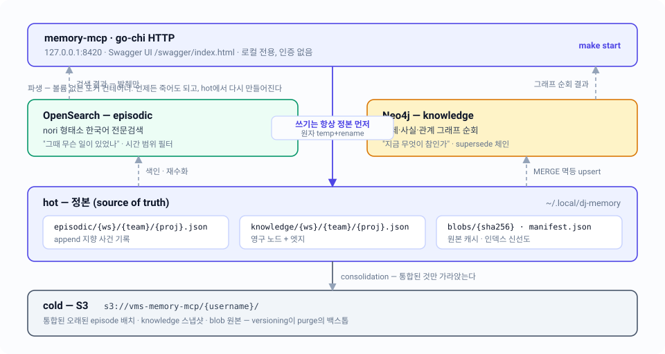

# memory-mcp 스펙 인덱스

현재 Go 코드가 **실제로 하는 일**을 기술하는 11개 문서. 설계 의도는 [`docs/design/architecture-v2.md`](../design/architecture-v2.md)에, 코드 규약은 [`docs/design/code-standards.md`](../design/code-standards.md)에 있고, 둘과 코드가 어긋나면 **코드가 이긴다** — 각 문서의 "⚠️ 설계 문서와 차이" 절이 그 격차를 기록한다.

## 문서 목록

| # | 문서 | 한 줄 |
|---|---|---|
| 01 | [시스템 개요](01-overview.md) | 정본 1개 + 파생 인덱스 2개 + 콜드 아카이브 1개의 전체 지도, 요청 하나가 지나는 경로와 죽어도 되는 것의 구분 |
| 02 | [저장 모델](02-storage-model.md) | hot 로컬 JSON 트리 · S3 cold 키 대응 · `manifest.json`의 실제 디렉토리·키·레코드 형태 |
| 03 | [메모리 생명주기](03-lifecycle.md) | knowledge 상태기계(active/archived/deprecated)와 episodic 에이징 판정식, S3 put → hot 삭제 → 인덱스 삭제 순서 |
| 04 | [Episodic 검색](04-episodic-search.md) | nori 형태소 OpenSearch 인덱스, 시간·kind 필터, 본문을 돌려주지 않는 발췌 전용 응답 계약 |
| 05 | [Knowledge 그래프](05-knowledge-graph.md) | Neo4j 단일 라벨 스키마와 실제 Cypher, 삭제 대신 개정하는 supersede 체인 |
| 06 | [문서](06-documents.md) | 업로드 1건 → blob + `document` 노드 + N개 `document_chunk` 분해, 청크에서 원본 바이트로 되짚는 경로 |
| 07 | [재수화와 degraded](07-rehydration.md) | 볼륨 없는 파생 컨테이너, manifest 드리프트 판정, 파생물이 죽어도 쓰기를 성공시키는 규칙 |
| 08 | [HTTP API](08-http-api.md) | 루프백 전용 go-chi 라우트 16개와 `{success, data, error}` 봉투, swaggo 생성물 |
| 09 | [코드 구조](09-code-structure.md) | `internal/` 13개 패키지의 단일 책임·의존 방향, 에러가 HTTP로 번역되는 단일 지점 |
| 10 | [운영](10-operations.md) | `make start` 15개 타깃, env 9개, 포트·자격증명과 실패 시 실제로 보이는 문자열 |
| 11 | [검증](11-testing.md) | fake 주입 단위 층 · 옵트인 라이브 계약 층 · 블랙박스 8단계 수용 기준의 권한 분리 |

## 읽는 순서

**처음 오는 사람** — 01 → 02 → 03. 이 셋이 "정본이 무엇이고, 어디 있고, 언제 사라지는가"를 끝낸다. 나머지는 전부 이 셋 위의 각론이다.

**API를 붙이려는 사람** — 01 → 08 → (필요한 평면만) 04 또는 05 → 06.

**서버를 띄우거나 고치려는 사람** — 10 → 07 → 11.

**코드를 고치려는 사람** — 09 → 해당 평면 문서(04/05/06) → 11.

핵심 의존은 03(생명주기)과 07(재수화)이다. 이 둘을 건너뛰면 "왜 파생 저장소를 지워도 되는가"와 "왜 미통합 레코드는 영원히 남는가"가 설명되지 않는다.

## 규칙의 단독 소유자

같은 규칙을 여러 문서가 설명하지 않는다. 아래가 각 규칙의 **정본 문서**이고, 나머지는 링크만 한다.

| 규칙 | 소유 문서 |
|---|---|
| 에이징 자격 판정(TTL·압박·미통합 불변식) `AgeEligible` | [03 §3.2](03-lifecycle.md) |
| knowledge 상태 전이와 purge 게이트 | [03](03-lifecycle.md) |
| hot/cold 키 형식과 `manifest.json` 스키마 | [02](02-storage-model.md) |
| 드리프트 판정과 degraded 응답 규칙 | [07](07-rehydration.md) |
| 응답 봉투·상태코드·요청 크기 한계 | [08](08-http-api.md) |
| env 변수와 기동 순서 | [10](10-operations.md) |
| 청킹·추출 한계(`DocumentChunkBytes`, `MaxDocumentChunks`) | [06](06-documents.md) |

## 문서 규약

새 문서를 추가하거나 고칠 때 지킬 것.

- 제목은 `# NN — 주제: 부제`, 그 아래 한 줄 목적, 그 다음 `관련 코드 / 관련 스펙 / 상태` 3행 메타데이터 표, 그 다음 다이어그램, 마지막이 "코드 위치" 표.
- 수치·env 이름·엔드포인트는 **코드에서 확인하고 쓴다.** 상수는 `internal/config/config.go`와 `internal/server/validate.go`가 정본이다.
- 다이어그램은 손으로 쓴 SVG만. 팔레트는 hot/정본 indigo `#eef2ff`/`#4f46e5`, episodic emerald `#ecfdf5`/`#059669`, knowledge amber `#fef3c7`/`#d97706`, cold slate `#f1f5f9`/`#475569`, 금지·purge red `#fee2e2`/`#dc2626`. 배경은 `#fbfcfe` `rx=14`, 박스 `stroke-width=1.6`, 파생·비동기 흐름은 `stroke-dasharray="5 4"`. 색이 3개를 넘으면 범례를 넣는다.
